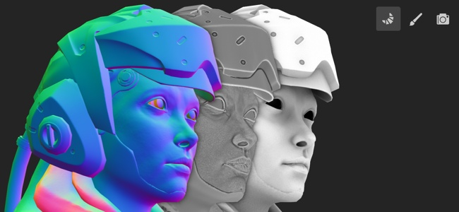

# ベイク処理

ベイク処理とは、**メッシュベースの情報をテクスチャに転送**&#x200B;する動作を指します。 この情報は、シェーダやSubstanceフィルタによって読み取られ、高度なエフェクトが作成されます。 例えば、スマートマテリアルとスマートマスクは、ベイク処理された曲率と法線マップを他のベイク処理された情報と並べて使用します。

Painterでは、ベイク処理は専用のベイクモードで行われます。 このモードには、専用アイコン（コンテキストツールバーにある小さなクロワッサン）を使用するか、[モードメニュー](../interface/main-menu/mode-menu.md)を使用するか、[キーボードショートカット](../interface/settings/shortcuts.md)を使用してアクセスできます。

Painterのベイクプロセスについて詳しくは、次のページを参照してください。

* [ベイクモードインターフェイス](baking-interface.md)
* [メッシュマップをベイクする方法](how-to-bake-mesh-maps.md)
* [ベイク処理ビジュアライゼーション設定](baking-visualization-settings.md)
* [ゆがみ補正](skew-correction.md)

ベイクモードの概要については、ビデオチュートリアルを参照してください。

>[!NOTE]
>
> ベーキングの概要について詳しくは、専用の[ベーキングに関するドキュメント](https://experienceleague.adobe.com/ja/docs/substance-3d/bakers/home)を参照してください。