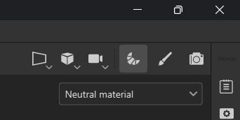
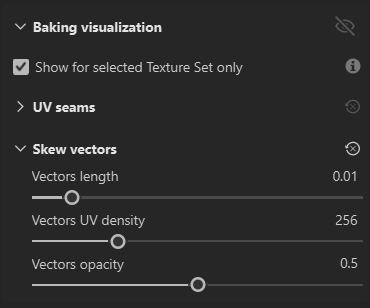

# ゆがみ補正

<table>
  <tr style="border: 0;">
    <td style="border: 0; width: 35%" valign="top"></td>
    <td style="border: 0; width: 65%" valign="top">高ポリゴンモデルから低ポリゴンにベイク処理を行うと、ディテールに歪みや歪みが生じることがあります。 これは通常、ケージ法線とサーフェス法線が適切に位置合わせされていない場合に発生します。 自動ベイク処理では、これらの標準値に基づいてローポリゴン上にハイポリゴンが投影されるため、正しくない場合はベイク処理の結果が悪くなります。 幸い、このタイプのアーティファクトを修正するには、スキュー補正（またはスキューのマッピング）が利用できます。 スキュー補正を使用すると、ローポリメッシュに値を直接ペイントして、カスタムケージを作成する必要なしに、ベイク処理で使用したプロジェクションをリダイレクトすることができます。</td>
  </tr>
</table>

>[!NOTE]
>
> スキュー補正は、**ベイクモード**&#x200B;内でペイントされ、テクスチャセットごとに保存されます。

## ペイントのゆがみ補正

スキュー補正ペイントを使用すると、ベイク処理専用にメッシュのサーフェス法線を手動で調整できます。 スキュー補正はベイク処理なしでペイントできますが、[最初にメッシュマップをベイク処理](how-to-bake-mesh-maps.md)すると便利です。

*ベイクモードに切り替えて、スキュー補正設定にアクセスします。*

>[!IMPORTANT]
>
> ゆがみ補正ペイントには、次の設定が必要です。
>
> * High polyシーンを選択する必要があります。 スキュー描画は、高ポリゴンから低ポリゴンにベイク処理する場合にのみ使用できます。「**低ポリメッシュを高ポリメッシュとして使用**」をオンにすると、スキュー補正描画は&#x200B;**使用できない**&#x200B;ようになります。
> * **ケージ**&#x200B;は&#x200B;**距離ベース**&#x200B;に設定する必要があります。
> * **平均法線**&#x200B;を確認する必要があります。

上記の設定を使用すると、**共通設定パネル**&#x200B;の「**スキュー補正のペイント**」をクリックしてペイントを開始できます。 スキュー補正ペイントモードに入ると、通常チャンネルの&#x200B;**自動リベイク**&#x200B;が自動的にオンになります。 必要に応じて、**自動リベイク**&#x200B;をオフにするか、[**メッシュマップベイカーパネル**](../interface/baking-panels/mesh-map-bakers.md)&#x200B;で選択したチャンネルを変更できます。

### ペイントツール

スキュー補正をペイントする場合、**消しゴム**&#x200B;ツールや&#x200B;**多角形の塗りつぶし**&#x200B;ツールなど、ペイントモードで使用するツールやショートカットの多くを使用できます。

* ツールバーから&#x200B;**ブラシ**、**消しゴム**、**多角形の塗り**&#x200B;を切り替えたり、ペイントモードから標準の[キーボードショートカット](../interface/settings/shortcuts.md)を使用したりできます。
* ブラシツールまたは消しゴムツールの使用中に、**ビューポート**&#x200B;の上部にあるパラメーターを使用して、ブラシのサイズ、流量、不透明度、間隔を調整できます。 該当する[キーボードショートカット](../interface/settings/shortcuts.md)を使用することもできます（使用可能な場合）。

### エッジ保護

エッジ保護では、サーフェス法線の滑らかなグラデーションを維持するために、エッジ付近でペイントされたスキュー補正が無視されます。 **エッジ保護**&#x200B;を「**ゆがみ補正**」セクションで切り替えることができます。 **エッジ補正**&#x200B;を有効にすると、最適な結果が得られるように、エッジの距離とエッジのコントラストを調整できます。

* エッジの距離：エッジ保護が有効になるエッジからの距離を制御します。
* エッジのコントラスト：エッジ保護のグラデーションを制御します。 コントラストが低いと、グラデーションが滑らかになります。

>[!TIP]
>
> **エッジの距離**&#x200B;と&#x200B;**エッジのコントラスト**&#x200B;の値は、メッシュのサイズに基づいています。 メッシュのサイズと比べてディテールが非常に小さいメッシュの場合は、スライダーを使用するよりも小さな値を手動で入力する方が簡単な場合があります。

>[!NOTE]
>
> エッジ保護は、UV境界ではなくメッシュのジオメトリに関連付けられている&#x200B;**ハードエッジ**&#x200B;メッシュマップに基づいています。

### ベクトル可視化のゆがみ

既定では、スキュー補正のペイントを開始すると、メッシュサーフェスの法線が&#x200B;**ビューポート**&#x200B;で赤、黄、緑の線として表示されます。 **ビューポート**&#x200B;に表示される&#x200B;**視覚エフェクトメニュー**&#x200B;の&#x200B;**ゆがみベクトル**&#x200B;セクションで、これらの線の外観を変更したり、完全にオフにしたりできます。

* **ベクトルの長さ**:ビューポートの線の長さを調整します。 線が長くなると、ベクトルの方向がわかりやすくなります。
* **ベクトルUV密度**:メッシュのサーフェス全体のライン数を変更します。 ベクトルはUV空間に配置されるため、メッシュのテクスチャ密度に一貫性がない場合、UVマップのポリゴンサイズに応じて、サーフェス領域の単位あたりのベクトルの数が変わります。
* **ベクターの不透明度** :ベクターの透明度を増減させます。

ベクトルの色は、各ベクトル位置で適用されるスキュー補正量を示す。

* 赤いベクトルは、スキュー補正がないことを示します。デフォルトのサーフェス法線が使用されています。
* 緑のベクトルは、サーフェス法線が完全に補正され、サーフェスに対して直接垂直であることを示します。

*流量の値を低く設定してペイントすると、ゆがみ補正の強度を微調整できます。*

## パフォーマンスの最適化

### UVの整理

**自動リベイク処理**&#x200B;は、スキュー補正をペイントする際に、各ブラシストロークが影響する領域にリベイク処理を制限するように最適化されています。 ストロークをペイントする場合、**自動リベイク**&#x200B;はUV空間のストロークの周りにバウンディングボックスを描画し、ボックス内のすべてを再ベイクします。 つまり、ストロークがUV空間の小さな部分のみをカバーしている場合は、小さな領域のみが再ベイク処理されるため、操作が非常に効率的になります。

ただし、ストロークがUV空間の反対側にある2つのUV アイランドを横切る場合、小さなストロークであってもテクスチャ全体を再ベイク処理する必要があり、最適化が行われないことがあります。

したがって、3D空間で互いに近くにあるUV アイランドもUV空間で互いに近くなるように、メッシュのUVを整理することをお勧めします。 これにより、**自動リベイク**&#x200B;のパフォーマンスが向上します。

### 位置揃えをUVに設定

一般に、**投影/整列**&#x200B;をUVに設定した状態でスキュー補正を行うと、パフォーマンスが向上します。 **配置**&#x200B;を変更するには：

1. **スキュー補正のペイント**&#x200B;を選択し、**ブラシ**&#x200B;または&#x200B;**消しゴム**&#x200B;を装備します。
1. **ビューポート**&#x200B;を右クリックして、**ブラシ設定パネル**&#x200B;を開きます。
1. **プロジェクション**&#x200B;まで下にスクロールします。
1. **線形**&#x200B;を&#x200B;**UV**&#x200B;に設定します。

**整列**&#x200B;を&#x200B;**UV**&#x200B;に設定すると、UV アイランドの継ぎ目をまたいで滑らかなストロークをペイントすることはより難しくなります。ただし、これは一般にメッシュをテクスチャリングする場合ほど重要ではありません。

>[!NOTE]
>
> **ブラシ**&#x200B;と&#x200B;**消しゴム**&#x200B;のパラメーターは別々に保存されます。 両方のツールのパフォーマンスを最大化するには、各ツールの&#x200B;**配置**&#x200B;を個別に設定する必要があります。

## ゆがみ補正とスタックの取り消し

ベイク処理とペイントは、1つの取り消し履歴を共有します。 ベイクモードとペイントモードの切り替え自体は取り消し不可能な手順であり、スキュー補正を有効または無効にすることも取り消すことができます。 ペイントモードでベイク処理を取り消すと、これらの手順を取り消す前にベイクモードが自動的に再度開くので、実行したモード以外で操作を取り消すことはできません。