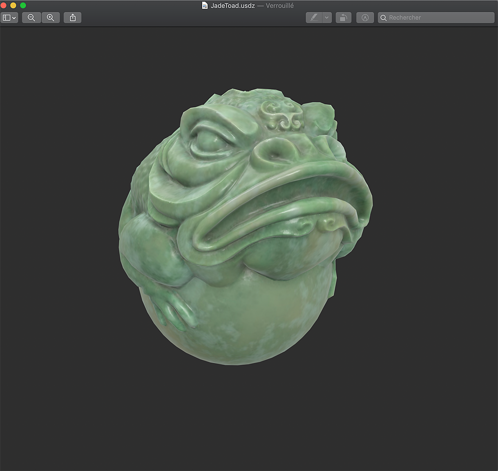

# USDz(Apple AR)の定義済みテンプレート

>[!NOTE]
>
> カスタム出力テンプレートを使用してUSDに書き出すには、USDz(Apple AR)テンプレートを使用しないでください。 代わりに選択した出力テンプレートを使用し、<b>設定タブ</b>の下部にある<b>USDアセットの書き出し</b>を有効にします。

USDz(Apple AR)の事前定義出力テンプレートは、Apple ARアプリケーションで使用するように設定されたアセットを書き出します。

USDz(Apple AR)テンプレートを使用するには：

1. <b>ファイル/テクスチャを書き出し</b>またはキーボードショートカット<b>Ctrl + Shift + E</b>を使用して、書き出しウィンドウを開きます。
1. <b>「設定」タブ</b>で、<b>「出力テンプレート」ドロップダウン</b>を開き、<b>USDz (Apple AR)</b>を選択します。

{zoomable="yes"}

5つのテクスチャファイル（ベースカラー、メタリック、法線、オクルージョン、粗さ）が作成、保存されます。 非可逆圧縮による斑点を避けるために、通常のマップを除くすべてのファイルがJPGとして保存されます。PNGとして保存されます。

さらに、次の2つのファイルが拡張子usdcとusdzで作成されます。

FinderからMacOSで直接開いたJadeToadの例を次に示します。

{width="400px"}

以下に、iPhoneに送信されたUSDZファイルの例を示します。このファイルでは、ARモードを使用してJadeToadモデルを実際の環境に配置しています。

{width="500px"}
