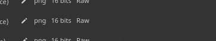

# 書き出し設定

{width="500px"}

<b>書き出し設定ウィンドウ</b>の<b>書き出しテクスチャタブ</b>では、書き出されるテクスチャの構成、サイズ、場所を設定できます。

## 一般およびテクスチャセット設定

ウィンドウの最初のエレメントは、左側のテクスチャセットのリストです。 「グローバル設定」セクションからは、すべてのテクスチャセットに共通のパラメーターにアクセスできます。 これにより、プロジェクトのすべてのテクスチャセットに適用される一連の設定を簡単に調整できます。 個々のテクスチャセット設定を変更すると、そのテクスチャセットのグローバル設定が上書きされます。 たとえば、グローバル設定で解像度を2048に設定し、特定のテクスチャセットのオーバーライドとして1024を設定すると、1024に設定されたテクスチャセットを除くすべてのテクスチャセットが2048の解像度でエクスポートされます。

各テクスチャセット名の横にあるチェックボックスは、関連付けられたテクスチャが書き出されるかどうかを示します。

ドロップダウンメニューは、テクスチャセット数の多いプロジェクトで使用すると、<b>すべてをチェック</b>、<b>すべてをチェック</b>、<b>すべての</b>アクションを反転して選択内容をすばやく変更できるため便利です。

## 一般的な書き出しパラメーター

このセクションには、生成される各テクスチャの共通の設定が含まれます。

| 設定 | 説明 |
| --- | --- |
| <b>出力ディレクトリ</b> | 書き出したテクスチャの保存場所。 |
| <b>出力テンプレート</b> | チャンネルに名前を付けてテクスチャファイルに合成するための出力テンプレートを選択します。 テンプレートの詳細については、[出力テンプレート](../export-presets/export-presets.md)の一覧を参照してください。 |
| <b>ファイルの種類</b> | ファイル形式とそのビット深度。 オプション<b>出力テンプレートに基づく</b>を選択した場合、ファイル形式は書き出しプリセットから継承されます。これにより、形式とビット深度をグローバルではなくテクスチャごとに決定できます。 使用できるビット深度はファイルの種類によって異なります。詳しくは、以下の表を参照してください。 |
| <b>サイズ</b> | 書き出すテクスチャファイルの解像度。 有効な値：<ul data-preserve-html="true"> <li data-preserve-html="true"><b>各テクスチャセットのサイズに基づく</b></li> <li data-preserve-html="true"><b>128</b></li> <li data-preserve-html="true"><b>256</b></li> <li data-preserve-html="true"><b>512</b></li> <li data-preserve-html="true"><b>1024</b></li> <li data-preserve-html="true"><b>2048</b></li> <li data-preserve-html="true"><b>4096</b></li> <li data-preserve-html="true"><b>8192</b> （1.5 GBを超えるVramを搭載したGPUでのみ使用可能）</li> </ul> |
| <b>パディング</b> | テクスチャの外側の領域をUV アイランドの内側で塗りつぶす方法。 指定可能な値は次のとおりです。<ul data-preserve-html="true"> <li data-preserve-html="true"><b>パディングなし（パススルー）</b>: テクスチャの現在の状態をそのまま使用します。</li> <li data-preserve-html="true"><b>拡張の無限</b>: UV アイランドの境界線が近隣の境界線に達するか、テクスチャの最後に達するまで、境界を伸縮します。</li> <li data-preserve-html="true"><b>拡張+透明</b>: UV アイランドの境界線をピクセル単位で伸縮します。残りは透明です。</li> <li data-preserve-html="true"><b>拡張 +デフォルトの背景色</b>: UV アイランドの境界線をピクセル単位の指定された間隔に伸縮します。残りはテクスチャセットチャンネルのデフォルトの色で塗りつぶされます。</li> <li data-preserve-html="true"><b>拡張 +デフォルトの背景色</b>: UV アイランドの境界線をピクセル単位の指定された間隔に伸縮します。残りはテクスチャセットチャンネルのデフォルトの色で塗りつぶされます。</li> <li data-preserve-html="true"><b>膨張+拡散</b> :UV アイランドの境界線をピクセル単位で指定された間隔に引き伸ばし、残りはUV アイランドのぼやけたバージョン（mipマップに基づく）で塗りつぶされます。</li> </ul> |

>[!NOTE]
>
> **psd**&#x200B;ファイル形式はコンテナです。これは、出力マップがディスク上の1つのファイルにまとめられることを意味します。

### ディザリング

8ビットテクスチャを書き出すと、グラデーションに縞模様が発生することがあります。 これは、法線マップとHeightマップで特に顕著です。 この問題を解決するには、より高い精度を使用する方法と、ディザリングで補償する方法の2つがあります。

より高い精度（16または32ビット）が理想的ですが、これはすべてのアプリケーションと互換性があるとは限りません。 最も注目すべきは、ゲームエンジンはしばしば8ビットに圧縮することです。 ディザリングは、8ビットの情報を使用しながら、バンディング問題を軽減するのに役立つノイズを導入します。

### テクスチャファイルフォーマット

Painterでサポートされているすべての書き出しファイル形式を以下に示します。

| 書式名 | 形式の拡張 | サポートされるビット深度 |
| --- | --- | --- |
| **ビットマップ** | bmp | 8、8 + ディザリング |
| **OpenEXR** | exr | 16（フローティング）、32（フローティング） |
| **Graphics Interchange Format** | gif | 8、8 + ディザリング |
| **Radiance HDR** | hdr | 32（フローティング） |
| **アイコン** | ico | 8、8 + ディザリング |
| **Jpeg 2000** | j2k | 8、8 + ディザリング、16 |
| **Jpegネットワークグラフィックス** | jng | 8、8 + ディザリング、16 |
| **Jpeg 2000** | jp2 | 8、8 + ディザリング、16 |
| **Jpeg** | jpeg | 8、8 + ディザリング |
| **JPEGの拡張範囲** | jpeg-xr | 8、8 + ディザリング、16、32（フローティング） |
| **ポータブルビットマップ** | pbm | 8、8 + ディザリング、16 |
| **ポータブル浮動小数マップ** | pfm | 32（フローティング） |
| **ポータブルグレーマップ** | pgm | 8、8 + ディザリング、16 |
| **ポータブルネットワークグラフィックス** | png | 8、8 + ディザリング、16 |
| **ポータブルピクセルマップ** | ppm | 8、8 + ディザリング、16 |
| **Photoshop文書** | psd | 8、8 + ディザリング、16 |
| **Truevision TGA** | targa | 8、8 + ディザリング |
| **画像ファイル形式のタグ付け** | tiff | 8、8 + ディザリング、16、32（フローティング） |
| **ワイヤレスアプリケーションプロトコルビットマップ形式** | wbmp | 8、8 + ディザリング |
| **WebP** | webp | 8、8 + ディザリング |
| **X PixMap** | xpm | 8、8 + ディザリング |

## 出力マップ

特定のテクスチャセットを選択すると、そのテクスチャセットの「出力マップ」セクションが表示されます。

このセクションには、現在の書き出しプリセットに基づいて生成されるすべてのテクスチャが一覧表示されます。 [カラーマネジメント](../../features/color-management/color-management.md)が有効になっている場合は、テクスチャ名テンプレート、ファイル形式、ビット深度、およびカラースペースも示されます。

このセクションでは、特定のファイルの書き出しを無効にしたり、<b>ファイル形式</b>および<b>ビット深度</b>を上書きしたりできます。

## USD アセットを書き出し

このチェックボックスをオンにすると、USDフォーマットで書き出すことができます。 <b>出力テンプレート</b>で利用可能なApple AR(USDz)プリセットとは異なり、この書き出しでは、書き出しに設定したテンプレートまたはパラメーターが考慮されます。 USDアセットボックスをオンにすると、次のファイルが書き出されます – 

* テクスチャマップを含むフォルダー
* テクスチャマップフォルダーを指す&#x200B;*.usda*。
* 元のメッシュファイルを使用してマテリアルを組み立てるオプションの.usd。 Omniverseで直接使用して、マテリアルが自動的に適用されたメッシュを表示できます。
* オプションの.usdファイル。プロジェクトで使用されているメッシュが含まれます。 元のメッシュファイルがUSDではない場合、またはPainterの自動ラップ解除を使用してUVが生成された場合にのみ、書き出されます。
