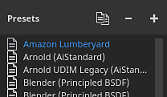

# 出力テンプレート

{width="500px"}

「出力テンプレート」タブでは、新しい出力テンプレートを管理および作成できます。 出力テンプレートを使用して、書き出されたテクスチャの名前、フォーマット、およびコンフィギュレーションを変更できます。

## プリセットリスト

プリセットリストには、使用可能なすべての出力テンプレートが表示されます。 この一覧には、[既定の出力テンプレート](../export-presets/default-presets.md)のコレクションと、ユーザーが作成したカスタムテンプレートが含まれます。

このリストから、テンプレートは<b>作成済み</b>、<b>名前変更</b>、<b>複製済み、</b>または<b>削除済み</b>にすることができます。

| アクション | ビジュアル | 説明 |
| --- | --- | --- |
| **複製** | 

 | リストで現在選択されている出力テンプレートのコピーを作成します。 |
| **削除** | 

 | リストで現在選択されている出力テンプレートを削除します。  **注意：**&#x200B;テンプレートの削除は元に戻せません。 |
| **追加** | 

 | 新しい空の出力テンプレートを追加します。 |
| **ダブルクリック** | 

 | 選択した出力テンプレートの名前を変更します。 |
| **右クリック** | 

 | テンプレートを右クリックしてコンテキストメニューを開き、テンプレートを削除、名前変更、または複製することができます。 |

## 出力マップリスト

このセクションには、テンプレートとそのコンポジションによって生成されるすべてのテクスチャが一覧表示されます。

### マップの種類とキーワード

一番上の行には、作成できるすべての種類のテクスチャが一覧表示されます。

| ボタン | ビジュアル | 説明 |
| --- | --- | --- |
| **グレー** | 

 | 新しいグレースケールマップを追加します。 |
| **RGB** | 

 | 新しいRGBカラーマップを追加します。 |
| **R+G+B** | 

 | 3つの個別のRGBスロットを持つ新しいグレースケールマップを追加します。 |
| **RGB+A** | 

 | 新しいRGBマップとアルファ（グレースケール）スロットを追加します。 |
| **R+G+B+A** | 

 | 4つの個別のグレースケールスロットを使用して新しいRGBAマップを追加します。 |

>[!NOTE]
>
> 一部のタイプは、空の場合や同じ入力マップを共有する場合に、マージ/折りたたむことができます。
> 
> 

### マップ名

各テクスチャには、カスタム命名規則を使用して名前を付けることができます。 いくつかのキーワードを（**$**&#x200B;ボタンを使用して）追加すると、最終的なファイルを生成したときにアプリケーションによって自動的に置き換えられます。

| キーワード | 説明 |
| --- | --- |
| **$プロジェクト** | プロジェクトファイル(.spp)の名前に置き換えられます。 |
| **$mesh** | メッシュファイル（.fbxなどの入力メッシュファイル）の名前に置き換えられます |
| **$textureset** | テクスチャの生成元となるマテリアル/テクスチャセットの名前で置き換えられます。 |
| **$udim** | テクスチャの生成元のUDIM番号で置き換えられます。 |
| **$カラースペース** | チャンネルに使用されているカラースペース名に置き換えられます（RGBまたはG。Alphaは無視されます）。 |

### ファイルのフォーマットとビット深度のマッピング

最初のドロップダウンは、現在の出力マップのファイル形式を指定するために使用できます。

2番目のドロップダウンは、出力マップのビット深度を指定するために使用されます。 ビット深度は、選択したファイル形式によって異なります。 詳細については、[設定の書き出し](export-settings.md)を参照してください。

>[!NOTE]
>
> 書き出し時に書式とビット深度の設定を考慮するには、[全般]設定のファイルの種類が&#x200B;**出力テンプレートに基づく**&#x200B;に設定されていることを確認してください。

## ソースマップリスト

### マップを入力

入力マップリストは、[テクスチャセット設定](../../interface/texture-set/texture-set-settings.md)を介して追加できるすべてのチャンネルを再編成します。

>[!NOTE]
>
> **ユーザー**&#x200B;チャネルは元の名前（**ユーザー\_x**）に基づいているため、カスタム名は無視されます。

### メッシュマップ

メッシュマップはベイク処理されたテクスチャです。

| 名前 | 説明 |
| --- | --- |
| **標準** | ベイク処理された法線マップ |
| **ワールド空間標準** | ベイクワールドスペース標準 |
| **ID** | ベイクID。 |
| **環境オクルージョン** | ベイク処理された環境オクルージョン |
| **曲線** | ベイク処理された曲率。 |
| **位置** | ベイク処理された位置。 |
| **Thickness** | 焼きThickness。 |
| **Height** | 焼きHeight。 |
| **曲がった法線** | ベイク処理されたベンド法線。 |

### 変換されたマップ

変換されたマップは、アプリケーションによって別のソースから生成されるマップです。

| 名前 | 説明 |
| --- | --- |
| **標準OpenGL** | ベイク処理された法線とテクスチャセットの法線チャンネルのOpenGL形式の結合された法線マップ |
| **通常のDirectX** | ベイク処理された法線とテクスチャセットの法線チャンネルのDirectXフォーマットの結合された法線マップ |
| **混合AO** | ベイク処理されたアンビエントオクルージョンとテクスチャセットのアンビエントオクルージョンチャンネルの組み合わせアンビエントオクルージョン。 |
| **拡散** | **ベースカラー**&#x200B;と&#x200B;**メタリック**&#x200B;チャンネルから生成された拡散テクスチャ（メタリック領域は黒に置き換えられます）。 |
| **Specular** | **基本色**&#x200B;と&#x200B;**メタリック**&#x200B;チャンネルから生成されたSpecularテクスチャ。 |
| **光沢** | 粗さチャンネルの反転から生成された光沢テクスチャ。 |
| **Unity4拡散反射光** | 非推奨。 Unity 4シェーダに一致するように&#x200B;**Base Color**&#x200B;チャンネルから生成された拡散テクスチャ。 |
| **Unity4グロス** | 非推奨。 Unity 4シェーダーに一致するように、**粗さ**&#x200B;と&#x200B;**メタリック**&#x200B;チャンネルから生成された光沢テクスチャ。 |
| **リフレクション** | 白が誘電体マテリアルを示し、他の色が金属マテリアルであることを示すテクスチャ。 |
| **1/ior** | 1を&#x200B;**IOR**&#x200B;値で除算したテクスチャです。 **IOR**&#x200B;は、金属マップ（誘電体の場合1.4、金属の場合100）から生成されます。 |
| **光沢2** | **光沢度**&#x200B;チャンネルの正方形バージョン（**光沢度** \* **光沢度**） |
| **f0** | フレネル0（誘電体の場合は0.04、金属の場合は1.0）として反射率の値を含むテクスチャ。 |
