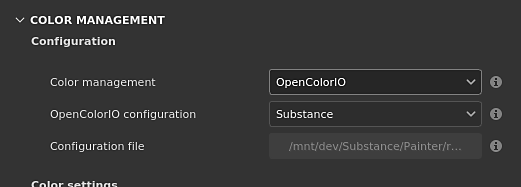

# OpenColorIOによるカラーマネジメント

このページでは、OpenColorIO(OCIO)に関連するカラーマネジメント設定の一覧を示します。

## プロジェクト設定

プロジェクト設定は、[新規プロジェクト](../../getting-started/project-creation.md)ウィンドウを使用して、または[プロジェクト構成](../../interface/project-configuration.md)ウィンドウを使用して、新規プロジェクトを作成するときに設定できます。

>[!NOTE]
>
> **OCIO**&#x200B;環境変数が存在し、有効な構成ファイルを指定している場合、UIの設定が上書きされ、無効になります。

使用可能な設定は次のとおりです。

<table data-preserve-html="true" style="width: 99.9039%;"><colgroup><col style="width: 12.512%;"/><col style="width: 21.1742%;"/><col style="width: 66.3122%;"/></colgroup><tbody><tr><th style="width: 12.5%;">セクション</th><th style="width: 21.1538%;">設定</th><th style="width: 66.25%;">説明</th></tr><tr><td rowspan="3" style="width: 12.5%;"><strong>構成</strong></td><td style="width: 21.1538%;"><strong>カラーマネジメント</strong></td><td style="width: 66.25%;">
カラーの管理に使用するエンジンを定義します。

有効な値：
<ul><li><strong>従来</strong> （既定）：定義済みのsRGB/リニアsRGBガンマ色補正を使用します。</li><li><strong>OpenColorIO</strong>: OCIO統合を使用します。</li><li><strong>Adobe ACE</strong>: Adobe Color Engine、ICCプロファイルをサポートします。</li></ul></td></tr><tr><td style="width: 21.1538%;"><strong>OpenColorIO 構成</strong></td><td style="width: 66.25%;">
カラーマネジメント設定の実行に使用する構成ファイル。

有効な値：
<ul><li><strong>Substance</strong> （既定）:リニアガンマを作業用スペースとして使用します。</li><li><strong>ACES 1.0.3</strong>: ACEScgを作業用スペースとして使用します。</li><li><strong>ACES 1.2</strong>: ACEScgを作業用スペースとして使用します。</li><li><strong>カスタム</strong>:カスタム構成ファイルを使用します。</li></ul></td></tr><tr><td style="width: 21.1538%;"><strong>構成ファイル</strong></td><td style="width: 66.25%;">OCIO設定ファイルへのパス。 構成モードが<strong>Custom</strong>に設定されていない場合は無効です。</td></tr><tr><th style="width: 12.5%;"> </th><th style="width: 21.1538%;"> </th><th style="width: 66.25%;"> </th></tr><tr><td rowspan="2" style="width: 12.5%;"><strong>カラー設定</strong></td><td style="width: 21.1538%;"><strong>作業カラースペース</strong></td><td style="width: 66.25%;">アプリケーション内で作業するためにエンジンによって使用されるカラースペース。 テクスチャを変換（読み込み）または変換（書き出し）するカラースペースです。</td></tr><tr><td colspan="1"><strong>標準 sRGB カラースペース</strong></td><td colspan="1">
[標準sRGB](https://en.wikipedia.org/wiki/SRGB)カラースペースに一致するカラースペース(IEC 61966-2-1:1999)。

このカラースペースは、アプリケーション内のいくつかの場所で使用されます。
<ul><li>カラーピッカーの16進フィールドでカラーセットを変換します。</li><li>カラーピッカー内でカラースウォッチを保存して読み込みます。</li><li>カラーピッカーリストにディスプレイとして表示されます。</li></ul></td></tr><tr><th style="width: 12.5%;"> </th><th style="width: 21.1538%;"> </th><th style="width: 66.25%;"> </th></tr><tr><td rowspan="4" style="width: 12.5%;"><strong>ビットマップ読み込みカラースペースのデフォルト</strong></td><td style="width: 21.1538%;"><strong>8 bit 画像</strong></td><td style="width: 66.25%;">8ビット画像ファイルを読み込むときにデフォルトで使用されるカラースペース。</td></tr><tr><td style="width: 21.1538%;"><strong>16 bit 画像</strong></td><td style="width: 66.25%;">16ビットイメージファイルを読み込むときにデフォルトで使用するカラースペース。</td></tr><tr><td style="width: 21.1538%;"><strong>浮動小数点画像</strong></td><td style="width: 66.25%;">HDR/EXR画像ファイルを読み込むときにデフォルトで使用するカラースペース。</td></tr><tr><td style="width: 21.1538%;"><strong>カラースペースを自動検出</strong></td><td style="width: 66.25%;">
特定の設定に基づいて、リソースからカラースペースを定義できるようにします。

有効な値：
<ul><li><strong>無効</strong>：既定の色設定を使用し、リソース構成を無視します。</li><li><strong>ファイル名</strong>の解析（既定）: OCIO [命名規則](https://opencolorio.readthedocs.io/en/latest/guides/authoring/rules.html?highlight=filename#strictparsing)を使用して、リソースで使用されているカラースペースの名前を抽出します。</li><li><strong>構成ファイルのルールを使用する</strong>: OCIO設定を使用して、カラースペースの割り当て方法を決定します。 このパラメーターは、以前の画像ファイルのカラースペース設定よりも優先されます。</li></ul></td></tr><tr><th style="width: 12.5%;"> </th><th style="width: 21.1538%;"> </th><th style="width: 66.25%;"> </th></tr><tr><td style="width: 12.5%;"><strong>Substance素材</strong></td><td style="width: 21.1538%;"><strong>マテリアルカラースペースのデフォルト</strong></td><td style="width: 66.25%;">
Substanceマテリアルのカラーマネジメント入出力に使用するカラースペースを定義します（チャンネルの一覧については、以下を参照）。
</td></tr><tr><th style="width: 12.5%;"> </th><th style="width: 21.1538%;"> </th><th style="width: 66.25%;"> </th></tr><tr><td rowspan="3" style="width: 12.5%;"><strong>書き出し時のカラースペース</strong>   </td><td style="width: 21.1538%;"><strong>8 bit 画像</strong></td><td style="width: 66.25%;">8 bit画像ファイルを書き出すときにデフォルトで使用されるカラースペース。</td></tr><tr><td style="width: 21.1538%;"><strong>16 bit 画像</strong></td><td style="width: 66.25%;">16ビットイメージファイルの書き出し時にデフォルトで使用されるカラースペース。</td></tr><tr><td style="width: 21.1538%;"><strong>浮動小数点画像</strong></td><td style="width: 66.25%;">HDR/EXR画像ファイルを書き出すときにデフォルトで使用するカラースペース。</td></tr></tbody></table>

### OpenColorIOロール

次の役割がサポートされており、カラースペースのデフォルト選択を変更できます。

| ロール名 | 説明 |
| --- | --- |
| **substance\_3d\_painter\_standard\_srgb** | [標準sRGB](https://en.wikipedia.org/wiki/SRGB)に一致するカラースペースを指定する役割です(IEC 61966-2-1:1999)。 |
| **substance\_3d\_painter\_bitmap\_import\_8bit** | 8ビット画像の読み込みに使用するカラースペースを指定する役割です。 |
| **substance\_3d\_painter\_bitmap\_import\_16bit** | 16ビット画像の読み込みに使用するカラースペースを指定する役割です。 |
| **substance\_3d\_painter\_bitmap\_import\_floating** | HDR画像の読み込みに使用するカラースペースを指定する役割です。 |
| **substance\_3d\_painter\_substance\_material** | Substanceマテリアルのカラーマネジメントチャンネルに使用するカラースペースを指定するロール。 |
| **substance\_3d\_painter\_bitmap\_export\_8bit** | 8ビットテクスチャの書き出し時に使用するカラースペースを指定する役割です。 |
| **substance\_3d\_painter\_bitmap\_export\_16bit** | 16ビットテクスチャを書き出すときに使用するカラースペースを指定する役割です。 |
| **substance\_3d\_painter\_bitmap\_export\_floating** | HDRテクスチャを書き出すときに使用するカラースペースを指定する役割です。 |

>[!NOTE]
>
> アプリケーションに付属のOCIO設定は、これらの特定の役割の使用方法の例として使用できます。
