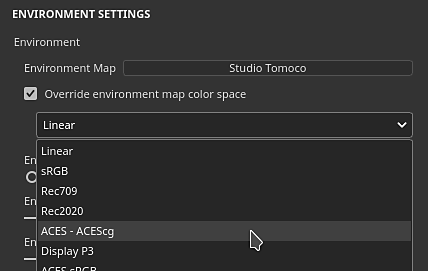

# カラーマネジメント

カラーマネジメントとは、カラーを処理および変換することです。 リソースの読み込みから、画面上でのカラーの表示、最終的なテクスチャの書き出しまで。 色校正は、アプリケーション間で同じ外観を保つために重要です。

アプリケーションのカラーマネジメントは、[OpenColorIO](https://opencolorio.org/) （略してOCIO）バージョン2の統合によって処理されます。 OCIOは、カラーを変換して表示するための、フィルムおよびアニメーションの標準規格です。 カラーマネジメントを有効にするには、新しいプロジェクトを作成するか、既存のプロジェクトを開き、専用の設定を有効にします。

>[!NOTE]
>
> カラーマネジメントは、バージョン7.4.0以降で利用できます。

## プロジェクト設定

カラーマネジメント設定：

* [Adobe ACEを使用したカラーマネジメント – ICC](color-management-with-adobe-ace-icc.md)
* [OpenColorIOによるカラーマネジメント](color-management-with-opencolorio.md)

## 語彙

関連するワークフローを理解するために、カラーマネジメントに関するいくつかの専門用語を知っていると役立つ場合があります。

| キーワード | 説明 |
| --- | --- |
| **カラースペース** | カラーが定義される座標系。 |
| **作業用スペース** | テクスチャやペイントなどをブレンドするためにアプリケーション内で使用されるカラースペース。 |
| **変形の表示** | 表示の変換は、リニアカラーを作業用スペースからモニターのカラースペースに変換して、人間の目に見える知覚的にカラーを表示します。 通常、表示変換には、画面で許可される値の制限範囲に合わせてカラーを圧縮するトーンマッピングパスが含まれます。 |
| **構成** | OCIO設定ファイル。 作業用スペース、カラースペースのリスト、表示変換のリストを定義します。 |
| **ACES** | ACESはAcademy Color Encoding Systemを表し、デジタルイメージファイルを交換するための多くのアプリケーションの標準です。 デフォルトでは、この標準の2つのバージョンがアプリケーション内に含まれています。 |
| **トーンマッピング** | これは、HDR(ハイダイナミックレンジ)からLDR（ローダイナミックレンジ）にカラー値をマッピングするプロセスです。 この処理により、表示される色の範囲が広くなります。 |

## カラーマネジメントチャンネルのリスト

アプリケーション内では、どのチャンネルをカラーマネジメントするかにかかわらず（データ/パススルー）、事前に定義されています。

| チャンネル | カラーマネジメント |
| --- | --- |
| **環境オクルージョン** | いいえ |
| **アニストトロピー角** | いいえ |
| **異方性レベル** | いいえ |
| **基本色** | **はい** |
| **マスクのブレンド** | いいえ |
| **コートの色** | **はい** |
| **標準のコート** | いいえ |
| **コートの不透明度** | いいえ |
| **コートの粗さ** | いいえ |
| **コートSpecular level** | いいえ |
| **拡散** | **はい** |
| **ディスプレイスメント** | いいえ |
| **光沢** | いいえ |
| **Height** | いいえ |
| **Ior** | いいえ |
| **メタリック** | いいえ |
| **標準** | いいえ |
| **不透明度** | いいえ |
| **リフレクション** | いいえ |
| **粗さ** | いいえ |
| **散布** | いいえ |
| **散布カラー** | **はい** |
| **光沢カラー** | **はい** |
| **光沢の不透明度** | いいえ |
| **光沢の粗さ** | いいえ |
| **Specular** | **はい** |
| **Specular edge color** | **はい** |
| **Specular level** | いいえ |
| **半透明度** | いいえ |
| **透過型** | **はい** |
| **ユーザーX (0-15)** | [テクスチャセットの設定](../../interface/texture-set/texture-set-settings.md)に依存しています。 デフォルトでは、ユーザーチャンネルはカラーマネジメントされません。 

 |

## カラーピッカー

カラーマネジメントが有効になっている場合、[カラーピッカー](../../interface/color-picker.md)の動作がわずかに変わります。

* カラーは、選択した現在の表示に基づいて編集されます。
* いくつかの追加情報がインターフェイスに追加されました。

詳しくは、カラーピッカー[ドキュメントページ](../../interface/color-picker.md)を参照してください。

## ビューポートコントロール

2Dビューと3Dビューはどちらもカラーマネジメントされており、ビューポートの上部にある専用の設定を使用して、使用する表示変換をコントロールできます。

* **左ボタン**:ビューポートの表示変換を有効または無効にします。 無効にすると、ビューポートにカラーが生/パススルーとして表示されます。 このボタンはデフォルトで有効になっています。
* **右側のドロップダウン**：画面上に表示する色を変換するために使用する表示変換を指定します。 デフォルト値は、OCIO設定に基づいています。 この設定はモニターに依存している可能性があるため、プロジェクトと一緒に保存されません。

>[!NOTE]
>
> ソロモード（チャンネルを個別に表示）では、データチャンネルを表示するとカラーマネジメントが自動的に無効になります（上のリストを参照）。

## 書き出し設定

主な書き出し設定は、プロジェクト設定によって決定されます（上記を参照）。

[テクスチャの書き出し](../../export/export.md)ウィンドウには、テクスチャごとに使用されるカラースペースをファイル名に追加するために使用できるキーワードがあります： **$colorSpace**。

<table>
<tr style="border: 0;">
<td style="border: 0;" valign="top">

{width="320px"}

</td>
<td style="border: 0;" valign="top">

{width="500px"}

</td>
</tr>
</table>

## カラースペースの上書き

リソースをデフォルトとは異なる別のカラースペースに指定する必要がある場合があります。 これは、カラースペースメニューから実行できます。

### リソースのカラースペースの変更

[プロパティウィンドウ](../../interface/properties.md)内で、特定のリソース（現在使用されているリソース）のカラースペースを上書きできます。

これを行うには、「カラースペース」セクションを展開し、ドロップダウンを使用して新しいカラースペースを指定します。

### 環境マップのカラースペースの変更

[表示設定](../../interface/display-settings/display-settings.md)内で、**環境マップのカラースペースを上書き**&#x200B;を有効にし、リスト内でリソースと一致するカラースペースを選択します。

