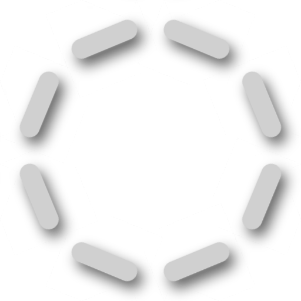

# 自動ステッチャー

<table>
  <tr style="border: 0;">
    <td style="border: 0;" valign="top"> <strong>イン：</strong>ステッチ、ステッチ</td>
    <td style="border: 0;" valign="top"><strong>説明</strong> 自動ステッチャージェネレーターは、手続き的に生成されたパスに沿ってステッチ効果を自動的に作成します。 これらのパスは、UVシーム、曲率、またはカスタム入力マップに基づいて生成できます。  自動ステッチャジェネレータは、白黒のテクスチャを出力します。 そのため、マスクを生成してステッチ効果を適用する場合に便利です。  曲率マスクモードを使用するには、ベイク処理された曲率マップが必要です。 <a href="../../../baking/baking.md">ベーキングの詳細については、こちらを参照してください</a>。</td>
  </tr>
</table>

## 入力

<table>
  <tr>
    <th>名前を入力</th>
    <th>説明</th>
  </tr>
  <tr>
    <td><strong>曲線</strong>グレースケール</td>
    <td>ステッチパスの生成方法を選択してください： <ul><li><strong>UVマスク</strong>は、UVシームに沿ってパスを生成します。</li><li><strong>曲率</strong>は、ハードエッジの近くにパスを生成します。</li><li><strong>カスタム入力</strong>を使用すると、マップを使用してパスを生成する場所を制御できます。 <strong>カスタム入力</strong>を使用すると、コントラストの高い領域にパスが生成されます。</li></ul></td>
  </tr>
  <tr>
    <td><strong>カスタム入力</strong>グレースケール</td>
    <td>カスタムテクスチャまたはアンカーポイントを使用します。</td>
  </tr>
</table>

## パラメーター

<table>
  <tr>
    <th>パラメーター名</th>
    <th>説明</th>
  </tr>
  <tr>
    <td><strong>マスクモード</strong></td>
    <td>マスクモードを選択します。 <ul><li>UVマスク：UV アイランドに基づくマスク。</li><li>曲率：曲率マップに基づくマスク。</li><li>カスタム入力：カスタム入力テクスチャに基づくマスク。</li></ul></td>
  </tr>
  <tr>
    <td><strong>パスのSmoothness</strong></td>
    <td>ステッチが適用されるパスをソフトにします。</td>
  </tr>
  <tr>
    <td><strong>パスの位置</strong></td>
    <td>パスの位置をオフセットします。</td>
  </tr>
  <tr>
    <td><strong>ステッチサイズ</strong></td>
    <td>ステッチのスケールを調整します。</td>
  </tr>
  <tr>
    <td><strong>ステッチ幅</strong></td>
    <td>ステッチの幅を調整します。</td>
  </tr>
  <tr>
    <td><strong>ステッチ長さ</strong></td>
    <td>ステッチの長さを調整します。</td>
  </tr>
  <tr>
    <td><strong>ステッチの丸み</strong></td>
    <td>ステッチの丸みを調整します。</td>
  </tr>
  <tr>
    <td><strong>ジッター</strong></td>
    <td>ステッチの流れ方向のジッターを調整します。</td>
  </tr>
</table>

## 例

<table>
  <tr>
    <td></td>
    <td>この例は、カスタム入力でステッチパスを作成する方法を示しています。  <ul><li>白黒のベースカラーは、オートステッチャージェネレーターのカスタム入力として使用しているノイズテクスチャを示しています。</li><li>Autostitcher Generatorが赤いレイヤーをマスクして、赤いステッチされたパスを表示したままにします。</li><li>赤いステッチされたパスが、カスタム入力ノイズテクスチャの十分に大きな黒または白の領域に収まることに注意してください。 レッドのステッチは、白から黒、または黒から白に交差することはありません。</li></ul> 下の画像は、この例の作成に使用した単純なレイヤー設定を示しています。  </td>
  </tr>
</table>
