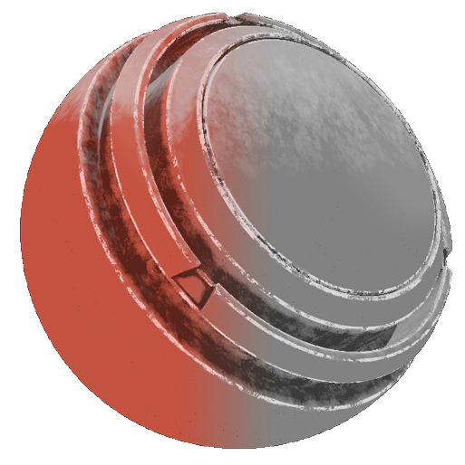

# グレースケール変換

<table>
  <tr style="border: 0;">
    <td style="border: 0;" valign="top"> <strong>イン：</strong>ジェネレーター、グレースケール、色</td>
    <td style="border: 0;" valign="top"><strong>説明</strong> グレースケール変換ジェネレーターは、テクスチャまたはマップをグレースケール値に変換します。  グレースケール変換ジェネレータは、白黒のテクスチャを出力します。 したがって、これはフルカラー入力マップからマスクを生成するのに便利です。</td>
  </tr>
</table>

## 入力

| 名前を入力 | 説明 |
| --- | --- |
| **ソース**&#x200B;の色 | カスタムカラーテクスチャまたはアンカーポイントを使用します。 |

## パラメーター

<table>
  <tr>
    <th>パラメーター名</th>
    <th>説明</th>
  </tr>
  <tr>
    <td><strong>グレースケールの種類</strong></td>
    <td>グレースケールの変換方法を設定します。  <ul><li><strong>彩度低下</strong>:RGBチャンネルの中で最も強いチャンネルと最も弱いチャンネルの中間の値を使用します。</li><li><strong>ルミナンス</strong>：人間の目から見た明るさに一致する重み付けされたRGB係数を使用します（緑を好みます）。</li><li><strong>平均</strong>：赤、緑、青のチャンネルを等しい量でミックスします。</li><li><strong>最大</strong>:RGBチャンネルの最大値を使用します。</li><li><strong>分</strong>:RGBチャンネルの最小値を使用します。<ul><li>赤チャンネル：赤チャンネルのみを使用します。</li><li>緑チャンネル：緑チャンネルのみを使用します。</li><li>ブルーチャンネル：ブルーチャンネルのみを使用します。</li></ul></li></ul></td>
  </tr>
  <tr>
    <td><strong>反転</strong></td>
    <td>マスクを反転します。</td>
  </tr>
  <tr>
    <td><strong>バランス</strong></td>
    <td>変換されたソース画像のバランスを調整し、中間点を明るさコントロールのように黒または白にシフトします。</td>
  </tr>
  <tr>
    <td><strong>コントラスト</strong></td>
    <td>変換された元画像のコントラスト/フォールオフを定義します。</td>
  </tr>
  <tr>
    <td><strong>タイル</strong></td>
    <td>変換されたソース画像のタイリングを設定します。</td>
  </tr>
  <tr>
    <td><strong>回転</strong></td>
    <td>変換されたソース画像の角度を微調整します。</td>
  </tr>
  <tr>
    <td><strong>安全な回転</strong></td>
    <td>セーフ回転モードのオン/オフを切り替えます。 Trueの場合、回転を45度にロックします。</td>
  </tr>
</table>
