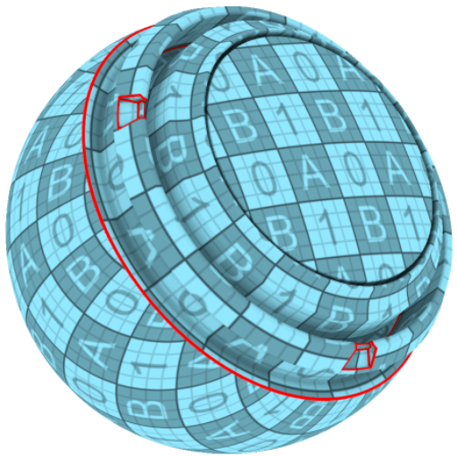

# UV チェッカー

<table>
  <tr style="border: 0;">
    <td style="border: 0;" valign="top"> <strong>イン：</strong> UV、境界、ランダム</td>
    <td style="border: 0;" valign="top"><strong>説明</strong> UVチェッカージェネレータは、モデルにグリッドのようなチェッカーパターンを適用するので、UVの問題（伸縮、不均等なスケール、ゆがみなど）を簡単に見つけることができます。   UVチェッカージェネレータは、通常、UVゆがみを確認するために塗りつぶしレイヤー上で直接使用します。</td>
  </tr>
</table>

## パラメーター

<table>
  <tr>
    <th>パラメーター名</th>
    <th>説明</th>
  </tr>
  <tr>
    <td><strong>シード</strong></td>
    <td>Dirtテクスチャの作成に使用するシード値を設定します。  <ul><li>別のランダムシードに切り替えるには、「ランダム」をクリックします。</li><li>鉛筆をクリックして現在のシード値を表示し、必要に応じて特定の値を入力します。</li></ul></td>
  </tr>
  <tr>
    <td><strong>チェッカーカラーモード</strong></td>
    <td>カラーの割り当て方法を選択します。 <ul><li><strong>均一</strong>:テクスチャセット全体に同じ色を適用します。</li><li><strong>ランダム</strong>：各UV アイランドにランダムな色を適用します。</li></ul></td>
  </tr>
  <tr>
    <td><strong>チェッカーカラー</strong></td>
    <td>チェックパターンの色を設定します。</td>
  </tr>
  <tr>
    <td><strong>チェッカーグリッドタイル</strong></td>
    <td>チェッカーパターンのサイズを調整します。</td>
  </tr>
  <tr>
    <td><strong>チェッカーグリッドの不透明度</strong></td>
    <td>グリッドの不透明度を調整します。 不透明度を0に設定すると、チェッカーテクスチャのみが表示され、グリッドは表示されません。</td>
  </tr>
  <tr>
    <td><strong>UV境界カラー</strong></td>
    <td>UV境界のカラーを設定します。</td>
  </tr>
  <tr>
    <td><strong>UV境界の幅</strong></td>
    <td>UV境界の幅を調整します。</td>
  </tr>
</table>
