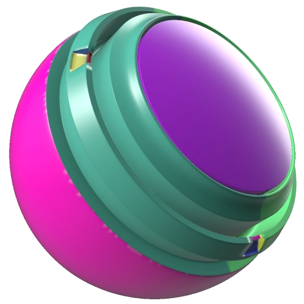

# UVランダムカラー

<table>
  <tr style="border: 0;">
    <td style="border: 0;" valign="top"> <strong>イン：</strong>ユーティリティ、マスク</td>
    <td style="border: 0;" valign="top"><strong>説明</strong> UVランダムカラージェネレーターは、各UV アイランドに固有の単色を割り当てます。 これは、複雑なメッシュを持つダイアグノスティックツールとして役立つ場合が多いものです。  UVランダムカラーは、マスクを作成する（白黒出力）か、塗りつぶしレイヤーとして直接使用し、UV アイランドに基づいてメッシュにカラーのバリエーションを適用できます。たとえば、木製の床の各板をランダム化します。</td>
  </tr>
</table>

## 入力

| 名前を入力 | 説明 |
| --- | --- |
| **カスタムグラデーション** | グラデーションマップを使用してカラー範囲を定義します。 |

## パラメーター

<table>
  <tr>
    <th>パラメーター名</th>
    <th>説明</th>
  </tr>
  <tr>
    <td><strong>シード</strong></td>
    <td>Dirtテクスチャの作成に使用するシード値を設定します。  <ul><li>別のランダムシードに切り替えるには、「ランダム」をクリックします。</li><li>鉛筆をクリックして現在のシード値を表示し、必要に応じて特定の値を入力します。</li></ul></td>
  </tr>
  <tr>
    <td><strong>カラーソースモード</strong></td>
    <td>使用するカラーソースモードを指定します。  <ul><li><strong>ランダム</strong>:ランダムモードでは、色がランダムに定義され、割り当てられます。</li><li><strong>カスタムグラデーション</strong> :カスタムグラデーションモードでは、カラーを選択するカスタムグラデーションマップを追加するための追加入力があります。</li></ul></td>
  </tr>
</table>
