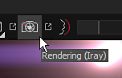

# Rayレンダラー

{width="600px"}

**Iray**&#x200B;は、[Nvidia](http://www.nvidia.com/object/nvidia-iray.html)によって開発されたGPUアクセラレーションパストラートレンダラーです。\
IRayを使用すると、シーン内および高解像度（高解像度）で非常に正確な照明で画像を作成することができます。

## 画像モード

Irayを起動するには、Substance 3D Painterのモードを変更する必要があります。\
これを行うには、さまざまな方法でキーを押します。

* **F10キー**&#x200B;を押して（または&#x200B;**F9**&#x200B;を押してペイントモードに戻る）
* メインツールバーのカメラアイコンをクリック
* モードメニューを使用

<table>
<tr style="border: 0;">
<td style="border: 0;" valign="top">

</td>
<td style="border: 0;" valign="top">

</td>
</tr>
</table>

## Iray パラメーター

Irayでは、特定のパラメーターのセットを使用しますが、Substance 3D Painterの通常のビューポートで共有される共通のプロパティも使用します。

* [画像設定](iray-settings.md)
* [ビューアとMDLの設定](viewer-and-mdl-settings.md)

## 表示設定

Display設定では、カメラとPostエフェクトの設定を制御できます。\
これらは通常のビューポートレンダリングと同じなので、同期が可能で、不要な照明の違いを避けることができます。

詳細については、専用ページを参照してください： [表示設定](../../interface/display-settings/display-settings.md)
