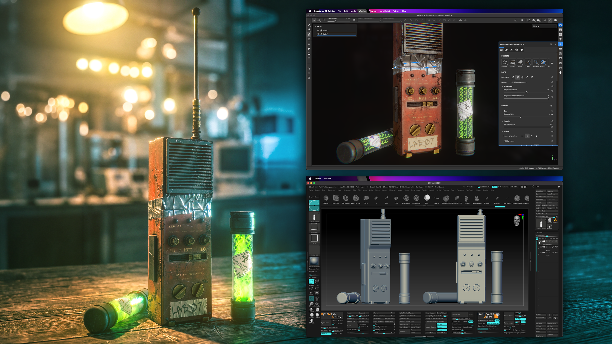
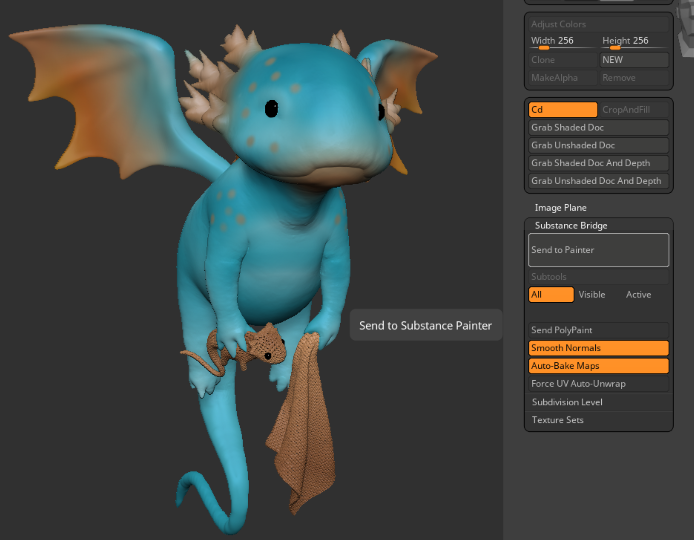

# PainterブリッジへのZBrush

ZBrush 2026.2.0（Maxon One 2026年4月アップデート）およびSubstance 3D Painter 12.0.2（SteamおよびCC版）以降では、ZBrushから最新バージョンのZBrushで自動的にインストールされたプラグインを介してPainterにモデルを直接送ることができます。

Substanceブリッジプラグインを使用すると、個別のlow-polyとhigh-polyファイルを書き出し、Painterに読み込み、ベイク処理の設定と実行という長いプロセスを経る必要がありません。

Zbrush to Painter bridgeの使用を開始するには：

1. ZBrushのバージョン2026.2.0がインストールされていることを確認してください。
1. **Python > zbrush_painter_plugin**&#x200B;がオンになっていることを確認して、Painter内のプラグインを有効にします。
1. ZBrushから、**Painterに送信**&#x200B;は、**テクスチャ/Substanceブリッジ**&#x200B;内で利用できます

## 構成

Painterでプロジェクトの自動作成に関する次の設定を構成できます。

| 設定 | 説明 |
| --- | --- |
| Painter に送信 | 現在の設定が適用された状態で、モデルをSubstance 3D Painterに送ります。 クリックするたびに、新しいSubstanceプロジェクトが最初から作成されます。 |
| **サブツール** | |
| すべて | 可視性に関係なく、すべてのサブツールを送信します。 眼球が入っているか入っていないかにかかわらず、すべてが送られます。 |
| 表示 | サブツールリストで目のアイコンがオンになっているサブツールのみを送信します。 |
| アクティブ | 現在選択されているサブツールのみを送信します |
| PolyPaintを送信 | PolyPaintをテクスチャマップに変換し、Substanceの塗りレイヤとして適用します。塗りレイヤの上にペイントし、ブレンドすることができます。 |
| スムーズ法線 | 書き出し時に接線の法線をスムーズにして、ファセットされたメッシュがSubstance内でスムーズに表示されるようにします。 オフにすると、ジオメトリの実際の面が表示されます。 |
| マップを自動ベイク | モデルの到着後にSubstanceのベイクアルゴリズムを自動的に実行し、高/低メッシュ比較から法線マップ、環境オクルージョン、曲率、およびその他の詳細マップを生成します。 |
| UVの自動ラップ解除を強制 | 受信するすべてのサブツールでSubstanceのUVアンラップアルゴリズムをトリガーします。 モデルに既に適切なUVがある場合は、UVが上書きされるので、オフにしておきます。 |
| 再分割レベル | 送信する再分割レベルを制御します。 「現在のレベル」を選択すると、表示されているレベルのみが送信されます。 「低&amp;高」は、ベーキングの最低値と最高値の両方を送信します。ほとんどのワークフローで推奨されるオプションです。 |
| テクスチャセット | UV空間をSubstanceに分割する方法を制御します。 Per SubTool（SubToolごとに1つのテクスチャセット）またはPer PolyGroup（各SubTool内のPolyGroupごとに1つのテクスチャセット）。 |

Painterがモデルを受け取ると、自動ベイク処理が有効になっている場合、ベイク処理が開始されます。 モデルの最も低いサブディビジョンはローポリゴンメッシュとしてインポートされたメッシュで、最も高いサブディビジョンはハイポリゴンとして使用され、ディテールがベイクされます。 ZBrushはPainterよりもはるかに多くのポリゴンを処理できるため、ローポリメッシュが最適なワーキングサイズを持っていることを確認してください（マシンによりますが、100万未満が最適です）。

Painterのテクスチャセットは、マテリアルの割り当てを表します。 1つのテクスチャセットは1つのUV空間に相当します。

* Per SubToolは、サブツールごとに1つのテクスチャセットを作成します（すべてのサブツールパーツは同じUV空間を共有します）。これは簡単なオプションです。
* Per PolyGroupでは、各サブツール内のPolyGroupごとに1つのテクスチャセットが作成され、マテリアルの割り当てをより細かく制御できます。

>[!NOTE]
>
>Steam版のPainterでは、ZBrushモデルを受け取るためにPainterが開いている必要があります。

## その他のリソース

[このビデオ](https://www.youtube.com/watch?v=fLkkwV4BzrU)を見て、Bridgeの動作を確認するか、[ZBrushドキュメント](https://help.maxon.net/zbr/en-us/Default.htm#html/reference-guide/texture/substance-bridge/substance-bridge.html?Highlight=painter)にアクセスして、詳細をご確認ください。
