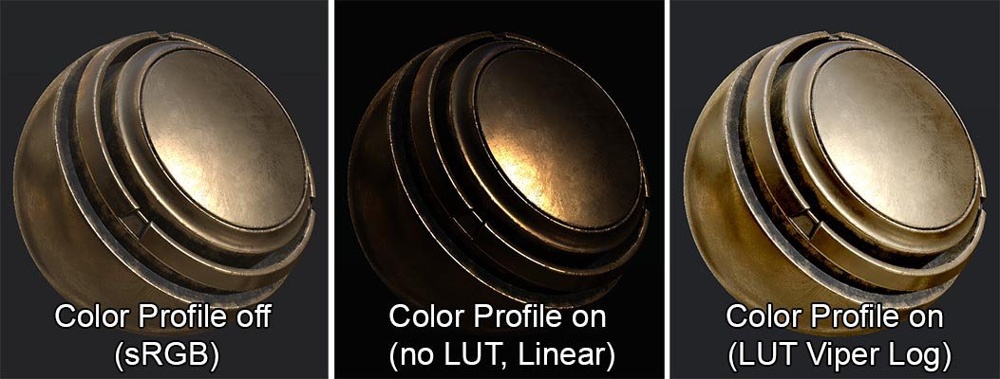
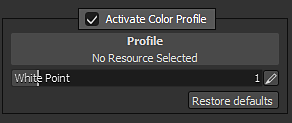

# カラープロファイル

{width="700px"}

Substance 3D Painterでは、**LUT**&#x200B;のテクスチャを読み込むことによって、**カラープロファイル**&#x200B;を&#x200B;**ビューポート**&#x200B;に割り当てることができます。\
カラープロファイルを使用すると、特定のカメラなどのターゲットに合わせて画面の最終的なカラーを補正できます。 多くの場合、プロファイルは、明るさ、ガンマ、コントラスト、またはカラーバランスを変更してカラーを操作します。

>[!NOTE]
>
> **LUT**&#x200B;は「**テーブルを検索**」を表します。 これは、カラーグレーディングをポストエフェクトとして実行するための最適化された方法です。 LUTは、ソースと結果の違いを補うために使用されます。\
>  Substance 3D Painterは、可能な解像度の&#x200B;**2Dテクスチャ** （フローティング）として保存された&#x200B;**3D** LUTを使用します（デフォルトは&#x200B;**2048 x 128ピクセル** ）。 つまり、カラー操作を保存する立方体は、並べて表示されるスライスに分割されます。 技術的な詳細については、**GPU Gem**&#x200B;の記事(<http://http.developer.nvidia.com/GPUGems2/gpugems2_chapter24.html>)を参照してください。

## カラープロファイルの使用

カラープロファイルは、ディスプレイ設定ウィンドウから読み込むことができます。\
「**カラープロファイルを有効化**」チェックボックスをオンにして、ビューポートに影響を与え、カラープロファイルを有効にします。



* 「カラープロファイルを有効化」が&#x200B;**無効**&#x200B;の場合、ビューポートのレンダリングは、マテリアルビューについては&#x200B;**sRGB**&#x200B;で実行されます（特定のチャンネルについてはリニア化されます）
* 「カラープロファイルを有効化」が&#x200B;**有効**&#x200B;の場合、ビューポートのレンダリングは、すべてのビュー（ソロチャンネルを含む）の&#x200B;**リニア/RAW**&#x200B;で実行されます

LUTテクスチャがリソーススロットに読み込まれる場合、 **マテリアルモード**&#x200B;でのビューポートのレンダリング操作に使用されます。\
そうでない場合は、レンダリングはリニア/RAWとして表示されます（例えば、ソロチャンネルビューの場合）。

**白色点**&#x200B;設定を使用すると、（LUTが有効になる前に）入力画像のトーンマッピングを変更できます。\
たとえば、太陽を見る場合、値は1（デフォルト）より大きい必要があります。 適正露出にするには、白色点を高い値に設定する必要があります。

白色点式は次のとおりです。

```
float Value = 1.0f / WhitePoint; // Value from the user interface 

float3 Output = clamp( HDR.rgb * Value, 0.0f, 1.0f );
```


カラープロファイルを使用する前に、特定のトーンマッピングを適用することができます。 [トーンマッピング](tone-mapping.md)で使用できる関数を確認してください。\
Substance 3D Painterは、白色点設定を介さない限り、入力カラーを処理しません。 例えば、適用されたShaper LUTはありません。

## カラープロファイルの作成

「**カラープロファイルを有効化**」が有効になっている場合、Substance 3D Painterはビューポートを&#x200B;**リニア**&#x200B;レンダリングに移動します。 つまり、LUTを適用する場合、カラーをリニアプロファイルから目的のターゲットに変換する必要があります。

### 方法1 ：アイデンティティLUTの変更

ID LUTの編集は、<b>Substance 3D Designer</b>など、<b>32ビットフローティング</b>テクスチャをサポートするソフトウェアで実行できます。 新しいプロファイルを作成するための出発点として、ID LUTをダウンロードします。

[color\_profile\_linear.exrをダウンロード](https://github.com/AdobeDocs/painter-python-api/raw/refs/heads/main/static/misc/color_profile_linear.exr)

### 方法2 : OpenColor IOを使用してLUTテクスチャを生成する

**OpenColor IO**&#x200B;ツールをインストールします。 次に、サンプルのOCIO設定をダウンロードします。こちらから入手できます： <http://opencolorio.org/downloads.html>\
次の引数を指定して&#x200B;**ociolutimage**&#x200B;プログラムを実行します：

```
ociolutimage --generate --cubesize 64 --config nuke-default/config.ocio --colorconvert linear srgb --output lutLinearToSRGB.exr
```


**注意**: **ocioconvert**&#x200B;プログラムを使用してこのLUTに色変換を適用することにより、**OpenColor IO**&#x200B;でID LUTを変更することもできます。

### 新しいカラープロファイルの読み込み

読み込みウィンドウを開きます（またはLUTをシェルフにドラッグ&amp;ドロップします）。 Substance 3D PainterにLUTテクスチャを読み込む場合は、新しいリソースソースに「**colorlut** 」**usage**&#x200B;を割り当ててください。 そうしないと、シェルフ内でリソースが正しく表示されません。

詳細については、新しいリソースのインポートに関するドキュメントを参照してください： [インポートウィンドウを使用したリソースの追加](https://helpx.adobe.com/substance-3d/unlisted/documentation/spdoc/adding-content-via-the-import-window-151584824.html)
