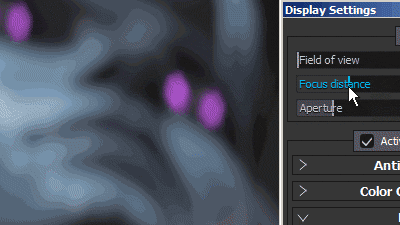

# 被写界深度

**フィールドの深度** (DOF)に直接パラメーターがありません。 有効にすると、**Iray**&#x200B;からの自由度が&#x200B;**上書き**&#x200B;されます。

ビューポート内の自由度の外観をコントロールするには、カメラを使用して次の2つの設定を使用できます。

| *設定* | *説明* |
| --- | --- |
| **焦点距離** | フォーカスポイントが位置する距離を定義します。  このポイントは「フィールドの深度」エフェクトで使用されます。 

 **注意：**&#x200B;フォーカス距離は、ショートカット&#x200B;**Ctrl +マウスの中ボタンでメッシュのポイントをクリックすることで自動的に設定できます。** |
| **絞り** | フィールドの深度の幅を指定します。 

 **注意：** Irayがこのパラメーターを制御している場合、このパラメーターを変更すると計算が再トリガーされます。 |
