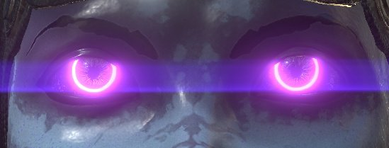

# グレア

パラメーターの説明：

| 設定 | 説明 |
| --- | --- |
| **輝度** | グレア効果の全体的な輝度です。 この値を0.0に設定すると、効果が完全に無効になります。  現実的な値の範囲は約0.5 ～ 4.0で、最大値は約16.0です。 |
| **しきい値** | しきい値より明るいピクセルのみが抽出され、グレアが生成されます。  自然な結果を得るには、0.0 ～ 1.0の値を指定することをお勧めします。 |
| **マップの変更** **係数** | 1.0以外の値を指定すると、抽出された高輝度コンポーネントはさらに非線形に拡張（または圧縮）されます。 1.0より大きい値を渡すと、明るいピクセルに対してグレアが強くなります。  他の効果に影響を与えることなく、グレアの輝度マッピングを個別に調整する場合に、このオプションを使用します。 明るいパスの後の輝度は、滑らかな曲線で増加し、輝度値1.0が&#x200B;**リマップ係数**&#x200B;に近づき、1.0を超える値が（**リマップ** **係数** ^2）に近づきます。 |
| **図形** | シェイプはグレアの外観を定義し、様々なモデルが使用可能です。<ul data-preserve-html="true"><li data-preserve-html="true"><strong>ブルーム</strong> ：ブルーム効果のみ。</li><li data-preserve-html="true"><strong>逆光：</strong>ブルーム/ゴースト（逆光）/残像</li><li data-preserve-html="true"><strong>標準：</strong>すべての基本要素をバランスよく含んだ型です。</li><li data-preserve-html="true"><strong>安いレンズ:</strong>安いレンズのシャープなゴーストやその他の表現。 </li><li data-preserve-html="true"><strong>画像の後：</strong>非常に強い残像を持つタイプ。 </li><li data-preserve-html="true"><strong>クロススクリーンフィルター：</strong>十字型スターフィルターのジェネレーターが取り付けられたレンズ。</li><li data-preserve-html="true"><strong>フィルターのクロススクリーンスペクトル</strong>：強力なスペクトルが付加された十字型スターフィルターのジェネレーターを備えたレンズです。</li><li data-preserve-html="true"><strong>フィルターSnowクロス</strong> : 6方向のスターフィルターのジェネレーターが取り付けられたレンズ。</li><li data-preserve-html="true"><strong>フィルターSnowのクロススペクトル</strong> : 6方向の強いスペクトラムを持つスターフィルターのジェネレーターが付いたレンズ。</li><li data-preserve-html="true"><strong>フィルターの日の丸</strong> : 8方向のスターフィルターのジェネレーターが取り付けられたレンズ。</li><li data-preserve-html="true"><strong>フィルターのサニークロススペクトル</strong> : 8方向に強いスペクトルが付いたスターフィルターのジェネレーターを備えたレンズ。</li><li data-preserve-html="true"><strong>水平線</strong> ：このレンズフレアタイプは、星に強い水平線を生み出します。</li><li data-preserve-html="true"><strong>垂直筋</strong> ：垂直方向に星の強い筋が入った書体です。 CCDデジタルカメラ等のスミア。</li></ul> |

## シェイプの例

