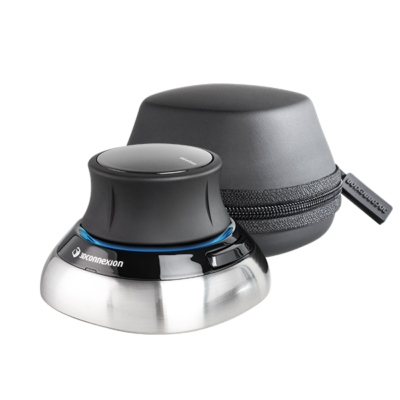

# SpaceMouse® by 3Dconnection

SpaceMouse® by 3Dconnectionは、3Dで簡単にナビゲーションできるデバイスです。 アプリケーションビューポートでカメラ/3Dモデルを操作するために使用できます。

* SpaceMouse®はバージョン7.4.2以降でサポートされています。
* このデバイスを正しく使用するには、[3Dconnection](https://3dconnexion.com/uk/drivers/)から最新のドライバーをインストールしてください。

>[!NOTE]
>
> コンパクトモデルを使用していて、環境マップを頻繁に回転する必要があるユーザーは、左ボタンにShiftキーを割り当てることをお勧めします。

## チュートリアル

## 概要

メインコントロールノブまたはSpaceMouse®を使用すると、通常のマウス/スタイラスおよびキーボードコントロールでは不可能な方法でビューポートを回転、パン、ズームできます。 このデバイスは、マウスおよびスタイラス付きタブレットと組み合わせて使用できます。

すべてのモデルとバージョンは、アプリケーションと互換性がある必要があります。

| モデル | 説明 | ビジュアル |
| --- | --- | --- |
| **コンパクトモデル** | ノブコントロール付きのベースモデルです。 | 

 |
| **Proモデル** | ノブのコントロールと、キーボードショートカットの追加ボタン。 | 

 |
| **エンタープライズモデル** | ノブコントロール、追加のボタン、およびコンテキスト表示。 | 

 |

>[!NOTE]
>
> Compact、Pro、Enterpriseの各モデルは、アプリケーションで正しく動作するようにテストおよび検証されています。

## 円形メニュー

メニューには、デバイスから直接アクセスできます。

* コンパクトモデルで、左ボタンをクリックし、円形メニューからプロパティを選択します。

  {width="250px"}
* ProモデルおよびEnterpriseモデルでは、メニューボタンを押すと、プロパティメニューにアクセスできます。

または、システムトレイ（システム時計の横）の3D接続アイコンを右クリックし、**[3D接続の設定を開く]**&#x200B;を選択します。 このメニューは、最後にアクティブだったウィンドウに基づいて状況依存になります。 タイトルバーには、対応するプログラムが示されます。Adobe Substance 3D Painterでない場合は、Painterウィンドウに切り替えてから、設定ウィンドウに戻ります。

## 初期設定

{width="400px"}

SpaceMouse®の設定パネルでは、最新バージョンのドライバーでPainterのデフォルト設定を利用できます。 追加の設定は必要ありません。デバイスを接続するだけで、プラグアンドプレイできます。

上部のドロップダウンメニューから正しいデバイスを選択してください。デフォルトでは、正しいデバイスが選択されます。

「速度」スライダーは、すべての軸と方向の感度を変更します。

### 詳細設定

「詳細設定」ボタンをクリックすると、メインコントロールの詳細な動作を変更できます。

デフォルトの設定は変更できます。 タブ&#x200B;**ナビゲーションモード**&#x200B;と&#x200B;**回転中心**&#x200B;には、2つの重要なセクションがあります。

#### ナビゲーションモード

{width="400px"}

3Dでノブがどのように動作するかを定義します。

| 設定 | 説明 |
| --- | --- |
| オブジェクトモード | ノブは3Dオブジェクト自体で、デフォルトになっています。 |
| カメラモード | 3Dでカメラを自由に制御。 |
| ターゲットカメラモード | 3D空間の特定の点をターゲットとするカメラを常に制御します。 |
| ヘリコプターモード | 3D空間でヘリコプターをコントロールします。 |
| 水平線をロック | 水平が常に水平になるようにカメラをロックします。 Painterにも同様のオプションが用意されていますが、ここで個別に制御できます。 デフォルトではロックされています。 |

#### 回転の中心

{width="400px"}

小さなピボットアイコンの動作を定義します。

| 設定 | 説明 |
| --- | --- |
| 自動 | 基点またはカメラターゲットを自動的に移動します。オフにすると、常にメッシュ原点の基点に固定されます。 |
| 常に表示 | 基点は、デバイスと対話しない場合でも、常に3Dビューポートに表示されます。 |
| モーションで表示 | 基点は、デバイスと対話する場合にのみ3Dビューポートに表示されます。 これはデフォルトのオプションです。 |
| 非表示 | 3Dビューポートの基点を完全に削除します。 |

>[!NOTE]
>
> ピボットポイントはPainter専用に設計されていますが、必要に応じて非表示にすることができます。

### ボタン

{width="400px"}

**ボタン**&#x200B;をクリックすると、コマンド、マクロ、または放射状メニューを割り当てることができます。 詳細については、[3Dconnectionドキュメント](https://3dconnexion.com/uk/support/faq/)を参照してください。
