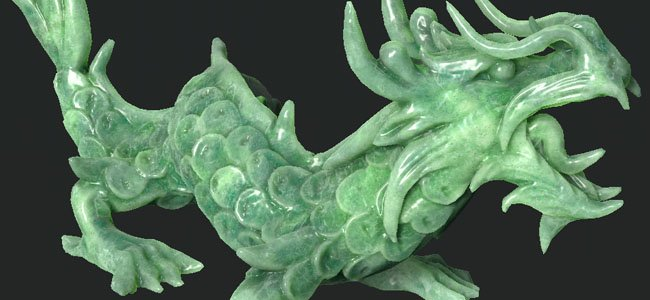
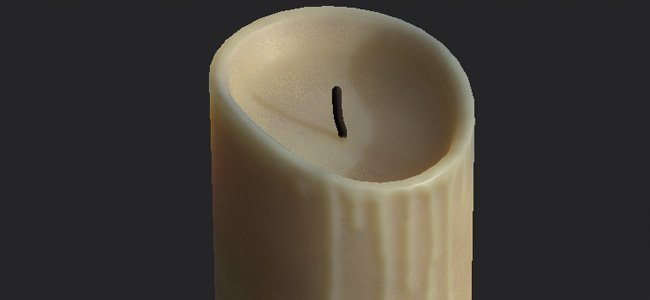

# サブサーフェスマテリアルタイプ

このページでは、サブサーフェススキャタリング機能を使用して作成できる各種マテリアルと、それらを作成するためのSubstance 3D Painterの設定方法について説明します。 マテリアルの種類ごとに尺度と色が与えられ、[サブサーフェスパラメータ](subsurface-parameters.md)で設定できます。

>[!NOTE]
>
> このページにリストされている値は、それぞれのタイプのマテリアルの概要を示すために使用されます。 これらは正確な値ではなく、プロジェクトごとに解釈したり調整したりする必要があります。

## ヒトの皮膚

適切なスキンマテリアルを作成するには、次の手順を実行します。

* 良いベーステクスチャ：リアルなキャラクターの場合、ディテールが多く、様々なカラーがあることを意味します。
* 強いHeight/法線テクスチャ：表面下効果は、表面のディテールを柔らかくし、最初から強いディテールがあると相殺されます。

| *設定* | *説明* |
| --- | --- |
| **スケール** | <ol data-preserve-html="true"><li data-preserve-html="true">05～0.2</li></ol> |
| **色** | **R** : 0.575 **G** : 0.894 **B** : 0.376 

 **注意：**&#x200B;この色は白人肌に適しています。 |

リアルな人間の例は、実在する人の3Dスキャンで見つけることができます。

* デジタルエミリー： <http://gl.ict.usc.edu/Research/DigitalEmily2/>
* 無限現実LPSヘッド: <http://www.ir-ltd.net/> | <http://casual-effects.com/data/>

## ヒスイ

**ヒスイ**&#x200B;は装飾用の鉱物で、古代アジアの芸術で特に注目を集めている緑の品種で主に知られています。

| *設定* | *説明* |
| --- | --- |
| **スケール** | <ol data-preserve-html="true"><li data-preserve-html="true">25</li></ol> |
| **色** | **R** : 0.575 **G** : 0.894 **B** : 0.376 

 |

## 大理石

| *設定* | *説明* |
| --- | --- |
| **スケール** | <ol data-preserve-html="true"><li data-preserve-html="true">25</li></ol> |
| **色** | **R** : 0.845 **G** : 0.777 **B** : 0.525 

 |

## ろう

ワックスは広範囲に及ぶ有機化合物を再編成する。 天然に存在するが、製造ラボで合成することもできる。 ワックスは、例えばロウソクの中に見つけることができます。

| *設定* | *説明* |
| --- | --- |
| **スケール** | <ol data-preserve-html="true"><li data-preserve-html="true">6以上</li></ol> |
| **色** | **R** : 0.820 **G** : 0.470 **B** : 0.205 

 |

## 牛乳

| *設定* | *説明* |
| --- | --- |
| **スケール** | <ol data-preserve-html="true"><li data-preserve-html="true">7</li></ol> |
| **色** | **R** : 0.895 **G** : 0.833 **B** : 0.750 

 |
