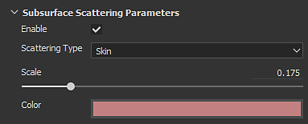
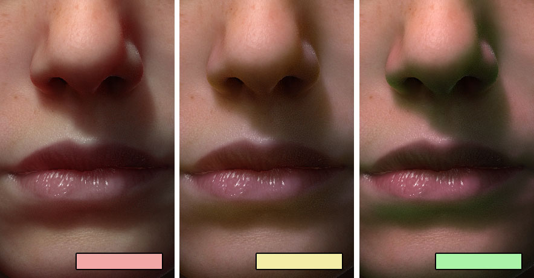

# サブサーフェスパラメータ

Substance 3D Painterのリアルタイムサブサーフェスの実装は、画面空間の表面化散乱効果です。 制御するパラメーターについては、このページで説明します。\
現在の実装は、PIXAR](http://graphics.pixar.com/library/ApproxBSSRDF/)によって公開された「効率的なサブサーフェス散乱のための近似反射プロファイル」手法[に基づいています。

これらのパラメーターに基づくマテリアルの例については、[サブサーフェスマテリアルの種類](subsurface-material-type.md)を参照してください。

## シェーダ/MDLパラメータ

[シェーダー設定](../../interface/shader-settings/shader-settings.md)ウィンドウで使用できます。

| *設定* | *説明* |
| --- | --- |
| **有効にする** | このシェーダー/mdlインスタンスに対する表面化散乱効果をアクティブ化または非アクティブ化します。  不要なマテリアルのSSS効果を無効にできます。 |
| **散布の種類** | マテリアル内のライト吸収の動作を定義します。<ul data-preserve-html="true"><li data-preserve-html="true"><strong>半透明</strong>：光がオブジェクトに深く浸透できる、ヒスイや大理石などの一般的なマテリアルに適しています。</li><li data-preserve-html="true"><strong>スキン</strong>：光がすばやく吸収され、表面近くの散乱のみが吸収されるオーガニックスキンに適しています。</li><li data-preserve-html="true"><strong>赤のシフト/レイリー</strong>：人間または生物のサーフェスの肌をシミュレートする場合は、肌の設定よりも正確です。</li></ul> |
| **スケール** | マテリアル内のライトの吸収の半径/深度を制御します。 このパラメーターのビヘイビアーは、シーン内のメッシュのサイズに応じて変化します。人間の大きさの頭のスケール0.0、0.2、1.0の比較：   

 |
| **色** | マテリアルに吸収されたときの光の色。3色の比較：   

 |

### 表示設定パラメータ

[表示設定](../../interface/display-settings/display-settings.md)ウィンドウで使用できます。

>[!NOTE]
>
> このパラメーター&#x200B;**は、表面化散乱効果の**&#x200B;リアルタイム&#x200B;**バージョンの**&#x200B;にのみ影響します。

| *設定* | *説明* |
| --- | --- |
| **サンプル数** | 画面空間でサブサーフェスぼかしを生成するために実行されるサンプルの量を制御します。 サンプル数が多いほどノイズは低くなりますが、パフォーマンスに影響します。サーフェスの近くで見たときの8、32、64のサンプルの比較：   

  **注意：**&#x200B;サンプルの量を増やすことなく[カメラの設定](../../interface/display-settings/camera-settings.md)を有効にすることで、ノイズの量を減らすこともできます。 |
