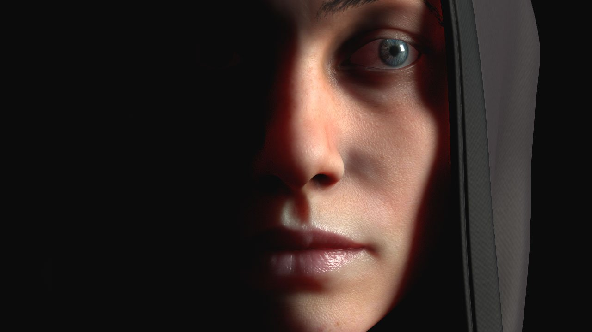

# 表面下散乱

{width="500px"}

&#x200B;>> 

(クレジット：The Soldier [by Ribeyrolles Leo](https://www.artstation.com/artwork/xNYDm) )

Substance 3D Painterは、**リアルタイムビューポート**&#x200B;と[Irayレンダラー](../../features/iray-renderer/iray-renderer.md)の両方で、**サブサーフェススキャッタリング**&#x200B;をサポートしています。

サブサーフェスのスキャタリングは、オブジェクトまたはサーフェスを貫通する際の光のメカニズムです。 光の一部が金属の表面のように反射されるのではなく、物質に吸収されて、**内部で散乱**&#x200B;されます。 この動作は、「**S** ub **S** urface **S** cattering」の頭字語&#x200B;**SSS**&#x200B;で知られています。 実際の多くのマテリアルには、肌やワックスなどの表面下の散乱があります。

詳しくは、次のページを参照してください。

* [プロジェクトでサブサーフェスを有効にする](enabling-subsurface-in-a-project.md)
* [サブサーフェスパラメータ](subsurface-parameters.md)
* [サブサーフェスマテリアルタイプ](subsurface-material-type.md)
