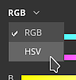
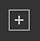

# カラーピッカー

カラーピッカーを使用すると、メッシュ上でペイントまたは投影するカラーを設定できます。 外部の画像からカラーを選択したり、アプリケーション内の既存の画像を調整するために使用できます。

カラーピッカーウィンドウは、Painterのカラーフィールドをクリックすると表示されます。カラーフィールドは、プロパティ、またはDisplayパラメーターやShaderパラメーターなどの追加の設定またはメニュー内にあります。

## カラーピッカーの概要

開くと、カラーピッカーは半永続的に保持されます。つまり、ペイントレイヤーから塗りつぶしレイヤーに切り替えるなど、コンテキストが変更されるまで開いたままになります。 ウィンドウを移動して、使用可能な任意の画面に配置できます。 ただし、他のウィンドウとは異なり、カラーピッカーをドッキングすることはできません。

ウィンドウは垂直方向のレイアウトで、次の3つのセクションで構成されます。

* グラデーションピッカー（またはスペクトル）
* スライダー(RGB/HSV)
* スウォッチ

{width="200px"}

### グラデーションピッカー（スペクトル）

| 名前とビジュアル | 説明 |
| --- | --- |
| **表示セレクター** 

 | カラーの編集に使用するディスプレイ（スペクトルとスライダー）を選択できます。 既定値は、メインビューポートで使用される表示と一致します。  **注意：**&#x200B;この設定は、[カラーマネジメント](../features/color-management/color-management.md)が有効になっている場合にのみ使用できます。 |
| **スペクトル** 

 | 垂直方向のスライダーは、一般的な色相です。 グラデーションフィールド内に表示するカラーのシェードを選択できます。一般シェードを選択したら、グラデーションフィールドで十字カーソルを押したままドラッグして、目的のカラーを選択できます。  **注意：** [カラーマネジメント](../features/color-management/color-management.md)が有効になっている場合、現在のディスプレイのHDRカラーがクランプされます（作業用カラースペース内）。 これは、カラーマネジメントされたチャンネルで出力HDR値が使用されないためです。 |
| **現在および前の色** 

 | 左側のボックスは、カラーピッカーから出力される最終的なカラーを示します。右のボックスには、前のカラー（カラーピッカーを開いたときのカラー）が表示されます。 それをクリックして以前のカラーに戻し、現在のカラーにすることができます。 |
| **16進フィールド** 

 | 16進数のフィールドは、現在のカラーを16進数の値で表します。 RGBコンポーネントは、1対の文字として表示されます。例えば、#FF0000は赤色を表します。  **注意：** [カラーマネジメント](../features/color-management/color-management.md)が有効になっている場合、現在の表示やプロジェクトで使用している作業用スペースに関係なく、16進数フィールドは常に標準のsRGBカラースペースで機能し、ソフトウェア間で値を簡単にコピー/ペーストできます。 |
| **スポイト** 

 | スポイトツールを使用して、外部ソースからカラーを選択できます。 アイコンの&#x200B;**クリック**&#x200B;して使用するには、マウスを動かしてから再度、必要な色をコピーします。  **注意：**&#x200B;ビューポート内でカラーを選択する場合、**Shift**&#x200B;修飾子を使用して、直接編集された現在のチャンネルを選択することができます。 これにより、元のテクスチャと画面に表示される色との間で非可逆な色変換を行う必要がなくなります。 これは、**マテリアル**&#x200B;表示モードから切り替えることなくカラーを選択する場合にも便利です。 

  **注意：**&#x200B;カラーフィールドの横にはスポイトツールが付いているので、カラーピッカーを開かずにすばやくカラーを選択できます。 

  **注意：** Mac OSでは、プライバシーの設定により、スポイトがアプリケーションインターフェイス外の色を選択できない場合があります。 この問題を解決するには、次のアプリケーションに適切な権限を割り当てます： `System Preferences > Security & Privacy > Privacy > Screen Recording` |

### カラー設定

| 設定 | 説明 |
| --- | --- |
| **スポイトのカラースペース** | ビューポートの外側で選択した色のカラースペースを指定します。**自動**&#x200B;設定では、プロジェクト設定の標準sRGBカラースペースが使用されます。 

 **注意：**&#x200B;この設定は、カラーボタンの横にあるスポイトツールにも適用されます。  **注意：**&#x200B;ビューポート内で選択した色も、[Shift]を使用しない場合にこのプロファイルを使用します。 |

### スライダー

カラースライダーを使用すると、個々の値を手動で調整できます。

スライダーには、**HSV**&#x200B;または&#x200B;**RGB**&#x200B;という2つの異なるモードを設定できます。 モードを変更するには、専用のドロップダウンメニューを使用します。

#### HSV

**HSV**&#x200B;は&#x200B;**H** ue、**S** aturationおよび&#x200B;**V** alueを表します。

**色相**&#x200B;では、垂直方向のグラデーションスライダーのように、全体的なカラーファミリーを順に切り替えることができます。

**彩度**&#x200B;は、選択したカラーの深みを制御し、グレースケールから完全な彩度まで変化します。

**値**&#x200B;は、カラーの暗さや明るさを指定するもので、完全な黒から完全な白までの範囲です。

#### RGB

**RGB**&#x200B;は&#x200B;**R** ed、**G** reenおよび&#x200B;**B** lueを表します。

これらは、コンピューターグラフィックにカラーを保存するためにデジタルで使用される主要なコンポーネントです。 各スライダーは、最終的なカラーに含まれるコンポーネントの量を表します。

例：下の画像は、レッドを100%、ブルーとグリーンを50%含むカラーです。

一般的には、RGBスライダーは0 ～ 255の値で測定されます。 これは、**浮動小数点値**&#x200B;オプションを無効にすることで実行できます。

### スライダー設定

設定メニューを使用すると、いくつかの追加のビヘイビアーを設定できます。

| 設定 | 説明 |
| --- | --- |
| **動的スライダー** | 有効にすると、現在のカラーに基づいてスライダーの背景色が調整されます。 |
| **浮動小数点値** | 有効にすると、スライダーの値は0.0から1.0の間で表示されます。無効にすると、次のようになります。<ul data-preserve-html="true"> <li data-preserve-html="true"><strong>HSV</strong>：色相スライダーは、色相環と同様に度数で測定されます。 彩度と値にはパーセント値を使用します。 </li> <li data-preserve-html="true"><strong>RGB</strong>:コンポーネントは、0から255までの値で表されます。</li> </ul> |

## 作業カラースペース

このセクションには、現在の作業用カラースペースが与えられた最終的なカラー値が表示されます。

**作業用カラースペース**&#x200B;のタイトルにマウスを合わせると、現在のカラースペースの名前が表示されます。

>[!NOTE]
>
> このセクションは、[カラーマネジメント](../features/color-management/color-management.md)が有効な場合にのみ使用できます。

## スウォッチ

カラースウォッチを使用すると、カラーを保存しておいて、後で再利用することができます。 スウォッチは、プロジェクションとセッションにまたがって利用できます。

### スウォッチを追加

このボタンをクリックすると、現在のセットに新しいスウォッチカラーが作成されます。

スウォッチカラーは、最後のカラー（ボタンの横にあるカラー）が現在編集しているカラーと異なる場合にのみ作成されます。

>[!NOTE]
>
> 現在の[カラーマネジメント](../features/color-management/color-management.md)の設定に関係なく、スウォッチの色が管理され、sRGBカラーとして保存されます。

### スウォッチカラー

スウォッチカラーをクリックして読み込みます。

スウォッチにカーソルを合わせると、16進数値が表示されます。

>[!NOTE]
>
> [カラーマネジメント](../features/color-management/color-management.md)が有効になっている場合、色の表示は現在選択されているディスプレイに基づいて調整されます。

### スウォッチ設定

スウォッチカラーを右クリックしてメニューを開き、削除します。

### 設定メニュー

設定メニューを使用して、すべてのスウォッチを削除します。

>[!NOTE]
>
> スウォッチは、ユーザーのドキュメントフォルダーにある設定ファイル内に保存されます。 詳しくは、[シェルフとアセットの場所](../pipeline-and-integration/resource-management/shelf-and-assets-location.md)ページを参照してください。
