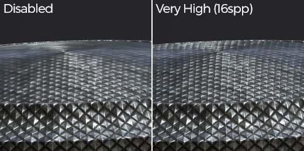
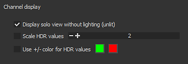
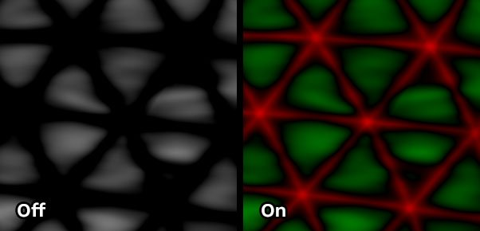

# ビューポート設定

**表示設定**&#x200B;のこのセクションでは、ワイヤーフレームやメッシュフィルタリングなど、ビューポートの表示に関連するさまざまな設定を制御します。

## テクスチャのフィルタリング

異方性フィルタリングおよびミップマップバイアスを使用すると、ビューポート内のテクスチャの表示を制御できます。 これらの設定はテクスチャに直接影響せず、書き出し時には適用されず、ビューポートでレンダリングプロセスを調整するだけです。 「バイアス」を設定すると、ピクセルが離れている場合や斜めに配置されている場合に、非常にシャープなテクスチャを使用できます。ただし、場合によっては、モアレパターンやジッターが発生することがあります。

デフォルト設定は品質とパフォーマンスの妥協であり、本当に必要な場合にのみ変更してください。

| *設定* | *説明* |
| --- | --- |
| **異方性フィルタリング** | 異方性フィルタリングを使用すると、斜めの角度から見たときのテクスチャの画質が向上します。 値を高くするとフィルタリングは良くなりますが、パフォーマンスが低下する可能性があります。 この設定は、フィルタリングに使用される1ピクセルあたりのサンプル数(spp)を制御します。<ul data-preserve-html="true"><li data-preserve-html="true"><strong>無効</strong> : フィルタリングがありません</li><li data-preserve-html="true"><strong>低</strong> (2spp)</li><li data-preserve-html="true"><strong>中</strong> (4spp) :デフォルト値</li><li data-preserve-html="true"><strong>高</strong> (8spp)</li><li data-preserve-html="true"><strong>非常に高い</strong> (16spp)</li></ul> 

 |
| **ミップマップバイアス** | ディテールのミップマップレベルをオフセットして、テクスチャの画質を向上させます。 シャープな値にすると、パフォーマンスが低下したり、テクスチャがギザギザになる可能性があります。<ul data-preserve-html="true"><li data-preserve-html="true"><strong>0 – ソフト</strong> （軽量パフォーマンス） ：既定値</li><li data-preserve-html="true"><strong>1 – 中ソフト</strong></li><li data-preserve-html="true"><strong>2 – シャープ</strong></li><li data-preserve-html="true"><strong>3 – 非常にシャープ</strong> （負荷の高いパフォーマンス）</li></ul>(0 ～ -3) |

## カメラフレーム

カメラ管理の詳細については、[カメラ管理](../viewport/camera-management.md)を参照してください

## ツールの表示

| *設定* | *説明* |
| --- | --- |
| **描画時にステンシルを非表示にする** | ステンシルを使用する場合（ペイントツールのプロパティを参照）、この設定により、メッシュにペイントするときにツールが一時的に非表示になります。 |
| **ステンシルの表示の不透明度** | ペイントしないときのビューポートレンダリング上のステンシルの可視性を制御します。 |
| **投影プレビューチャンネル** | 投影ツールを使用するときに表示するマテリアルのチャンネルを制御します。 |

## メッシュワイヤーフレーム

| *設定* | *説明* |
| --- | --- |
| **ワイヤーフレームを表示** | ビューポートでのメッシュワイヤーフレームの表示を有効または無効にします。 |
| **ワイヤーフレームの色** | ワイヤーフレームの描画に使用する色をコントロールします。 |
| **ワイヤーフレームの不透明度** | メッシュの上に描画されるワイヤーフレームの表示量を制御します。 |

## チャンネル表示

>[!NOTE]
>
> チャンネルの表示設定は、**単一チャンネル**&#x200B;表示モードを使用する場合にのみ使用できます。

| *設定* | *説明* |
| --- | --- |
| **照明なしで単独のビューを表示（消灯）** | シングルチャンネルモードで表示している場合、この設定を有効にすると照明が消え、チャンネルが単色で表示されます。 無効にすると、メッシュの境界線にシャドウが適用されます。 |
| **HDR 値の拡大/縮小** | シングルチャンネルモードでHeightなどの&#x200B;**HDR** テクスチャを表示する場合、この設定により合計値がスケールされます。 これは、-1より大きい値や–1より小さい値を表示する場合に便利です。 結果は&#x200B;**スケールで分岐**&#x200B;したチャンネルに等しくなります。次の例では、Heightチャンネルの値は最大3です。 ただし、デフォルトでは拡大・縮小の値が変更されない限り表示されません。 

 |
| **HDR 値に+/ – 色を使用する** | この設定を使用すると、正の値を最初のカラーで置き換え、負の値を2番目のカラーで置き換えることで、HDRのテクスチャをより簡単に見ることができます。 ニュートラル値(0)は黒です。例： 

 |
| **カラーチャンネル** | 現在のチャンネルのR、G、B、またはAlphaコンポーネントのみを個別に表示するには、ビューポートビューモードを変更します。 この設定は、マテリアル表示モードでは使用できません。 有効にすると、選択したカラーチャンネルの名前がビューポートに表示されます。  

  有効な値：<ul data-preserve-html="true"><li data-preserve-html="true"><strong>RGBA</strong> （既定）:カラーチャンネルで、透明度を持つすべてのコンポーネントを表示します。</li><li data-preserve-html="true"><strong>グレースケール+ Alpha</strong> （既定値）:グレースケールチャンネルで、透明度のあるグレースケール値を表示します。</li><li data-preserve-html="true"><strong>R</strong>:カラーチャンネルでは、赤のコンポーネントのみを表示します。</li><li data-preserve-html="true"><strong>G</strong>:カラーチャンネルでは、緑のコンポーネントのみを表示します。</li><li data-preserve-html="true"><strong>B</strong> :カラーチャンネルでは、青コンポーネントのみを表示します。</li><li data-preserve-html="true"><strong>Alpha</strong>：任意のチャンネルで、テクスチャの透明度のみを表示します。</li></ul> |

## グリッド

グリッド設定を使用すると、3D ビューポート内の3D グリッドの描画を表示および制御できます。

グリッドの分割は、ズームと角度の現在のカメラレベルに基づいて自動的に行われます。 現在のグリッドユニットは、ビューポートの左下に表示されます。

| 設定 | 説明 |
| --- | --- |
| **グリッドを表示** | 有効な場合は、3D ビューポートにグリッドを表示します。 |
| **軸** | ビューポートにグリッドを表示する軸を指定します。 これがアプリケーションのアップ軸であるため、デフォルト値はYです。 |
| **グリッドの色** | ビューポートで描画したときのグリッドの色です。 |
| **グリッドの不透明度** | ビューポートのグリッドの不透明度。 |
