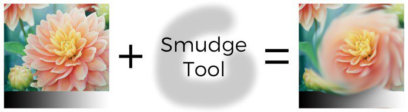
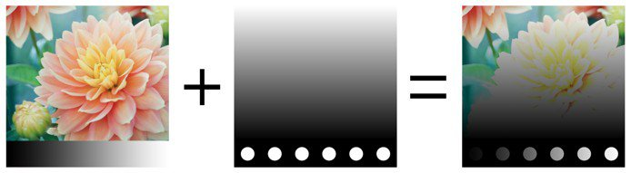
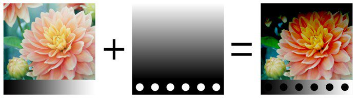
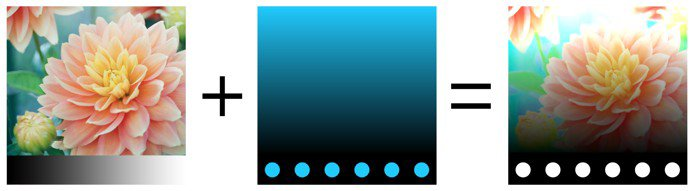

# 描画モード

レイヤーと効果は、多くの&#x200B;**描画モード**&#x200B;にアクセスできます。 これにより、レイヤーの結果をその下にある他のレイヤーと異なる方法でミックスできます。

すべての描画モードがすべてのユースケースに適しているわけではありません。 例えば、**法線マップ**&#x200B;の描画モードは、テクスチャセットの&#x200B;**法線チャンネル**&#x200B;にのみ有効です。

## 描画モードの順序

描画モードが適用される方法とタイミングを理解するには、**レイヤースタック**&#x200B;で操作が実行される順序を理解することが重要です。

1. 下部のレイヤーが計算されます。
1. 上のレイヤーが計算され、描画モードに基づいて下のレイヤーと混合されます（例：乗算）。
1. マスクを適用して、上のレイヤーを最終的な外観にします

## 描画モードの変更

レイヤー内の&#x200B;**各チャンネル**&#x200B;の描画モードを変更できます。 チャンネルを切り替えるには、レイヤースタックウィンドウの左上のドロップダウンを使用します。

描画モードを変更するには、特定のレイヤーの描画モードドロップダウンをクリックします。

>[!NOTE]
>
> ドロップダウンにフォーカスがある場合は、次のショートカットを使用して描画モードをすばやく切り替えることができます。
> 
> * 上向き矢印または下向き矢印のキーボードショートカット
> * マウスホイールを上下に動かす

## 描画モードのリスト

Substance 3D Painterのレイヤーとエフェクトで使用できるすべての描画モードを以下に示します。 ほとんどの描画モードは、RGB（またはグレースケール）の処理によって機能しますが、一部の処理は[HSV （色相、彩度、値）](https://en.wikipedia.org/wiki/HSL_and_HSV)という別のモードでも機能します。 すべての描画モードは、内部の&#x200B;**リニアガンマ空間**&#x200B;で実行されます。

| *名前* | *説明* |
| --- | --- |
| 法線 | 一番上のレイヤーを変形せずに一番下のレイヤーの上に表示します（コピーモード）。 上のレイヤーに透明度（アルファ）がある場合は、透明ピクセルを通して下のレイヤーが表示されます。 

 |
| Passthrough | 下のレイヤーを上のレイヤーに統合します。 主に次の場合に役立ちます。<ul data-preserve-html="true"> <li data-preserve-html="true">最上位レイヤーの下にあるすべてのレイヤーにエフェクトを適用するには</li> <li data-preserve-html="true">一番上のレイヤーの下にあるレイヤーをこする、またはコピーするには</li> </ul> 

 **注意：** **効果**&#x200B;は、レイヤースタックに直接&#x200B;**ドラッグ&amp;ドロップ**&#x200B;できます。この操作を行うと、すべてのチャンネルで描画モードが「通過」に設定されたレイヤーが作成されます。 |
| Disable | レイヤーのブレンドを破棄し、前のレイヤーのみを表示します。 このエフェクトを使用すると、最上位レイヤーのチャンネルを無視して、チャンネルの計算を最適化することができます。 

 |
| 置き換え | 下のレイヤーを上書きします。 これは、下にあるレイヤーと情報が混ざり合うのを防ぐのに便利です。 「置き換え」は、最上位レイヤーに存在するアルファも無視されるため、透明ピクセルになる可能性があるため、通常の描画とは動作が異なります。 

 |
|  |  |
| 乗算 | 一番上のレイヤーを一番下のレイヤーの上に重ねます。 結果は常に暗い色になります。 

 |
| Divide | 下のレイヤーを現在のレイヤーのカラー情報で割ります。 結果画像はほとんどの時間が明るくなり、焼け落ちているように見えることがあります。 

 |
| 逆除算 | 分割ブレンドモードと同じですが、ブレンド操作で上位レイヤーと下位レイヤーが入れ替わります。 

 |
| 比較 (暗) (最小) | 一番上のレイヤーと一番下のレイヤーの間のカラーの最小値を維持します。 

 |
| 比較 (明) (最大) | 一番上のレイヤーと一番下のレイヤーの間のカラー値を最大値のままにします。 

 |
|  |  |
| 覆い焼き (リニア) - 加算 | 上レイヤーのカラー値を下レイヤーに追加します。 結果は、0未満または1より大きいカラーを与えることができます。この場合、チャンネルがHDRでない場合、結果はクランプ/クリップされます。 この描画モードは、Height情報などを集める場合に便利です。 

 |
| 減算 | 下のレイヤーから上のレイヤーのカラーを減算します。 結果は、0未満のカラーを与えることができます。この場合、チャンネルがHDRでなければ、結果はクランプ/クリップされます。 

 |
| Inverse Subtract | 削除の描画モードと同じですが、描画モードでは、上レイヤーと下レイヤーが入れ替わります。 

 |
| Difference | 下のレイヤーから上のレイヤーのカラーを減算しますが、結果の絶対値を受け取ります（負の値は正の値になります）。 

 |
| 除外 | 差描画モードと似ていますが、コントラストは低くなります。 

 |
| 署名済みの追加(AddSub) | 「両方」を選択すると、上位レイヤーのカラーに基づいて、下位レイヤーのカラー情報が増減されます。 グレースケール値は影響しませんが、暗いカラーでは情報が減算され、明るいカラーでは情報が加算されます。 

 |
|  |  |
| オーバーレイ | スクリーン描画モードと乗算描画モードを組み合わせます。 一番上のレイヤーのグレースケール値は無視されますが、暗いカラーでは色が乗算され、明るいカラーでは明るくなります。 

 |
| スクリーン | 最上位レイヤーと最下位レイヤーのカラー情報を反転して乗算し、その結果を再度反転します。 これにより、「乗算」描画モードと逆の視覚的な結果が生成され、画像が明るくなります。 

 |
| 焼き込み (リニア) | 上位レイヤーと下位レイヤーのカラー情報を加算した結果から1を減算します。 

 |
| 焼き込みカラー | 下のレイヤーを上のレイヤーで分割します。 操作が実行される前に、Bottomレイヤーが反転されます。 このブレンド操作により、上のレイヤーは暗くなり、コントラストが上がって下のレイヤーの色が表示されます。 下のレイヤーが暗いほど、そのカラーが多く使用されます。 

 |
| 覆い焼きカラー | 下のレイヤーを反転された上のレイヤーで分割します。 この操作により、上のレイヤーの値に応じて下のレイヤーが明るくなります。 上のレイヤーが明るいほど、下のレイヤーへのカラーの影響が大きくなります。 

 |
|  |  |
| ソフトライト | オーバーレイ描画モードと似ていますが、カラー情報をブレンドする別のカーブを適用して、画像のコントラストを下げます。 

 |
| ハードライト | オーバーレイ描画モードと同様です（乗算とスクリーンの両方の操作を組み合わせます）。 違いは、操作の順序が反転されることで、カラーは暗くなるか明るくなりますが、コントラストが低下する画像が作成される点です。 

 |
| ビビッドライト | 覆い焼きカラーと焼き込みカラーの描画モードを組み合わせます。 覆い焼きはグレーよりも明るいカラーに適用され、焼き込みはグレーよりも暗いカラーに適用されます。 グレー値は影響を受けません。 結果は、よりコントラストの強い画像になります。 

 |
| リニアライト | 覆い焼き（リニア）と焼き込み（リニア）を組み合わせます。 覆い焼きはグレーよりも明るいカラーに適用され、焼き込みはグレーよりも暗いカラーに適用されます。 グレー値は影響を受けません。 結果は、ビビッドライトに似ていますが、コントラストは弱くなります。 

 |
| ピンライト | 最上位レイヤーのカラーに基づいて、カラー情報を明るくしたり暗くしたりします。 一番上のレイヤーの暗いカラーが一番下のレイヤーの暗いカラーよりも暗い場合は表示され、暗くない場合は破棄されます。 明るいカラーにも同じ原則が適用されます。 この描画モードを使用すると、斑点や斑点（大きなノイズ）が発生する可能性があり、すべての中間調が完全に削除されます。 

 |
|  |  |
| 色合い | HSVモデルを使用して操作を実行します。 一番上のレイヤーの色相のみを保持し、一番下のレイヤーの彩度と値を使用します。 黒および非常に暗いカラーには色相がないので、下のレイヤーのカラーは変更されません。 

 |
| Saturation | HSVモデルを使用して操作を実行します。 上のレイヤーの彩度のみを保持し、下のレイヤーの色相と値を使用します。 黒および非常に暗いカラーの彩度が下がるため、下のレイヤーのカラーはグレースケール値になります。 

 |
| Color | HSVモデルを使用して操作を実行します。 一番上のレイヤーの色相と彩度のみを保持し、一番下のレイヤーの値を使用します。 黒および非常に暗いカラーには色相がなく、彩度が下がるため、下のレイヤーのカラーはグレースケール値になります。 

 |
| Value | HSVモデルを使用して操作を実行します。 一番上のレイヤーの値のみを保持し、一番下のレイヤーの色相と彩度を使用します。 

 |
|  |  |
| 法線マップの結合 | ホワイトアウトのブレンド操作。 平坦な法線が正しく動作していることを確認しながら、ディテールを保持します。 詳細については、[標準マップペイント](../../painting/advanced-channel-painting/normal-map-painting.md)を参照してください。 

 |
| 法線マップの詳細 | ディテール指向のブレンド操作（再方向付き法線マッピング）、法線マップの組み合わせよりも正確です。 平坦な法線マップと2つのソースの強度を保持します。 上のレイヤーの法線の方向が下のレイヤーのサーフェスに沿うように変更されるようにします。 詳細については、[標準マップペイント](../../painting/advanced-channel-painting/normal-map-painting.md)を参照してください。 

 |
| 法線マップの逆ディテール | 法線マップの詳細のブレンド操作と同じ動作ですが、最上位レイヤのサーフェスに合わせて変換されるのは最下位レイヤです。 詳細については、[標準マップペイント](../../painting/advanced-channel-painting/normal-map-painting.md)を参照してください。 

 |

&#x200B;>>
