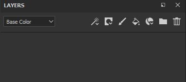

# レイヤーの作成

レイヤースタックでは、複数の方法でレイヤーを追加/作成できます。

| *アクション* | *デモ* |
| --- | --- |
| 専用のボタンをクリックして&#x200B;**ペイントレイヤー**&#x200B;を作成する 

 | 

 |
| 専用のボタンをクリックして&#x200B;**塗りつぶしレイヤー**&#x200B;を作成する 

 | 

 |
| 専用のボタンをクリックして&#x200B;**フォルダー**&#x200B;を作成する 

 | 

 |
| 次のいずれかの方法を使用して、レイヤーを&#x200B;**複製**&#x200B;します。<ul data-preserve-html="true"><li data-preserve-html="true">右クリックして「複製」</li><li data-preserve-html="true">ショートカットCTRL+DまたはCOMMAND+D</li><li data-preserve-html="true">[Ctrl]または[Command]を押したまま、レイヤをドラッグアンドドロップします</li></ul> | 

 |
| 専用ボタンをクリックしてレイヤーを削除 

 | 

 |

>[!NOTE]
>
> これらのアクションの中には、キーボードショートカットが関連付けられているものがあり、[専用ページ](../settings/shortcuts.md)で確認できます。

シェルフからリソースをドラッグ&amp;ドロップして、レイヤーを作成することもできます。

| *アクション* | *デモ* |
| --- | --- |
| **マテリアル**&#x200B;を[アセット](../assets/assets.md)からレイヤースタックにドラッグ&amp;ドロップします | 

 |
| **スマートマテリアル**&#x200B;を[アセット](../assets/assets.md)からレイヤースタックにドラッグ&amp;ドロップします | 

 |
| **効果**&#x200B;を[アセット](../assets/assets.md)からレイヤースタックにドラッグ&amp;ドロップします | 

 |
