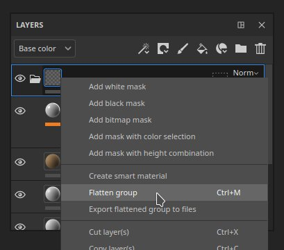

# レイヤーを統合

## レイヤーを統合

レイヤーを統合すると、選択したグループの表示されているテクスチャデータを1つのレイヤーに統合できます。 これにより、レイヤースタックが簡素化され、パフォーマンスが向上し、プロジェクトの管理が容易になります。

>[!NOTE]
>
> 「統合」機能を使用すると、新しいレイヤーが作成されますが、元のレイヤーグループは削除されません。 代わりに、ソースグループは無効になり、削除するか、後で編集するためにスマートマテリアルとして保存するかを選択できます。

## レイヤーの統合方法

一連のレイヤーを統合するには：

1. 目的のレイヤーを選択します。
1. <b>CTRL + G (CMD + G) </b>を使用して、選択範囲をグループ化します。
1. <b>CTRL + M (CMD + M)</b>を使用して、選択範囲を結合します。

キーボードショートカットを使用する代わりに、右クリックメニューからこれらのオプションにアクセスすることもできます。

レイヤーを統合すると、統合されたテクスチャを使用して新しい塗りつぶしレイヤーが作成され、ソースグループは無効になります。

## 特定のチャンネルを統合

* 塗りつぶしレイヤーで、プロパティパネルを使用して、統合の必要がないチャンネルを無効にします。 チャンネルが無効になっても、情報は失われません。 レイヤーを統合した後も、チャンネルを再度有効にすると、データはそのまま表示されます
* グループまたはペイントレイヤーの場合は、描画モードを使用してチャンネルを無効にできます。
  * レイヤースタックの一番上で、無効にするチャンネルを選択します。
  * 目的のレイヤーの描画モードを「無効」に変更します。
  * 描画モードを右クリックして「すべてのチャンネルに適用」を選択すると、レイヤーのすべてのチャンネルに同じ描画モードを適用できます。

## レイヤースタックから統合されたマップを書き出し

レイヤースタックの右クリックメニューから「<b>統合されたグループをファイルに書き出し</b>」を使用すると、テクスチャをすばやく書き出すことができます。 このオプションは、レイヤーまたはグループが選択されている場合に使用できます。 複数のレイヤーまたはグループが選択されている場合、それらはバッチとして処理され、1つずつ書き出されたように処理されます。

>[!NOTE]
>
> <b>グループの統合</b>機能と同様に、空のチャンネルまたは無効になっているチャンネルおよびレイヤーは書き出されません。 ジオメトリマスクを使用している場合は、そのジオメトリマスク内で有効になっているUVタイルのみが書き出されます。

### ファイル管理

<b>統合されたグループをファイルにエクスポート</b>を選択すると、エクスポートされたファイルのフォルダーの場所を選択できます。

書き出されたファイルには、「ファイル名」フィールドのパターンに従って名前が付けられます。 デフォルトのパターンは次のとおりです。

* <b>$textureSet\_$layerName\_$srcMap(.$udim)</b>

このパターンを使用すると、マップにはテクスチャセット名、レイヤ名、チャンネル名が含まれ、UVタイルプロジェクトの場合はUDIM番号が含まれます。

パターンを修正した場合、次回ウィンドウを開いたときに再び使用できるようになります。

### 書き出されたファイルのプロパティ

書き出されるファイルのプロパティは、書き出し時に次の値に基づきます。

* 解像度は、テクスチャセットの解像度に基づいています。
* ビットデプスはテクスチャセット設定のチャンネルビットデプスに基づきます。

次のプロパティはハードコードされており、変更できません。

* パディングは1 pxにロックされています。
* ファイル形式は、書き出すチャンネルによって異なります。 通常、Heightや法線などのマップは、より多くのビット深度を必要とし、EXRとして書き出されます。その他のチャンネルはPNGとして書き出されます。
* マスクのみが書き出される場合は、書き出し形式を選択できます。

## 統合されたレイヤーはどのように生成されますか？

平坦化機能は、新しい塗りつぶしレイヤー内の有効なチャンネルごとにビットマップを作成します。 解像度はテクスチャセットの解像度に基づき、ビット深度はテクスチャセットの設定によって決まります。

「統合」は、特定のチャンネル内にテクスチャデータがある場合に機能します。 「統合」は空のペイントレイヤーでは機能せず、選択範囲にデータがない場合はエラーメッセージをログに投稿します。

統合できるのは、表示されているレイヤーとエフェクトのみです。 グループを統合するときにグループ内の一部のレイヤーが無効になっている場合、これらのレイヤーのエフェクトは統合の結果に含まれません。

### 無効なレイヤー

統合できるのは、表示されているレイヤーとエフェクトのみです。 グループを統合するときにグループ内の一部のレイヤーが無効になっている場合、これらのレイヤーのエフェクトは統合の結果に含まれません。

### レイヤーマスクとジオメトリマスク

マスクはテクスチャデータとは別に統合されます。 つまり、マスクを含むグループを統合すると、統合された塗りと統合されたマスクの両方が生成されます。

ジオメトリマスクを使用する場合、ジオメトリマスク内の一部のUVタイルのみが選択されていると、統合されたレイヤーはこの選択を保持します。 ジオメトリマスクで選択されていないUVタイルは空とみなされるため、テクスチャリングはフラット化された結果に保持されません。

## 統合されたコンテンツの管理

>[!NOTE]
>
> 統合された画像は、プロジェクトファイル(.SPP)に保存されます。 これは、プロジェクトファイルのサイズに影響を与えることを意味します。

統合された画像は自動的に「統合」されるタグが付けられるので、アセットパネルで簡単に検索できます。 また、自動的に「保存された検索」カテゴリの「統合されたレイヤー」に保存されます。

### 未使用の画像のクリーンアップ

プロジェクトファイルから未使用の画像を削除すると、プロジェクトのサイズを明るくすることができます。 アセットパネルでは、右クリックメニューから画像を削除できます。 または、使用されていない画像をすべて削除するには、<b>ファイル/使用されていないリソースを削除</b>を使用します。 これにより、統合されたイメージが削除されるだけでなく、レイヤースタック、バックアップされたマップスロット、またはUIの他の場所で使用されていないリソースも削除されることに注意してください。
