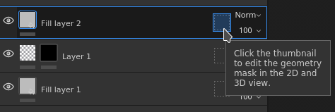

# ジオメトリマスク

\
ジオメトリマスクはレイヤー上の2番目のマスクで、関連付けられたテクスチャセットの3Dモデルジオメトリに基づいてレイヤーをマスクできます。 メッシュ名またはUV タイルでマスクできます。

## 概要

ジオメトリマスクは、3Dモデルのどの部分にレイヤーを適用するかを含む/除外リストで指定することによって機能します。

ジオメトリマスクは、3Dモデルジオメトリの大部分をすばやく破棄するのに便利なツールです。 ペイントマスクにはいくつかの利点があります。

* 通常は、ビューポート選択モードを使用した方が短時間で設定を行うことができます。
* テクスチャを生成する際にジオメトリを完全に破棄できるため、パフォーマンスが向上します。
* これは非破壊的で、再読み込み後に3Dモデルが変更されると更新されます。
* これにより、マスクされたジオメトリの下にあるジオメトリにペイントを付け、隠れている部分をペイントにすることができます。
* ペイントマスクと同様に、ジオメトリマスクはグループに適用して、一度に複数のレイヤーに影響を与えることができます。

### アイコンの状態

ジオメトリマスクアイコンは、その状態を示すことができます。

| アイコン | 説明 |
| --- | --- |
| 

 | ジオメトリが除外されていない場合、レイヤーは関連付けられたテクスチャセットのメッシュ全体に適用されます。これは、新しいレイヤーまたはフォルダーのデフォルトのステートです。 |
| 

 | 1つ以上のメッシュ名が除外されました。 この数値は、レイヤーの影響を受けている残りのエレメントの量を示します。 |
| 

 | 1つ以上のUV タイルが除外されました。 この数値は、レイヤーの影響を受けている残りのエレメントの量を示します。 |
| 

 | メッシュ名は含まれません。レイヤーに実際の効果は反映されません。 |

## ジオメトリマスクを編集する

特定のレイヤーのジオメトリマスクを変更するには、専用アイコンをクリックします。 編集モードを終了するには、コンテンツやペイントマスクなど、レイヤーの別の部分をクリックします。

### マスクの種類

ジオメトリマスクは、次の2種類のマスクをサポートしています。

| タイプ | 説明 |
| --- | --- |
| **UV タイル** | マスクは、含めるUV タイル(UDIM)番号を指定することで実行されます。 これは最もパフォーマンスの高いメソッドで、テクスチャが計算から完全に破棄されます。 |
| **メッシュ名** | マスクは、3Dモデルに含めるサブメッシュを指定することで実行されます。 ジオメトリはメッシュ名でグループ化されます。 |

### レイヤースタックの操作

ジオメトリマスクのステートは、アイコンを右クリックしてレイヤースタックから直接素早く変更できます。

次のアクションがあります。

| アクション | 説明 |
| --- | --- |
| **ジオメトリマスクをコピー** | 指定したレイヤーのジオメトリマスクのタイプと選択範囲をコピーします。 |
| **ジオメトリマスクにペーストします。** | 前にコピーしたジオメトリマスクプロパティを貼り付けます。 |
| **すべて含める** | 指定したマスクのすべてのエレメントを選択対象としてマークします。 |
| **すべて除外** | 指定したマスクのすべてのエレメントを選択解除します。 |

## マスクされたジオメトリを通してペイント

ジオメトリの一部が除外されている場合、はビューポートで非表示にできます。 これにより、以前は下位にあってアクセスできなかったジオメトリにペイントを当てることができます。

除外されたジオメトリを非表示にするには、コンテキストツールバーのビューポートの上部にあるボタンを使用します。

以下の例では、3Dモデルは上部と下部の2つのオブジェクトに分割されています。 デフォルトでは、ブラシストロークはすべてのオブジェクトと衝突します。 上部パーツを除外することで、下部パーツのみにペイントを設定できるようになりました。

>[!NOTE]
>
> ジオメトリマスクに含める/除外リストは動的で、その状態を変更すると、レイヤー内のブラシストロークの新しい計算がトリガーされます。 これにより、新しいUVタイルを持つメッシュを再読み込みする場合や、メッシュ名が変更された場合に、ブラシストロークを失うことなくマスクを調整できます。 ただし、ブラシストロークはベイクされないため、ジオメトリマスクを変更すると、後でブラシが正しく投影されなくなる可能性もあります。

| ビジュアル | 説明 |
| --- | --- |
| 

 | ジオメトリマスクでジオメトリが除外されていません。白いブラシストロークが適用されたペイントレイヤーが、すべてのジオメトリに衝突します。**除外されたジオメトリを非表示**&#x200B;ボタンは無効です。 |
| 

 | 上部はジオメトリマスクから除外されており、白いブラシストロークはジオメトリの下部にのみ衝突します。**除外されたジオメトリを非表示**&#x200B;ボタンが有効になっています。 |
| 

 | 上部はジオメトリマスクから除外されており、白いブラシストロークはジオメトリの下部にのみ衝突します。**除外されたジオメトリを非表示**&#x200B;ボタンは無効です。 |
