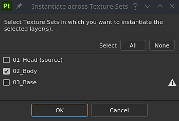
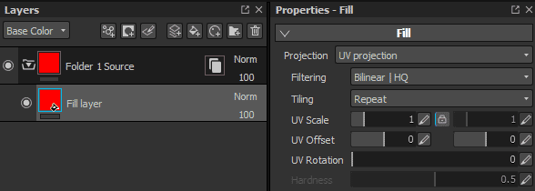

# レイヤーのインスタンス化

**レイヤーのインスタンス化**&#x200B;を使用すると、メッシュに依存する結果を生成しながら、複数のレイヤーおよび[テクスチャセット](../texture-set/texture-set.md)にわたってレイヤーのパラメーターを同期できます。

レイヤーインスタンスが作成されると、元のレイヤー（またはソースレイヤー）を使用して、既存のすべてのインスタンスにパラメーターが複製されます。 **ソースレイヤーのみを変更できます**。

>[!WARNING]
>
> ペイントアクション（ブラシストローク、ポリゴンの塗りなど） は、ソースレイヤーが配置されているテクスチャセットでのみ機能します。 このレイヤのインスタンスを持つ他のテクスチャセットは、ペイント操作を破棄するだけです。

## レイヤーインスタンスの作成

レイヤーインスタンスを作成するには：

1. 既存のレイヤーを選択
1. レイヤーをコピーします(**CTRL+C**)
1. インスタンスとして貼り付けます（**Ctrl + Shift + V**&#x200B;を使用するか、右クリックしてコンテキストメニューを開き、**インスタンスとして貼り付け**&#x200B;を選択します）

>[!NOTE]
>
> インスタンスは、**グループ**&#x200B;を含むすべてのレイヤーから作成できます。 フォルダーのインスタンス化は、様々なテクスチャセットにわたって複数のレイヤーを簡単に複製する方法として使用できます。 インスタンスフォルダー内にレイヤーを追加すると、既存のインスタンスにも複製されます。

インスタンスが作成されると、ソースレイヤーとターゲットレイヤーに新しいアイコンが表示されます。 このアイコンを使用すると、テクスチャセットを手動で切り替えることなく、ソースレイヤーとそのインスタンス間を簡単に移動できます（下記参照）。

| 名前 | アイコン |
| --- | --- |
| **インスタンス化されていないレイヤー** | 

 |
| **インスタンスソース** | 

 |
| **インスタンスターゲット** | 

 |

## テクスチャセット間でのインスタンスの作成

複数のテクスチャセット上にレイヤインスタンスを1回の操作で作成することができます。その場合、手動でコピー/ペーストする必要はありません。

複数のテクスチャセットにまたがるインスタンスを作成するには：

1. 既存のレイヤーを選択
1. レイヤーを右クリックしてコンテキストメニューを開きます
1. **テクスチャセット間でインスタンス化**&#x200B;を選択します
1. 新しいウィンドウで、どのテクスチャセットがインスタンスを受け取る必要があるかをチェックします。
1. 「OK」をクリックし、インスタンスを検証して作成します。

<table>
<tr style="border: 0;">
<td style="border: 0;" valign="top">

</td>
<td style="border: 0;" valign="top">

</td>
</tr>
</table>

>[!NOTE]
>
> テクスチャセット名の横の感嘆符は、チャネル&#x200B;**不一致**&#x200B;を示しています。 これは、このテクスチャセットでインスタンスが作成された場合、チャンネルが見つからないため、正しくレンダリングされないことを意味します。

## インスタンスとソースの切り替え

技術的な理由により、**ソースの編集**&#x200B;でインスタンスを&#x200B;**のみ**&#x200B;更新できるため、プロパティを編集するにはソースレイヤーを選択する必要があります。\
これは、レイヤースタックのレイヤーの&#x200B;**インスタンスプロパティボタン**&#x200B;をクリックすることで実行できます。

インスタンスのプロパティボタンをクリックすると、**プロパティウィンドウ**&#x200B;が現在のツール/レイヤーから&#x200B;**リスト**&#x200B;に切り替わり、ソースレイヤーとそのインスタンスが表示されます。\
リストの&#x200B;**任意の要素**&#x200B;をクリックすると、自動的に&#x200B;**このレイヤーにジャンプ**&#x200B;します。 これにより、現在の&#x200B;**選択したテクスチャセット**&#x200B;が自動的に&#x200B;**変更**&#x200B;され、適切なセットに変更されます。

**インスタンスツリー**&#x200B;の一覧を使用すると、**依存関係**&#x200B;を同時に表示しながら、インスタンスからそのソースに&#x200B;**すばやく**&#x200B;移動できます。

## インスタンスサイクル（およびその解決方法）

サイクルは、直接または間接的にソースレイヤー自体で使用されるインスタンスです。 Substance 3D Painterエンジンでサイクル&#x200B;**を計算**&#x200B;できません。そのため、修正または削除されるまで&#x200B;**無効**&#x200B;にする必要があります。

例：\

この例では、ソースレイヤーのインスタンスはフォルダーであるため、その内部に移動します。 インスタンスが壊れるのは、パラメーターを生成するために、インスタンスのパラメーターに依存するソースからパラメーターを照会する必要があるためです。 これにより、自動的に解決できないサイクルが作成されます。 インスタンスが無効になります。

サイクルを修正する唯一の方法は、インスタンスをフォルダー外に&#x200B;**移動**&#x200B;するか、インスタンスを&#x200B;**削除**&#x200B;することです。

レイヤーインスタンスは、インスタンス自体が別のソースレイヤーを参照している限り、ソースレイヤーで使用できます。
