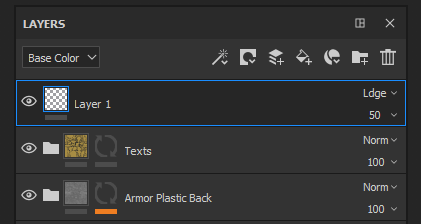
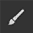

# レイヤースタック

**レイヤースタック**&#x200B;を使用すると、テクスチャセットのレイヤーを操作できます。 レイヤーには、シーンの3Dオブジェクトにテクスチャを作成するペイントと効果が含まれます。 レイヤーの表示と非表示を切り替えたり、レイヤーをフォルダーに入れたり、不透明度や描画モードを変更したりすることができます。

詳しくは、次のページを参照してください。

* [レイヤーの作成](creating-layers.md)
* [レイヤーの管理](managing-layers.md)
* [マスクとエフェクト](masking-and-effects.md)
* [描画モード](blending-modes.md)
* [レイヤーのインスタンス化](layer-instancing.md)
* [ジオメトリマスク](geometry-mask.md)

## 概要

レイヤースタックには、特定の階層のレイヤーが表示されます。一番下のレイヤーが最初にメッシュに描画され、一番上のレイヤーが後に続きます。 したがって、一番上のレイヤーが最後の項目で、一番下のレイヤーが最初の項目です。 フォルダーも同じ原則ですが、フォルダーの内容が優先されます。 つまり、フォルダーの内容は、同じレベルのレイヤーよりも先に処理されます。

**共通の特徴：**

* 各レイヤーは&#x200B;**マルチチャンネル**&#x200B;です。
* ペイントツールでは、マテリアルの設定に応じて&#x200B;**対応するすべてのチャンネル**&#x200B;にペイントされます（レイヤースタックで現在表示しているチャンネルには影響しません）。
* 各レイヤーには、**描画モード**&#x200B;とチャンネルごとの&#x200B;**不透明度**&#x200B;があります（左上のドロップダウンメニューでチャンネルを切り替えることができます）。

**レイヤーの種類：**

* **ペイントレイヤー** ：このタイプのレイヤーは、ブラシやパーティクルでペイントできます
* **レイヤーを塗りつぶし** ：このレイヤーにペイントすることはできません。代わりに、レイヤーにマテリアルを読み込んで、チャンネルを塗りつぶすことができます。 （たとえば、変形を操作してマテリアルを繰り返すこともできます）。
* **フォルダー** ：このタイプのレイヤーは、他のレイヤーを含むことを目的としているため、主にレイヤースタックを整理するために使用されます

各レイヤーで、**マスクを追加**&#x200B;できます。マスクでは、現在のテクスチャセットのチャンネルの特定の部分にのみコンテンツを適用できます。\
マスクは手動で（ブラシを使用してグレースケールで）ペイントすることも、フィルターやサブスタンスを使用して、よりダイナミックでプロシージャルな結果を得ることもできます。

## Viewmode

レイヤースタックの左上のドロップダウンは、レイヤースタックの表示モードを制御します。 レイヤーは複数のチャンネルをカバーできるため、すべてのプロパティを一度に表示することはできません。 したがって、ビューモードを使用して現在の表示コンテキストを定義できます。 このドロップダウンを使用すると、レイヤーサムネールでの表示に使用するチャンネルを指定したり、このチャンネルのみの描画モードと不透明度を制御したりできます。

このドロップダウンの一覧は、[テクスチャセット設定](../texture-set/texture-set-settings.md)で使用できるチャンネルの一覧に基づいています。

## アクション

アイコンの右上のリストは、レイヤースタックで実行できる一般的なアクションです。

| アクション | 説明 |
| --- | --- |
| エフェクトの追加 

 | 新しいエフェクトを作成し、現在選択されているレイヤーに追加します。 効果の詳細については、[専用ページ](../../features/effects/effects.md)を参照してください。 |
| マスクの作成 

 | 次の項目を含むマスクアクションメニューを開きます。<ul data-preserve-html="true"><li data-preserve-html="true">ホワイトマスクの追加</li><li data-preserve-html="true">ブラックマスクの追加</li><li data-preserve-html="true">ビットマップマスクの追加</li><li data-preserve-html="true">カラー選択によるマスクの追加</li><li data-preserve-html="true">高さを組み合わせたマスクの追加</li></ul> |
| ペイントレイヤーを新規作成 

 | 現在選択されているレイヤーの上に新しいペイントレイヤーを作成します。 |
| 塗りつぶしレイヤーを新規作成 

 | 現在選択されているレイヤーの上に新しい[塗りつぶしレイヤー](../../painting/fill-projections/fill-projections.md)を作成します。 |
| 新しいスマートマテリアルを追加 

 | 現在選択されているレイヤーの上に新しいスマートマテリアルを挿入します。このボタンをクリックするとミニシェルフが開き、現在の[アセット](../../interface/assets/assets.md)で使用可能なスマートマテリアルのリストを参照できます。 |
| 新規フォルダーを追加 

 | 現在選択されているレイヤーの上に空のフォルダーを新規作成します。 |
| レイヤーを削除 

 | 現在選択されているアイテム（レイヤー、フォルダー、エフェクト）を削除します。 |
