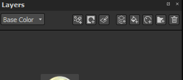
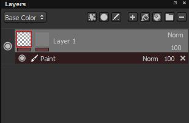

# マスクとエフェクト

## マスキング

レイヤーは、テクスチャの特定の部分にのみコンテンツを表示/適用するためにマスクできます。 マスクは、レイヤーのコンテンツに対する強度パラメーターとして機能します。 レイヤー上のマスクは、ペイントに使用するコンテンツの種類に関係なく、常にグレースケールです。そのため、どのカラーもペイントされる前にグレースケール値に変換されます。

マスクを追加するには、右クリックメニューを使用するか、専用ボタンを使用します。

マスクで可能な操作：

* マスク自体を表示するには、サムネイルで&#x200B;**ALTキーを押しながらマウスの左ボタンをクリック**&#x200B;します。 ビューポートが、このレイヤーからのマスクの独立したビューに切り替わります。 この操作は、ビューアーの設定からも実行できる。
* マスクを一時的に無効にするには、サムネールで&#x200B;**Shift +左マウスをクリック**&#x200B;します。 同じ操作をやり直して、もう一度有効にします。 この操作は、右クリックメニュー（「マスクの切り替え」）からも実行できる。
* マスクの内容を他のマスクにコピーするには、**右クリック/マスクの内容をコピー**&#x200B;してサムネールをクリックし、次に2番目のマスクのサムネールを&#x200B;**右クリック/マスクにペースト**&#x200B;して行います。
* マスクの背景を反転するには、**右クリックして「マスクの背景を反転」**&#x200B;を実行します。 これは、マスクに適用されたエフェクトが破棄されないようにする場合に便利です。

>[!WARNING]
>
> もう一度マスクを追加するか削除すると、マスクとそのマスクに適用されているすべてのエフェクトが破棄されます。

**CTRL**&#x200B;キーが押されている場合、（ドラッグ&amp;ドロップにより）塗りつぶしレイヤーを作成するときに、すぐにマスクを作成できます。

## エフェクト

エフェクトはいつでも編集できる特別な操作です。 エフェクトは、レイヤーのコンテンツのいずれかのマスクに配置できます。\
しかし、効果は、他の人のためのより適切です。 例えば、「ジェネレータ」はマスクに適しています。

レイヤー上の各サムネールの下の線は、エフェクトが存在するかどうかを示します。 グレーは効果なし、赤は少なくとも1つの効果を表します。 マスク単位およびコンテンツ単位のエフェクトスタックがあります。

詳細については、[専用ページを参照](../../features/effects/effects.md)してください。

## スマートマスク

スマートマスクは、マスクとその効果を保存して、他のレイヤーや他のプロジェクトで簡単に再利用できる方法です。 スマートマスクを作成するには、マスクの上で右クリックして、「**スマートマスクを作成**」を選択します。\
スマートマスクをレイヤーにドラッグ&amp;ドロップすると、黒いマスクが存在しない場合は、黒いマスクが作成されます。存在しない場合は、エフェクトリストが既存のマスクと結合されます。 スマートマスクをドロップするときに「**CTRL**」を押したままにすると、エフェクトリストを完全に上書きできます。

<table>
<tr style="border: 0;">
<td style="border: 0;" valign="top">

</td>
<td style="border: 0;" valign="top">

</td>
</tr>
</table>
