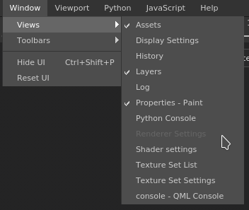

# ウィンドウメニュー

\
ウィンドウメニューを使用すると、ウィンドウのリストと、それらがインターフェイスに表示されているかどうかを表示できます。 ツールバーメニューを使用して、一部のツールバーを非表示にすることもできます。

| アクション | 説明 |
| --- | --- |
| **ビュー** | インタフェースで使用可能なウィンドウが一覧表示されます（チェックボックスは現在表示されているかどうかを示します）。 |
| **ツールバー** | インターフェイスで使用可能なツールバー（現在表示されているかどうかを示すチェックボックスを使用して、ツールバーを切り替えることができます）:ドッキング、プラグイン、ツール。 |
| **UIを非表示** | インタフェースのすべてのウィンドウとドックを非表示にし、ビューポートを最大化します。 |
| **UIのリセット** | 現在のウィンドウレイアウトを既定値にリセットします。 |
