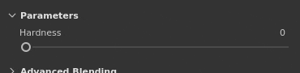

# スライダー

このページでは、アプリケーション・インタフェースのスライダの使用方法を示します。

| アクション | 例 | 説明 |
| --- | --- | --- |
| **ドラッグ** | 

 | スライダーにカーソルを合わせてクリック&amp;ドラッグすると、値が変更されます。 |
| **精密ドラッグ** | 

 | キーボードのShiftキーを押したままクリックすると、スライダーのドラッグ距離が長くなります。 このショートカットを使用すると、スライダーをドラッグしながら、より正確にスライダーを微調整できます。 |
| **ジャンプ** | 

 | スライダーの任意の場所をクリックすると、マウス位置の値にジャンプします。 |
| **上/下** | 

 | スライダーをクリックしてフォーカスを取得した後、キーボードの上矢印キーと下矢印キーを使用して、値をステップごとに増減させます。 |
| **バリューエディション** | 

 | スライダーのすぐ上にあるテキストフィールドをクリックすると、キーボードを使用して値を手動で編集できます。 |
