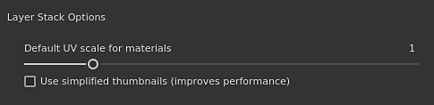
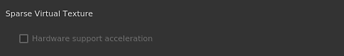
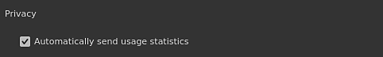

# 一般環境設定

このページでは、アプリケーションの主な設定について説明します。

## インターフェイスオプション

| 設定 | 説明 |
| --- | --- |
| **言語** | アプリケーションのインターフェイスで使用される言語を定義します。 この設定を有効にするには、アプリケーションの再起動が必要です。有効な値：<ul data-preserve-html="true"><li data-preserve-html="true"><strong>既定（システム言語）</strong>:オペレーティングシステムから互換性のある言語を取得します</li><li data-preserve-html="true"><strong>英語</strong></li><li data-preserve-html="true"><strong>ドイツ語</strong></li><li data-preserve-html="true"><strong>フランス語</strong></li><li data-preserve-html="true"><strong>日本語</strong></li><li data-preserve-html="true"><strong>中国語</strong> （簡体字）</li></ul> |
| **キーボードヘルパーの表示** | 有効な場合は、[Ctrl]や[Shift]などのキーを押したときに、ビューポートの左下にキーボードショートカットが表示されます。 |
| **ワールド軸を表示** | 有効な場合は、3Dビューの右下にワールド軸が表示されます。 |
| **背景色** | ビューポートの背景として使用する色を選択します。 グラデーションの作成には、2つのカラーを使用できます。 |
| **ペイント時に選択したマテリアルのみを表示する** | 有効にすると、ペイント時に現在選択されているテクスチャセットのみが3Dビューに表示されます（他のテクスチャセットは一時的に非表示になります）。  **注意：**&#x200B;この設定はオフにしておくことをお勧めします。ビューポートで表示を素早く変更すると、[スパース仮想テクスチャ](../../features/sparse-virtual-textures.md)のパフォーマンスに影響を与える可能性があります。 |
| **ビューポートの拡大/縮小** | HDPI/Retinaスクリーンのビューポートの解像度を下げて、パフォーマンスを向上させることができます。有効な値：<ul data-preserve-html="true"><li data-preserve-html="true"><strong>なし</strong>:スケーリングしません。ビューポートはネイティブの画面解像度でレンダリングされます。</li><li data-preserve-html="true"><strong>自動</strong>：画面解像度を2で割ります（HDPI画面の場合のみ）。</li></ul> |

## レイヤースタックオプション

| 設定 | 説明 |
| --- | --- |
| **マテリアルの既定のUV スケール** | 塗りつぶしレイヤーのデフォルトのタイリング/繰り返し値と、マテリアルの適用時にレイヤースタック内で塗りつぶし効果を定義します。 |
| **簡易サムネールを使用する** | 有効にすると、サムネールが計算されず、レイヤースタックにアイコンのみが表示されます。 アイコンを使用するとパフォーマンスが向上します。 この設定は、UVタイルワークフローを使用するプロジェクトには常にアイコンが表示されるので、適用されません。 |

## カメラオプション

| 設定 | 説明 |
| --- | --- |
| **回転速度** | ビューポート内のカメラの既定の回転速度の乗数。 |
| **ズーム速度** | ビューポート内のカメラの既定のズーム速度の乗数。方向を反転マウスの動きに基づいて、ズームの方向を反転させることができます。 |
| **車輪速度** | マウスホイールのズーム速度の乗数です。方向を反転ホイールの動きに基づいて、ズームの方向を反転させることができます。 |

## ベイク処理オプション

| 設定 | 説明 |
| --- | --- |
| **前処理されたシーンファイルの保存** | 有効にすると、ベーカーが使用する前処理されたハイポリメッシュがディスクに保存され、後で再利用できるようになります。 この設定を使用すると、より早く再ベイクできます。 |
| **ライブプレビューのベイクプロセスを有効にする** | 有効にすると、3Dおよび2Dビューポートに、メッシュ上で計算されている現在のベイカーテクスチャが表示されます。 |
| **GPU レイトレーシングを有効にする** | 有効にすると、ベイカーはCPUの代わりにGPUを使用してレイトレーシングを実行しようとします。 この機能により、ベーカーは一般的に動作が速くなります。これは、互換性のあるハードウェアでのみ有効にできます。 詳細については、[必要システム構成](../../getting-started/system-requirements.md)を参照してください。 |

## 「プレビュー」オプション

| 設定 | 説明 |
| --- | --- |
| **ローカルキャッシュディレクトリ** | 生成時に資源サムネールが配置される第2の場所を定義します。この設定は、リソースパスが読み取り専用（読み取りアクセス専用のネットワークパス上など）の場合に、リソースサムネールを計算および保存するのに便利です。 これにより、サムネールがディスクに保存されないため、毎回の起動時にサムネールを再計算する必要がなくなります。 |
| **ローカルキャッシュの予算（MB単位）** | ローカルキャッシュの最大キャッシュサイズを定義します。 |
| **マテリアルプレビューシェーダー** | シェルフにマテリアルのサムネイルを生成するために使用するシェーダを定義します。 これは、リソースがデフォルトのシェーダとは異なるワークフローを使用する場合に便利です。 この設定を有効にするには、アプリケーションを再起動する必要があります。 |

## 一時ファイル

| 設定 | 説明 |
| --- | --- |
| **キャッシュディレクトリ** | 一時ファイルが書き込まれる場所を定義します。 これには、[スパース仮想テクスチャ](../../features/sparse-virtual-textures.md)キャッシュが含まれます。 この設定は、[環境変数](../../pipeline-and-integration/configuration/environment-variables.md)で上書きできます。 |

## 疎仮想テクスチャ

| 設定 | 説明 |
| --- | --- |
| **ハードウェアサポートアクセラレータ** | 有効にすると、アプリケーションはGPUで疎テクスチャの使用を試みます。 詳細については、[スパース仮想テクスチャ](../../features/sparse-virtual-textures.md)ページを参照してください。 この設定は、[環境変数](../../pipeline-and-integration/configuration/environment-variables.md)で上書きできます。 |

## Iray ハードウェア

このセクションには、Rayでレンダリングする際に使用できる互換性のあるハードウェアがすべてリストされます。

CPU設定はすべてのコンピューターで使用できます。 コンピューターにCUDA互換のバージョンが&#x200B;**Nvidia GPU**&#x200B;が搭載されている場合も、ここに一覧表示されます。

>[!NOTE]
>
> 最高のレンダリングパフォーマンスを確保するために、CPUを無効にし、GPUハードウェアのみを有効にしておくことをお勧めします。 CPUとGPUの両方を同時に有効にすると、レンダリング時間が長くなる可能性があります。

## プライバシー

| 設定 | 説明 |
| --- | --- |
| **使用状況の統計を自動的に送信する** | 有効になっている場合は、コンピューターのハードウェア構成に関する情報とその他の使用状況データを匿名で送信します。 これらのデータは、ソフトウェアの開発と改善に役立ちます。 |
