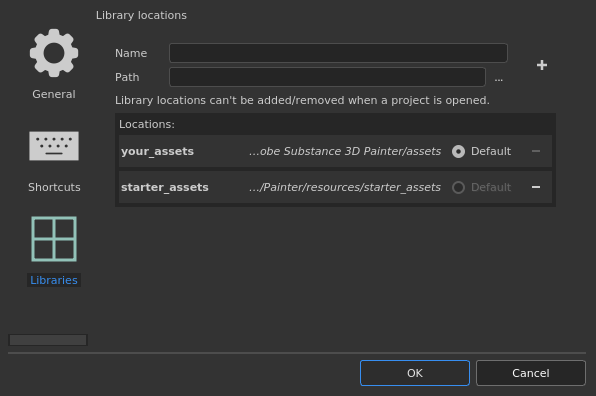

# ライブラリ設定

このセクションでは、追加のリソースフォルダへのカスタムパスと、既定で保存する場所リソースの場所を指定できます。

## デフォルトのパス

デフォルトでは、2つのパスが事前に定義されています。

| 名前 | ロケーション |
| --- | --- |
| **自分の\_assets** | このパスは、現在のユーザープロファイルのDocumentsフォルダーにあります。 プリセットなどのリソースは、デフォルトでアプリケーション内から作成されます（旧バージョンでは「シェルフ」という名前でした）。 |
| **starter\_assets** | このパスは、アプリケーションのインストールフォルダー内にあります。 デフォルトのリソースが含まれます。 （古いバージョンでは「allegorithmic」または「substance」という名前）。 |

**デフォルト**&#x200B;ラジオボタンは、新しいコンテンツ（ブラシプリセット、マテリアルプリセット、スマートマテリアルなど）を保存するパスを定義するために使用します。

## 新しいパスの追加

>[!NOTE]
>
> パスは、プロジェクトが現在開かれていない場合にのみ作成/変更できます。

| 設定 | 説明 |
| --- | --- |
| **名前** | インターフェイス内のパスを参照するために使用される名前付き（リソースを右クリックした場合など）。 この名前は、リソースが最新かどうかを追跡するための内部場所名も定義します。したがって、定義された後にこの名前を変更しないことをお勧めします。 |
| **パス** | リソースがディスク上に存在する（または存在する）実際の場所。 |
| **プラスボタン**  

 | このボタンをクリックすると、名前とパス設定で定義されたパスが以下のリストに追加されます。新しいパスを追加すると、データとリソースを整理するために必要なサブフォルダー構造が自動的に作成されます。 リソースを配置する場所については、[シェルフへのコンテンツの追加](https://helpx.adobe.com/substance-3d/unlisted/documentation/spdoc/adding-content-to-the-shelf-142213317.html)を参照してください。 |
| **マイナスボタン**   

 | パスの前にあるこのボタンをクリックすると、リストから削除されます。 リソースは[アセット](../assets/assets.md)インターフェイスに表示されなくなります。  **注意：**&#x200B;既定のパスは削除できませんが、無効になり、代わりにリソースが非表示になります。 |
