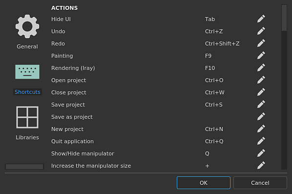

# ショートカット

{width="400px"}

このページには、使用可能なすべてのキーボードショートカットとマウスショートカットが表示されます。

## ショートカットの概要

利用可能なすべてのショートカットの簡単な概要については、グラフィック[チュートリアルで利用可能](https://helpx.adobe.com/jp/substance-3d/unlisted/tutorials/courses/substance-3d-painter-keyboard-shortcuts.html)を参照してください。

## ショートカットの変更方法

ショートカットの横にある[ペン]アイコンをクリックして編集し、新しい組み合わせを入力します。最後のキーを押すと自動的に編集モードが終了し、ショートカットが変わります。

### 編集可能なショートカットのリスト

ショートカットを右クリックするだけで、データをデフォルト値にリセットできます。

| *アクション* | *ショートカット (Windows)* | *ショートカット (MacOS)* | *説明* |
| --- | --- | --- | --- |
| **UIを非表示** | Tab | Tab | インターフェイスのすべてのドック/ウィンドウを非表示にして、ビューポートを最大化します。 |
| **取り消し** | Ctrl+Z | ⌘+Z | 直前の操作を元に戻します。 |
| **やり直し** | Ctrl+Y | ⌘+Y | 元に戻した操作をやり直します。 |
| **ベイク処理** | F8 | F8 | ベイクモードに切り替え |
| **ペイント** | F9 | F9 | ペイントモードに切り替えます。 |
| **レンダリング(Iray)** | F10 | F10 | レンダリングモードに切り替えます。 |
| **プロジェクトを開く** | Ctrl+O | ⌘+O | 開くSubstance Painterプロジェクトに移動して選択します。 |
| **プロジェクトを閉じる** | Ctrl+F4 | ⌘+W | 現在のプロジェクトを閉じます。 |
| **プロジェクトを保存** | Ctrl+S | ⌘+S | 現在のプロジェクトを保存します。 |
| **プロジェクトとして保存** |  |  | 現在開いているプロジェクトを新しい名前で保存します。 |
| **新しいプロジェクト** | Ctrl+N | ⌘+N | 新しいプロジェクト作成ウィンドウを開きます。 |
| **アプリケーションの終了** | Alt+F4 | ⌘+Q | Substance Painterを閉じます。 |
|  |  |  |  |
| **マニピュレーターの表示/非表示** | Q | Q | 変形の制御に使用するマニピュレーターの表示を切り替えます。 |
| **マニピュレーターサイズを大きくする** | + | + | ビューポートでマニピュレーターを大きくします。 |
| **マニピュレーターサイズを小さくする** | \- | \- | ビューポートでマニピュレーターを小さくします。 |
| **操作スペースを切り替える** | T | T | マニピュレーターのオブジェクト変形とワールド空間変形を切り替えます。 |
| **ワープ編集モードの切り替え** | Shift+V | Shift+V | ワープ投影の編集時に、ワープ変形モードと編集頂点モードを切り替えます。 |
| **ツールの移動** | 幅 | 幅 | マニピュレーターモードをtranslationに設定します。 |
| **回転ツール** | E | E | マニピュレーターモードを「回転」に設定します。 |
| **拡大・縮小ツール** | R | R | マニピュレーターモードを「拡大・縮小」に設定します。 |
| **サーフェスツール** | Shift+W | Shift+W | マニピュレータモードを3Dモデルサーフェス上にスナップするように設定します。 |
| **対称** | L | L | 特定の軸に沿って対称を有効にします。 |
| **エンジンの計算を一時停止する** | Shift + Escape | Shift + Escape | 計算を切り替えます。 |
|  |  |  |  |
| **ペイントツールを選択** | 1 | 1 |  |
| **ペイントツール+パーティクルを選択** | Ctrl+1 | ⌘+1 |  |
| **消しゴムツールを選択** | 2 | 2 |  |
| **消しゴムツール+ パーティクルを選択** | Ctrl+2 | ⌘+2 |  |
| **投影ツールを選択** | 3 | 3 |  |
| **投影ツール+パーティクルを選択** | Ctrl+3 | ⌘+3 |  |
| **多角形の塗りつぶしを選択** | 4 | 4 |  |
| **指先ツールを選択** | 5 | 5 |  |
| **クローンを選択ツール（相対ソース）** | 6 | 6 |  |
| **クローンを選択ツール（絶対ソース）** | Ctrl+6 | ⌘+6 |  |
| **メッシュマップのベイク** | Ctrl+Shift+B | ⌘+Shift+B | ベイク設定ウィンドウを開きます。 |
| **ツールサイズを拡大** | **&rbrack;** | **&rbrack;** | ペイントツールのブラシサイズを大きくします。 |
| **ツールサイズを縮小** | **&lbrack;** | **&lbrack;** | ペイントツールのブラシサイズを小さくします。 |
| **グレースケールツールの反転** | X | X | マスク上にペイントツールがある場合、現在のグレースケール値を反転します。 |
| **ストロークマテリアルを選択** | P | P | マテリアルピッカーツールを有効にします。 |
| **レイジーマウス** | D | D | 現在のツールでレイジーマウスビヘイビアーを有効にします。 |
| **除外されたジオメトリを非表示/無視** | Alt+H | Option+H | ジオメトリマスクによって除外された3Dモデルパーツを非表示にします。 |
|  |  |  |  |
| **遠近法** | F5 | F5 | ビューポートのカメラを遠近法表示に変更します。 |
| **カメラ** | F6 | F6 | ビューポートのカメラを正投影ビューに変更します。 |
| **次のチャンネルを表示** | C | C | ビューポートをソロビューモードに切り替えて、現在のテクスチャセットの次のチャンネルを表示します。 |
| **前のチャンネルを表示** | Shift+C | Shift+C | ビューポートをソロビューモードに切り替え、現在のテクスチャセットの前のチャンネルを表示します。 |
| **表示マテリアル** | M | M | ビューポートの表示モードをマテリアルに切り替えます。 |
| **次のメッシュマップを表示する** | B | B | ビューポートを単独表示モードに切り替えて、現在のテクスチャセットの次のメッシュマップを表示します。 |
| **以前のメッシュマップを表示** | Shift+B | Shift+B | ビューポートを単独表示モードに切り替え、現在のテクスチャセットの前のメッシュマップを表示します。 |
| **アニメーションの切り替え** | スペース | スペース | アニメーション投影が進行中の場合に、パーティクルのパーティクルを一時停止/一時停止を解除します。 |
| **テクスチャの書き出し** | Ctrl+Shift+E | Shift+⌘+E | 書き出しテクスチャウィンドウを開きます。 |
| **メッシュ全体を中央揃え** | F | F | 現在のプロジェクトのメッシュ全体をビューポートの中央に配置します。 |
| **クイックマスク版の切り替え** | U | U | クイックマスク版を入力または終了します。 |
| **クイックマスクをクリア** | Y | Y | クイックマスクを無効にしてクリーニングします。 |
| **クイックマスクを反転** | I | I | クイックマスクの現在の値を反転します。 |
| **ビューポートのレイアウト3D/2D** | F1 | F1 | 3Dと2D ビューの両方を同時に表示するようにビューポート表示を変更します。 |
| **ビューポートレイアウト（3Dのみ）** | F2 | F2 | 3Dビューのみを表示するようにビューポート表示を変更します。 |
| **ビューポートレイアウト2Dのみ** | F3 | F3 | ビューポートの表示を変更して2D ビューのみを表示します。 |
| **2D / 3Dビューの入れ替え** | F4 | F4 | ビューポートビューと2D UVビューで2Dビューと3Dビューを切り替えます。 |
| **テクスチャセットの分離** | Alt+Q | Option+Q | ビューポートの現在のテクスチャセットを分離するには、もう一方を非表示にします。 |
|  |  |  |  |
| **ツール/ ペイントを使用** | マウス左 | マウス左 |  |
| **直線を描画する** | Shift +左矢印 | Shift +左矢印 |  |
| **スナップしながら直線を描く** | Ctrl + Shift +マウスの左矢印 | Ctrl + Shift +マウスの左矢印 |  |
| **カメラ回転** | Alt +左矢印 | Option +左矢印 |  |
| **スナップ回転** | Alt+Shift+マウスを左に押す | Shift + ⌘ +左矢印 | カメラの回転角度を90度ごとにスナップします。 |
| **カメラの平行移動** | Alt +中央マウス | Option+⌘ +左矢印 |  |
| **カメラの平行移動 （代替）** | Ctrl+Alt+マウスを左方向に押す |  |  |
| **カメラズーム** | Alt+マウスの右向き矢印 | マウス中央 |  |
| **ステンシル回転** | S +左矢印 | S +左矢印 |  |
| **スナップ回転** | Shift + S +左矢印 | Shift + S +左矢印 |  |
| **ステンシルの翻訳** | マウスのS +中央 |  |  |
| **ステンシルズーム** | S +右マウスボタン | S +右マウスボタン |  |
| **切断サイズ/硬さの変更** | Ctrl+マウスの右矢印 | ⌘+マウスの右 | 水平方向に移動してサイズを変更し、垂直方向に移動してブラシの硬さを変更します。 |
| **ツールフロー/回転の変更** | Ctrl +左矢印 | ⌘ +左矢印 | 水平方向に移動して現在のブラシのフローを変更、垂直方向に移動してブラシの回転を変更 |
| **環境の回転** | Shift+マウスの右向き矢印 | Shift+マウスの右向き矢印 | ビューポートの照明に使用する環境マップを水平方向に回転します。 |
| **自動フォーカス（フィールドの深度）** | Ctrl +中央マウス |  |  |
| **テクスチャセットの選択** | Ctrl + Alt +マウスの右矢印 | Option+⌘ +右マウス |  |
| **コンテキストメニュー** | マウスの右ボタン | マウスの右ボタン | ビューポート内のプロパティウィンドウにアクセスするためのクイックメニュー |
| **クローンツールのソースの場所の設定** | V +左矢印 | V +左矢印 |  |
|  |  |  |  |
| **ステンシルマスクを無視** | N | N | ステンシルを一時的に無効にします（完全に削除することは避けてください）。 |
| **前のストロークを再開** | A | A | 前の手順で作成したブラシストロークをそのまま使用して、ブラシが途切れないようにします。 |

## 編集不可能なショートカットのリスト

一部のショートカットは、特定のウィンドウの&#x200B;**マウスが**&#x200B;を超えた場合にのみ&#x200B;**機能**&#x200B;する場合があります。

例： **コピー**&#x200B;と&#x200B;**貼り付け**&#x200B;では、マウスが&#x200B;**レイヤースタックの上**&#x200B;にある必要があります。

| *アクション* | *ショートカット (Windows)* | *ショートカット (MacOS)* | 説明 |
| --- | --- | --- | --- |
| **レイヤーをコピー** | Ctrl+C | ⌘+C | 現在選択されているレイヤーをコピーします。 |
| **レイヤーの切り取り** | Ctrl+X | ⌘+X | 現在選択されているレイヤーをカットします。 |
| **レイヤーの貼り付け** | Ctrl+V | ⌘+V | レイヤーをメモリにペーストします。 |
| **レイヤーの削除** | 削除 | 削除 | 現在選択されているレイヤーを削除します。 |
| **レイヤーを複製** | Ctrl+D | ⌘+D | 現在選択されているレイヤーを複製します。 |
| **グループレイヤー** | Ctrl+G | ⌘+G | 現在選択されているレイヤーをフォルダーに配置します。 |
| **レイヤーコンテンツのコピー** | Ctrl+Shift+C | Option+⌘+C | レイヤーの内容（ペイント）とその効果をコピーします。 |
| **レイヤーコンテンツを貼り付け** | Ctrl+Shift+V | Option+⌘+V | 現在メモリにあるコンテンツ（ペイント）とエフェクトをペーストします。 |
| **ビューポートにマスクを表示** | Alt +左矢印 | Option+マウスの左向き矢印 | ビューポートの表示モードを、指定したレイヤーのマスクに切り替えます。 |
| **マスクを無効/有効にする** | Shift +左矢印 | Shift +左矢印 | レイヤーのマスクの状態を切り替えます。 |
|  |  |  |  |
| **マテリアルをドラッグ&amp;ドロップ** | CTRL +ドラッグ&amp;ドロップ | ⌘+ドラッグ&amp;ドロップ | このキーを押しながらマテリアル（またはスマートマテリアル）をビューポートにドラッグ&amp;ドロップすると、3Dモデルの特定部分にのみ作用します。 |
|  |  |  |  |
| **マニピュレーターの制約/スナップ** | Shift | Shift | 3D ビューのマニピュレーター（移動または回転）を調整する場合は、変形をスナップします。 2D ビューのマニピュレーターを調整するときに、縦横比を固定します。 |
| **ミラー変換** | Ctrl | ⌘ | ミラーマニピュレーターは、2D ビューのピボットポイントを中心としたトランスフォームをポイントします。 |
