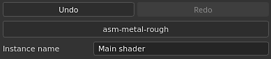

# シェーダー設定

**シェーダ設定**&#x200B;ウィンドウでは、シェーダー （およびIray mdl）パラメーターとジオメトリディスプレイスメントパラメーターを制御できます。

シェーダーは、ビューポートのライトやシャドウを操作するときにオブジェクトをどのように見えるかを定義する関数です。 このアプリケーションでは、シェーダを使用してテクスチャセットチャンネルを読み取り、ビューポートの3D メッシュをレンダリングする方法を知ることができます。

## スタックとシェーダーファイルの取り消し

シェーダー設定ウィンドウのこのセクションでは、シェーダを操作するときの主なパラメータを制御します。\
シェーダーの取り消しとやり直しのスタックは、ペイント時の競合を避けるため、メインの[履歴](https://substance3d.adobe.com/display/DRAFTPAINTER/History)とは独立しています。

シェーダーファイルが「古い」とマークされている場合は、可能な限り更新することをお勧めします。 参照： [シェーダーの更新](https://substance3d.adobe.com/display/DRAFTPAINTER/Updating+a+Shader)

| *設定* | *説明* |
| --- | --- |
| **取り消し** | シェーダーファイルの変更またはシェーダーパラメータの変更を元に戻す/キャンセルする |
| **やり直し** | 取り消しによって取り消された変更をもう一度適用します。 |
| **シェーダーファイル** | 現在使用されているシェーダーファイルを示すボタン。 ボタンをクリックしてミニシェルフを開き、別のシェーダーを選択します。 |
| **インスタンス名** | シェーダーインスタンスの名前。 |
| **既定値に戻す** | すべてのシェーダー・パラメータを（シェーダー・ファイルに含まれている状態で）デフォルト値に戻します。 |

### シェーダーインスタンス

シェーダーインスタンスとは、元のシェーダーファイルに基づいたシェーダーですが、カスタマイズされたパラメータが含まれています。 シェーダーインスタンスは複数のテクスチャセットで共有でき、テクスチャセットは一意のシェーダーインスタンスを持つことができます。

**例：**&#x200B;プロジェクトでは基本シェーダーを使用できますが、あるテクスチャセットではカスタムシェーダーを使用して不透明度をサポートします。

シェーダーインスタンスを作成および管理するには、[テクスチャセットリスト](../texture-set/texture-set-list.md)ウィンドウを参照してください。

## シェーダーパラメーター

シェーダーパラメータは、現在ロードされているシェーダーファイルに依存します。

## ディスプレイスメントとテッセレーション

ディスプレイスメントとテッセレーションは、オブジェクトのシェイプを編集してディテールを加える2つの機能です。

* **ディスプレイスメント**：入力チャンネルに基づいてジオメトリをプッシュまたはオフセットします。
* **テッセレーション**:ジオメトリを再分割して密度を高くします。 密度が高いほどポリゴン間の間隔が短くなり、ディテールが細かくなります。

「**通常のHeight**」という名前のフィルターがシェルフ内で使用でき、最終的な法線マップを取得するために使用できます（ネイティブ変換が不十分な場合）。

### ディスプレイスメント

ディスプレイスメントの設定は次のとおりです。

| *設定* | *説明* |
| --- | --- |
| <b> ソースチャンネル </b> | メッシュのデフォメーションの基準となるチャンネル。 デフォルトはHeightですが、ディスプレイスメントに設定することもできます。 |
| <b>スケール単位</b> | ディスプレイスメント尺度の定義方法を選択します。<ul data-preserve-html="true"> <li data-preserve-html="true"><b>正規化： </b>ディスプレイスメントのスケールは、メッシュのバウンディングボックスのサイズに対する相対的な値です。</li> <li data-preserve-html="true"><b>シーン: </b>ディスプレイスメントスケールは、インポートされたシーンファイルの単位を基準とします。</li> <li data-preserve-html="true"><b>物理サイズ(cm)</b>:ディスプレイスメントのスケールは、オブジェクトの物理サイズに基づいてcm単位で測定されます。</li> </ul> |
| <b>スケール適用量</b> | 選択したスケールユニットに基づいて、プロジェクト内のメッシュに適用されるデフォメーションの量をコントロールします。 |

>[!NOTE]
>
> <b>シーン</b>と<b>物理サイズ (cm) </b>スケールの両方を設定するには、インポートされたモデルが物理サイズ測定用に準備されている必要があります。 読み込まれたファイルで単位が正しく設定されていない場合、または読み込まれたファイルの種類で物理サイズ単位がサポートされていない場合、ディスプレイスメントは機能しますが、必要に応じて正確な結果が提供されない場合があります。

### テッセレーション

テッセレーション設定は次のとおりです。

| *設定* | *説明* |
| --- | --- |
| **サブディビジョンモード** | サブディビジョンの量の計算方法を指定します。 使用可能な構成は次のとおりです。<ul data-preserve-html="true"><li data-preserve-html="true"> 均一（デフォルト） </li><li data-preserve-html="true"> エッジの長さ </li></ul> |
| **サブディビジョン数** | （モードユニフォーム）1 ～ 32。 値が大きいほどポリゴンの数が増え、詳細は表示されますが、パフォーマンス上の問題が発生する可能性があります。 |
| **最大長** | （モードエッジ長）1 /値。 各セグメントがこのシーンのサイズである 1/1 の数値以下になるまで、すべてのポリゴンエッジが分割されます。 |
