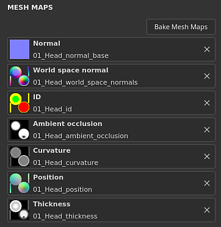

# テクスチャセット設定

{width="300px"}

**テクスチャセット設定**&#x200B;は、現在選択されているテクスチャセットのパラメーターを制御します。 ここで、解像度、チャンネル、および関連するメッシュマップを管理できます。

## 一般プロパティ

| 設定 | 説明 |
| --- | --- |
| **名前** | テクスチャセットの名前。 3Dモデルに割り当てられたマテリアル名を継承します。 |
| **説明** | テクスチャセットに関する情報を追加できるテキストフィールド。 このテキストは、[テクスチャセットリスト](texture-set-list.md)と[ベイク処理](../../baking/baking.md)のウィンドウに表示されます。 |
| **サイズ** | テクスチャセット内のチャンネルの解像度をピクセル単位で制御します。 **非正方形**&#x200B;の解像度（例： 2048 x 1024）を使用するには、2つのドロップダウンの間の&#x200B;**ロックボタン**&#x200B;を無効にします。**非破壊的なワークフロー**&#x200B;のため、テクスチャセットの解像度は&#x200B;**動的**&#x200B;です。 つまり、低い解像度で作業して優れたパフォーマンスを得た後、高い解像度を使用して品質を向上させることができます。 アプリケーション内では、チャンネルの最大解像度は4096 x 4096ピクセルですが、書き出し時には8192 x 8192（GPUでサポートされている場合）になります。 解像度を変更すると、エンジンの計算に時間がかかる場合があります。 |
| **シェーダーインスタンス** | [ビューポート](../viewport/viewport.md)で指定されたテクスチャセットのレンダリングに使用する[シェーダ](../shader-settings/shader-settings.md)を定義します。 |

## チャネル

### チャンネルリスト

リストは、チャネルを追加または削除することでいつでも変更できます（[マテリアルレイヤー](../../features/dynamic-material-layering.md)ワークフローによって上書きされない限り）。

| ボタン/アイコン | 説明 |
| --- | --- |
| <b>チャネルの追加</b>  

 | このボタンをクリックすると、新しいチャンネルがリストに追加されます。表示されるポップアップメニューは、次の3つのカテゴリに分かれています。<ul data-preserve-html="true"><li data-preserve-html="true"><strong>サポートされているチャンネル</strong>：これらのチャンネルは、ビューポートの現在のシェーダで使用できます。</li><li data-preserve-html="true"><strong>サポートされていないチャンネル</strong>：これらのチャンネルは、ビューポートの現在のシェーダによって無視されます。</li><li data-preserve-html="true"><strong>ユーザーチャンネル</strong>：詳細情報をペイントするための追加のチャンネルです。通常、シェーダではサポートされていません。</li></ul>  **注意：**&#x200B;追加できるチャンネル数に制限はありませんが、チャンネル数が多すぎるとパフォーマンスに重大な影響が生じる可能性があり、追加のメモリが必要になります。 |
| <b>チャネルの削除</b>  

 | リストからチャンネルを削除します。  **注意：**&#x200B;プロジェクト内のペイント情報はチャンネルと共に削除されないため、再計算後にテクスチャリングを復元する必要がある場合は、後でチャンネルを追加し直すことができます。 |
| <b>チャネル名</b>  

 | 指定されたチャンネルの名前。ユーザー・チャネルの名前は、現在の名前をダブルクリックして変更できます。 

 |
| <b>チャネル設定</b>  

 | このボタンをクリックすると、チャンネルの設定メニューが開き、いくつかのアクションが表示されます。最初のアクション・リストは、チャネルのストレージ・タイプと精度を制御します。<ul data-preserve-html="true"><li data-preserve-html="true"><strong>sRGB8</strong>: RGBの色、ガンマ補正された値、8ビットに格納されます。</li><li data-preserve-html="true"><strong>L8</strong>:グレースケール値。8ビットに格納されます。</li><li data-preserve-html="true"><strong>RGB8</strong>: RGBの色。8ビットに格納されています。</li><li data-preserve-html="true"><strong>L16</strong>:グレースケール値。16ビットに格納されます。</li><li data-preserve-html="true"><strong>RGB16</strong>: RGBの色。16ビットに格納されます。</li><li data-preserve-html="true"><strong>L16F</strong>:グレースケール値 – 正と負の値。16ビット浮動小数に格納されます。</li><li data-preserve-html="true"><strong>RGB16F</strong>: RGBの色 – 正と負の値で、16ビット浮動小数に格納されます。</li><li data-preserve-html="true"><strong>L32F</strong>:グレースケール値 – 正と負の値。32ビット浮動小数点に格納されます。</li><li data-preserve-html="true"><strong>RGB32F</strong>: RGBの色 – 正と負の値で、32ビット浮動小数に格納されます。</li></ul>  **注意：**&#x200B;記憶域の種類&#x200B;**は、カラースペースまたはガンマのコントロールではありません**。 チャンネルの情報の保存に使用されるデータ（sRGB8やL32Fなど）は、アプリケーションによるチャンネルの読み取り方法には影響しません。 例えば、粗さチャンネルはデータ/RAWと見なされ、ベースカラーはガンマ補正と見なされます。  メニューの最後の操作を使用して、チャンネルの[カラーマネジメント](../../features/color-management/color-management.md)を有効または無効にできます。<ul data-preserve-html="true"><li data-preserve-html="true"><strong>カラーチャンネル</strong>：有効にすると、チャンネルはカラーマネジメントされます。 このオプションは、ユーザーチャンネルに対してのみ手動で変更できます。</li></ul> |
| <b>カラーマネジメント</b>  

 | 存在する場合は、チャンネルがカラーマネジメントされていることを示します。 カラーマネジメントとしてマークできるのはユーザーチャンネルのみです。その他のチャンネルの動作は固定されます。カラーマネジメントされているチャンネルの詳細な一覧については、[カラーマネジメント](../../features/color-management/color-management.md)を参照してください。 |

### ミキシング設定

これらの設定は、チャンネルの生成方法、特にベイクテクスチャ（メッシュマップ）とチャンネルを組み合わせる方法に関するさまざまな動作を制御します。

| 設定 | 説明 |
| --- | --- |
| **通常のミキシング** | 「ベイク処理された法線マップ」を「法線」チャンネルと組み合わせる方法を制御します。 指定可能な値は次のとおりです。<ul data-preserve-html="true"><li data-preserve-html="true"><strong> </strong>の置き換え：「ベイク処理された法線マップ」を無視し、このテクスチャセットに「法線」チャンネルのみを使用します。 ベイク処理された法線マップ上のペイントに使用できます。 詳細については、[チャンネルペイントの詳細設定](../../painting/advanced-channel-painting/normal-map-painting.md)のドキュメントを参照してください。 法線チャンネルが存在しない場合、または法線チャンネル出力が空の場合でも、ベイク処理された法線マップが使用されます。</li><li data-preserve-html="true"><strong> </strong>を結合（デフォルト） :ディテール指向の関数を使用して、「法線」チャンネルと「ベイク処理された法線マップ」を結合します。</li></ul>  **注意：**&#x200B;この設定は、チャネルの一覧にチャネルが存在しない場合は無効になる可能性があります。 チャンネルが見つからない場合は、デフォルトのミキシング値が使用されます。 |
| **通常のメソッドへのHeight** | Heightチャンネルを法線マップに変換するために使用する方法をコントロールします。 指定可能な値は次のとおりです。<ul data-preserve-html="true"><li data-preserve-html="true"><strong>シャープ</strong>:ノイズやエイリアスが発生するリスクを伴って、より明確な法線マップを作成します。 布地などの繰り返しパターンに適しています。</li><li data-preserve-html="true"><strong>滑らか(Sobel)</strong> （既定値）: Sobelフィルターを使用して滑らかな法線マップを作成します。ディテールが失われる可能性があります。 ほとんどの場合に適しています。</li></ul> |
| **アンビエントオクルージョンミキシング** | 「ベイク処理されたアンビエントオクルージョン」と「アンビエントオクルージョン」チャンネルを組み合わせる方法を制御します。 指定可能な値は次のとおりです。<ul data-preserve-html="true"><li data-preserve-html="true"><strong> </strong>の置き換え：「焼き付けられたアンビエントオクルージョン」は無視し、このテクスチャセットには「アンビエントオクルージョン」チャンネルのみを使用します。 ベイク処理されたアンビエントオクルージョンのペイントに使用できます。 詳細については、[高度なチャンネルペイント](../../painting/advanced-channel-painting/ambient-occlusion-painting.md)のドキュメントを参照してください。  </li><li data-preserve-html="true"><strong> Multiply </strong> （デフォルト） :multiply演算を使用して、「アンビエントオクルージョン」チャンネルと「ベイク処理されたアンビエントオクルージョン」を組み合わせます。  </li></ul>  **注意：**&#x200B;この設定は、チャネルの一覧にチャネルが存在しない場合は無効になる可能性があります。 チャンネルが見つからない場合は、デフォルトのミキシング値が使用されます。 |
| **UVパディング** | UV アイランドの外側にパディングを生成する方法を制御します。 指定可能な値は次のとおりです。  <ul class="steps" data-preserve-html="true"> <li class="step" data-preserve-html="true">    <strong>3D空間の隣接</strong> （既定値）: UVシームの反対側を見て隣接するピクセルカラーを見つけ、それをUV境界で使用します。 この設定は、連続パターンを使用してUVシームを越えてペイントする場合に推奨されます。 左に通常のパディング、右に3D近隣を指定した例：           </li> <li class="step" data-preserve-html="true">    <strong>2Dスペース近隣</strong>:パディングを生成する前に、UV アイランド内のピクセルをUV アイランド外の境界線にコピーします。 この設定は、UV アイランドが情報に大きな対立を持ち、情報が重ならない場合にお勧めします。 例えば、左側にバンドがUV アイランドごとに一意のカラーを持つ球体、左側に2D隣接ページ設定、右側に3D隣接ページが設定されている場合（にじみが見られます）:           </li> </ul>  **注意：**&#x200B;このパディング設定はテクスチャセットごとに保存され、テクスチャの書き出しとビューポートへの視覚化の際に考慮されます。3D空間ネイバーの機能により、通常のチャンネルでは使用できず、代わりに2Dバージョンが使用されます。 |

## メッシュマップ

メッシュマップは、フィルター、スマートマテリアル、スマートマスクを使用してテクスチャリングの品質を向上させるために使用される、メッシュとテクスチャセットに固有のベイク処理されたテクスチャです。 詳しくは、[ベイク処理](../../baking/baking.md)のドキュメントを参照してください。
