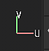

# 2D ビュー

{width="450px"}

2Dビューには、現在選択されている[テクスチャセット](../texture-set/texture-set.md)のメッシュUV アイランドが表示されます。 レイヤスタックのテクスチャを表示するだけでなく、メッシュUV アイランド上にペイントすることもできます。

## 表示モード

ビューポートの右上に、表示モードドロップダウンがあります。 このコントロールを使用すると、ビューポートに表示する情報を変更できます。 これにより、単一のチャンネル、メッシュマップ、または最終的なマテリアル結果を照明で表示できます。

## 軸の情報

ビューポートの右下には、**軸情報**&#x200B;があります。これは、2つの次元の軸の方向を示します。 2Dビューの場合、軸はUとVです。

## UVタイル情報

**表示モード**&#x200B;の横には、**UVタイル情報**&#x200B;ボタンがあり、UVタイルに関連する情報を表示または非表示にすることができます。 このボタンは、通常のプロジェクトでは表示されません。

## プロジェクトワークフロー

プロジェクトの作成時に定義したワークフローによっては、2Dビューの外観と動作が異なる場合があります。

| *プロジェクトワークフロー* | *ビヘイビアー* |
| --- | --- |
| **通常のプロジェクト** | 通常のプロジェクトでは、UV範囲[0-1]のUVのみにペイントできます。 この範囲外は表示されますが、インタラクティブにはなりません。この例では、左側のUV アイランドのみ（背景が明るいグレー）にペイントできます。 

 |
| **UVタイルプロジェクト** | UVタイルプロジェクトを使用すると、各UV範囲はペイント可能な新しいテクスチャセットになります。 2Dビューとグリッドが表示され、各タイルの構成がわかりやすくなります。 各タイルにはUDIM番号が割り当てられます。 

 |
