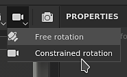

# ビューポート

{width="600px"}

ビューポートは、3D メッシュとそのテクスチャが表示される場所です。 また、3D メッシュサーフェス上のペイントも可能です。

## 概要

ビューポートは、4つの部分に分割されます。

* **コンテキストツールバー** ：このツールバーは、ビューポートの上部にあり、現在のコンテキストに応じて様々なプロパティのショートカットを提供します（例えば、ペイント時のブラシパラメーター）。
* **3Dビュー**：このビューは、カメラによって定義された特定の角度からの3D メッシュを表示します。
* **2D ビュー**：このビューには、現在選択されている[テクスチャセット](../texture-set/texture-set-list.md)の3D メッシュのUV ラップ解除が表示されます。
* **進捗バー**: エンジンの下部にある灰色/緑色のバーは、計算が進行中の場合（ビューポートがテクスチャを生成している場合など）に表示されます。

詳しくは、専用ページを参照してください。

* [2D ビュー](2d-view.md)
* [3D ビュー](3d-view.md)
* [カメラ管理](camera-management.md)

3Dビューおよび2Dビューは、[表示設定](../../interface/display-settings/display-settings.md)を使用して、追加または異なる情報を表示するように調整できます。

## ビューポートナビゲーションコントロール

ビューポートの動き回るコントロールは、2Dビューでも3Dビューでも同様です。

<table>
  <tr>
    <th>移動タイプ</th>
    <th>ショートカット</th>
    <th>説明</th>
  </tr>
  <tr>
    <td>オービット/回転 </td>
    <td><strong>Alt +左クリック</strong></td>
    <td><ul><li>3D ビュー:カーソル位置を中心にカメラを回り込ませます。</li><li>2D ビュー:カーソル位置の周囲でUV空間を回転させます。</li></ul></td>
  </tr>
  <tr>
    <td>パン</td>
    <td><strong>Alt +中マウスボタンをクリック</strong></td>
    <td>カメラを上、下、左または右に移動します。</td>
  </tr>
  <tr>
    <td>ズーム/ドリー</td>
    <td><strong>Alt +右クリック</strong></td>
    <td>メッシュ/UVの近くまたは遠くにズームします。</td>
  </tr>
</table>

>[!NOTE]
> 2Dビューと3Dビューのどちらでも、**Alt + Shift +左クリック**&#x200B;でオービット/回転する際に直交角度にスナップできます。

## レイアウトを変更する

既定のレイアウトでは、3Dビューは左側に、2D ビューは右側に配置されます。 レイアウトを変更できる&#x200B;**コンテキストツールバー**&#x200B;からいくつかのパラメーターを使用できます。

<table>
  <tr>
    <th><em>設定</em></th>
    <th><em>説明</em></th>
  </tr>
  <tr>
    <td><strong>ビューポートモード</strong> </td>
    <td>ビューポートのレイアウトを制御するには、次の設定を行います。 <ul><li><strong>3D/2D</strong> （既定）: ビューポートに3Dビューと2Dビューの両方を表示します</li><li><strong>3Dのみ</strong>: 3Dビューを最大化し、2D ビューを非表示にします。</li><li><strong>2Dのみ</strong>: 2D ビューを最大化し、3Dビューを非表示にします。</li><li><strong>3D/2Dの入れ替え</strong>:ビューが表示される順序を交換します。 3Dビューが左側にある場合、このアクションを選択すると右側に表示されます。</li></ul></td>
  </tr>
  <tr>
    <td><strong>遠近法モード</strong> </td>
    <td>これらの設定は、3Dビューでの3D メッシュの表示方法を制御します。 <ul><li><strong>遠近法表示</strong> （既定）：人間の目やカメラが見ているような3D メッシュを表示します。</li><li><strong>正投影ビュー</strong>：すべての方向が同じ長さを測定するため、3D メッシュを表示します。</li></ul></td>
  </tr>
  <tr>
    <td><strong>カメラの回転モード</strong> </td>
    <td>この設定は、カメラが回転できる軸の数を制御します。 <ul><li><strong>自由回転</strong>: カメラはX、Y、Z軸に回転します。</li><li><strong>制約付き回転</strong> （既定）: カメラはX方向とY軸でのみ回転します（ロールなし）。</li></ul></td>
  </tr>
  <tr>
    <td><strong>レンダリングモード</strong> </td>
    <td><a href="../../features/iray-renderer/iray-renderer.md">レンダリングモード</a>に切り替えます。</td>
  </tr>
</table>
