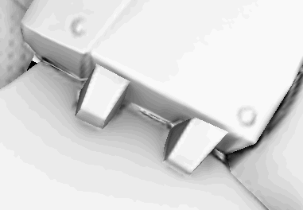

# 環境オクルージョンペイント

アンビエントオクルージョンチャンネルを使用すると、オブジェクトのアンビエントシャドウのディテールをペイントできます。 これを使用して、マテリアルからAOディテールを追加したり、必要に応じて手動でベイク処理エラーを修正したりできます。

&#x200B;>> 

コンピューターグラフィックスでは、環境オクルージョンは、シーン内の各ポイントが環境光に対してどの程度露出しているかを計算するために使用するシェーディングおよびレンダリング技法です。 チューブの内部は通常、露出している外側の表面よりも塞がれています（暗くなっています）。チューブの内部に入れば入るほど、照明はより塞がれています（暗くなります）。 環境オクルージョンは、各サーフェスポイントに対して計算されるアクセシビリティ値と見なすことができます。\
出典： &lt;https://en.wikipedia.org/wiki/Ambient_occlusion>

この計算の&#x200B;**result**&#x200B;は、「環境オクルージョン」マップという名前のビットマップに保存されます。 このマップは、アプリケーションで直接ベイク処理できます。参照： [ベイク処理](../../baking/baking.md)。

## ペイント環境オクルージョン

カスタムオクルージョンのディテールをペイントするには、環境オクルージョンチャンネルが必要です。 [テクスチャセット設定](../../interface/texture-set/texture-set-settings.md)を使用して追加できます：

チャンネルをテクスチャセットに追加すると、任意のレイヤを使用して新しい情報をペイントできます。 AOチャンネルにはグレースケール情報のみが含まれているため、推奨される描画モードは&#x200B;**通常** （上にペイント）および&#x200B;**乗算** （結合）です。

描画モードとチャンネルごとに変更する方法の詳細については、[描画モード](../../interface/layer-stack/blending-modes.md)を参照してください。

## 環境オクルージョンの追加マップ上にペイントする

場合によっては、ベイク処理された周囲光オクルージョンをペイントしてディテールを隠したり、ベイク処理の問題を修正したりすると便利です。

Substance 3D Painterのプロジェクトのデフォルト設定では、環境オクルージョン&#x200B;**チャンネル**&#x200B;が&#x200B;**追加のマップ**&#x200B;の環境オクルージョンマップと組み合わされます。 つまり、ベイク処理された追加マップはデフォルトではペイントできないので、各マップ（ベイク済みマップとチャンネル）の結果は合成されます。 この設定は次の設定で変更できます。

### 1 – 周囲オクルージョンチャンネルを追加する

現在のテクスチャセットにアンビエントオクルージョンチャンネルを追加します。\

混合モードを「 **multiply** 」ではなく「 **replace** 」に設定します：\

### 2 – ベイク処理されたアンビエントオクルージョンによる塗りレイヤの設定

新しい塗りつぶしレイヤーを作成し、プロパティパネルを使用して、ベイク処理したアンビエントオクルージョンを「アンビエントオクルージョン」スロット内に配置します。 塗りつぶしレイヤーが1に設定されていない場合は、デフォルトのタイリングを変更してください。\

### 3 – 塗りつぶしレイヤーの描画モードの変更

デフォルトでは、新しいレイヤー上のAOチャンネルの描画モードは「 **乗算** 」に設定されています。 ビットマップにはアルファがないため、ベースとして塗りレイヤを使用することをお勧めするので、ここでは「通常」のブレンドモードを選択しました。これは、ビットマップにはアルファが存在せず、シェーダのデフォルトカラーを含めて、その下のすべてが置き換えられるためです。\

### 4 – ベイク処理されたアンビエントオクルージョンマップ上にペイントするレイヤを作成する

新規レイヤー（通常レイヤーまたは塗りつぶしレイヤー）を作成し、AOチャンネルの描画モードを「通常」に変更します。 この設定が完了すると、AOチャンネルにペイントされたオブジェクトは、下のレイヤにあるベイク処理されたAOマップを引き継ぎます。\

