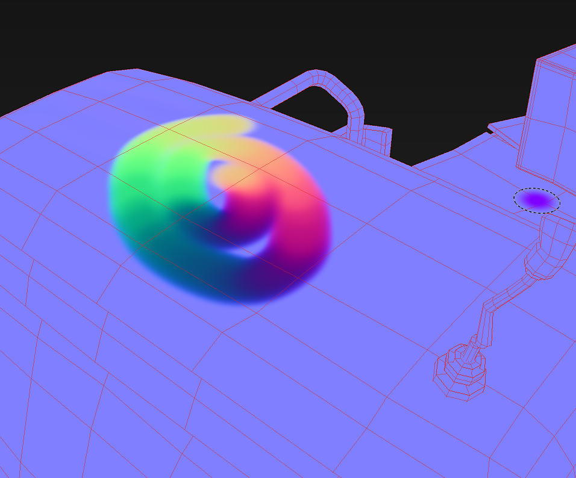

# フローマップペイント

専用チャンネルの作成が予定されていますが、通常チャンネルとブラシパラメーターを使用することで、Substance 3D Painterでフローマップをペイントできます。

## ステップ1 :法線マップを作成する

16 x 16ピクセルのテクスチャを作成します。 色は128、255、128である必要があり、次の色が設定されます： \
（このカラーは、DirectXでベクトルが見上げるのと同じです）。

## ステップ2 ：通常チャンネルを追加する

Substance 3D Painterプロジェクトで、**テクスチャセット設定**&#x200B;を使用して&#x200B;**通常**&#x200B;チャンネルがまだ存在しない場合は追加します。

## ステップ3 :ブラシを設定する

ブラシパラメーターでパス追跡機能を有効にします。 テクスチャを通常のチャネルスロットに装着します（手順1）。 他のチャンネルを無効にします。

{width="300px"}

## ステップ4:ペイント!

「パスに従う」設定を有効にしてメッシュをペイントすると、ブラシストロークが法線マップに向かって描画されます。

{width="700px"}
