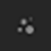

# ダイナミックストローク機能の有効化

動的ストローク機能を有効にするには、まず特定のリソースが必要です。

## 動的ストロークと互換性のあるリソースの検索

[アセット](../../interface/assets/assets.md)ウィンドウを参照すると、サムネイルの右下にある専用のアイコンがリソースの互換性の種類を示します。 表示されているアイコンがない場合は、リソースがその機能を利用できないことを意味します。

| *アイコン* | *説明* |
| --- | --- |
| 

 | このリソースは、次の1つ以上の動作を使用できます。<ul data-preserve-html="true"><li data-preserve-html="true">スタンプインデックス</li><li data-preserve-html="true">時間</li><li data-preserve-html="true">ランダムシード</li></ul> |
| 

 | このリソースは、Random Seedパラメーターのみを公開します。 |

シェルフの検索フィールドに次のキーワードを入力してリソースを検索することもできます。

* dynamicstroke
* randomseed

## 動的ストロークパラメーター

ダイナミックストロークSubstanceがロードされると、リソースパラメータグループの直前にパラメータの新しいリストが追加されます。

| *パラメーター* | *説明* |
| --- | --- |
| **動的コントロール** | 現在使用されているSubstanceファイルで使用できるパラメーターを一覧表示します。 |
| **印鑑開始** | リソースに動的コントロール「印鑑インデックス」がある場合にのみ使用できます。 ブラシストローク内のスタンプのインデックスを開始する値を示します。<ul data-preserve-html="true"><li data-preserve-html="true"><strong>先頭から(0)</strong>:デフォルト。 新しいストロークが作成されるたびに、インデックスが0から始まります。</li> <li data-preserve-html="true"><strong>ランダムインデックスから</strong>:インデックスはランダムな値から始まります（最大はスタンプサイクル数によって定義されます）。 以下の値は常に順番に表示され、完全にランダムではありません。</li> </ul> |
| **印鑑循環棚卸** | リソースに動的コントロール「印鑑インデックス」がある場合にのみ使用できます。 このパラメーターは、Substance 3D Painterが新しいSubstanceのバリエーションの生成を停止し、既存のバリエーションの再利用を開始するタイミングを制御します。 このパラメーターは、パフォーマンスに大きな影響を与えます。詳しくは、[ダイナミックストロークパフォーマンス](dynamic-stroke-performances.md)を参照してください。 |
| **ランダムシードの種類** | リソースに動的コントロール「ランダムシード」がある場合にのみ使用できます。 ランダムシードの変更方法を制御します。<ul data-preserve-html="true"><li data-preserve-html="true"><strong>単一</strong>:デフォルト。 Substanceパラメーターを使用して手動で設定できる1つのランダムシード値を使用します。</li> <li data-preserve-html="true"><strong>ストロークあたりのランダム値</strong>：新しいブラシストロークごとに新しいランダムシード値を生成します。</li> <li data-preserve-html="true"><strong>スタンプごとにランダム</strong>:ブラシストローク内のスタンプごとに新しいランダムシード値を生成します。 <em><strong>パラメータは非常に高価になる可能性があるため、注意してください</strong>。</em></li> </ul> |
| **時間** | タイムダイナミックコントロールにはパラメーターがありません。 ブラシストロークのペイントの時間で決まります。 |

## 互換性のあるツール一覧

ダイナミックストロークの設定は、次のツールとコンテキストでのみ使用できます。

| *ツールの種類* | *互換性のあるリソーススロット* |
| --- | --- |
| **ペイント** | <ul data-preserve-html="true"><li data-preserve-html="true">アルファ</li><li data-preserve-html="true">マテリアル</li></ul> |
| **消しゴム** | <ul data-preserve-html="true"><li data-preserve-html="true">アルファ</li><li data-preserve-html="true">マテリアル</li></ul> |
| **プロジェクション** | <ul data-preserve-html="true"><li data-preserve-html="true">アルファ</li></ul> |
| **指先** | <ul data-preserve-html="true"><li data-preserve-html="true">アルファ</li></ul> |
| **複製** | <ul data-preserve-html="true"><li data-preserve-html="true">アルファ</li></ul> |

>[!NOTE]
>
> 動的ストロークは&#x200B;**パーティクル**&#x200B;と互換性がありません。そのため、物理モードでツールを使用すると、この機能は無効になります。
