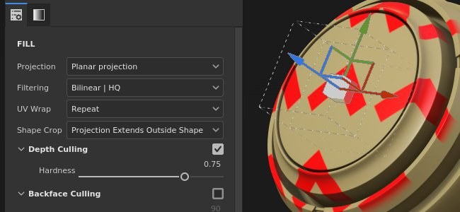
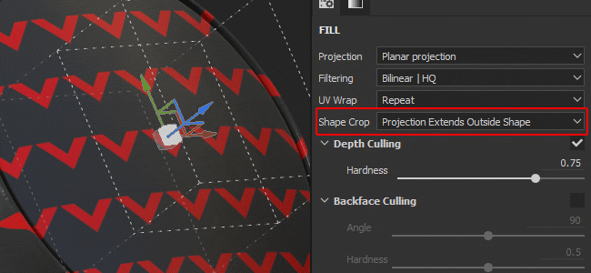
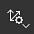

# 平面投影

塗りの平面投影は、イメージを平面として投影する3D投影です。 サーフェス上または3Dモデルを通して標識、デカール、その他のパターンを投影するために使用できます。

## プロパティ

| *設定* | *説明* |
| --- | --- |
| **フィルター** | テクスチャまたはマテリアルのフィルタリング方法をコントロールします。 この設定は、テクスチャを複数回繰り返したときの外観に影響する場合があります。 デフォルトとは異なるフィルタリングを使用してスケーリング値を大きくすると、見栄えが良くなる場合があります。 現在の設定：<ul data-preserve-html="true"><li data-preserve-html="true"><strong>バイリニア | HQ</strong> （既定値）:タイル値が高い場合にテクスチャの品質を向上させる、高度なバイリニアフィルタリングです。</li><li data-preserve-html="true"><strong>バイリニア |シャープ</strong>:テクスチャをわずかに滑らかにしながら、ディテールを保持する単純なバイリニアフィルタリングです。</li><li data-preserve-html="true"><strong>最も近い</strong>:フィルター処理なし。バイリニアフィルターの結果がぼやけて、細かいディテールが見えなくなる場合に便利です。 テクスチャにエイリアスを作成できます。</li></ul> |
| **UV ラップ** | 投影内でテクスチャがどのように繰り返されるかを制御します。 指定可能な値は次のとおりです。<ul data-preserve-html="true"><li data-preserve-html="true"><strong>なし</strong>:テクスチャは繰り返されません。 テクスチャの外側にあるものは黒/透明です。</li><li data-preserve-html="true"><strong>水平方向に繰り返す</strong>:テクスチャは水平方向でのみ繰り返されます。</li><li data-preserve-html="true"><strong>垂直方向に繰り返す</strong>:テクスチャは垂直方向にのみ繰り返されます。</li><li data-preserve-html="true"><strong>繰り返し</strong> （既定）:テクスチャは両方の軸で繰り返されます。</li></ul>  

 |
| **図形の切り抜き** | 投影されたテクスチャを投影領域の外側に表示するかどうかを定義します。 指定可能な値は次のとおりです。<ul data-preserve-html="true"><li data-preserve-html="true"><strong>プロジェクトがシェイプに切り抜かれました</strong>：投影は投影領域内に限定されます。</li><li data-preserve-html="true"><strong>投影がシェイプの外側に広がっています</strong> （既定）：投影は投影領域を超えて続けられます。</li></ul>  

 |
| **深度カリング** | 有効にすると、投影は無限ではなく、投影軸に沿ってフェード/カットされます。  <ul class="steps" data-preserve-html="true"> <li class="step" data-preserve-html="true">    <strong>有効</strong>:           </li> <li class="step" data-preserve-html="true">    <strong>無効</strong>:         </li> </ul>  次の1つのパラメーターを使用できます。<ul data-preserve-html="true"><li data-preserve-html="true"><strong>硬さ</strong>の設定は、投影軸に沿った深度カリングの硬さまたは柔らかさを制御します。</li></ul>  

 |
| **裏面カリング** | 有効にすると、投影は投影軸から離れた3Dモデルの面には表示されません。次の2つのパラメーターを使用できます。<ul data-preserve-html="true"><li data-preserve-html="true"><strong>角度</strong>：向こうを向いている面を無視する最小の角度を定義します。</li><li data-preserve-html="true"><strong>硬さ</strong>:トランジションの硬さまたは柔らかさを定義します。</li></ul>  

 |

>[!NOTE]
>
> 変形スケールを調整すると、投影の深度も制御できます。
> 
> 

### UVトランスフォーム

UVトランスフォーメーション設定は、投影内のテクスチャ/マテリアルを制御します。

<table data-preserve-html="true" style="width: 100.0%;"><colgroup> <col style="width: 40.0%;"/> <col style="width: 20.0%;"/> <col style="width: 40.0%;"/> </colgroup><tbody><tr><th>スケールモード</th><th>設定</th><th>説明</th></tr><tr><td>
<strong>並べて表示</strong> （既定）<strong>  </strong>

現在のテクスチャの繰り返し量を手動で設定できます。
</td><td><strong>タイリング</strong></td><td>テクスチャを繰り返す回数を制御します。</td></tr><tr><td rowspan="2">  </td><td colspan="1"><strong>回転</strong></td><td colspan="1">テクスチャをメッシュに投影する角度を制御します。</td></tr><tr><td colspan="1"><strong>オフセット</strong></td><td colspan="1">テクスチャの投影元をコントロールします。 デフォルト値は、テクスチャの中心がメッシュのUVの中心にあることを意味します。</td></tr><tr><th colspan="1"> </th><th colspan="1"> </th><th colspan="1"> </th></tr><tr><td rowspan="4">
<strong>物理サイズ</strong>

メッシュサイズと埋め込み物理サイズに従ってテクスチャを自動調整します。 幅と長さ（XおよびYの測定値）を使用して、正しい物理サイズを計算します。 Z値は考慮されません。

(詳しくは、専用の[ドキュメントページ](https://experienceleague.adobe.com/en/docs/substance-3d-painter/using/features/physical-size)を参照)
</td><td><strong>カスタムサイズ</strong></td><td>
有効にすると、アセットを手動で入力し、物理サイズで提供されているアセットを上書きできます。

物理サイズが検出されない場合、または異なる物理サイズを持つ複数のアセットが同じレイヤー/エフェクト内で使用されている場合は、自動的に選択されます。
</td></tr><tr><td colspan="1"><strong>サイズ(cm)</strong></td><td colspan="1">埋め込まれた物理サイズはセンチメートル単位で表されます。 異なる測定単位で作成されたメッシュファイルで作業することができます。正しい縦横比を維持します。 ただし、アセットサイズは現在、センチメートル単位でのみ表示されています。</td></tr><tr><td colspan="1"><strong>回転</strong></td><td colspan="1">テクスチャをメッシュに投影する角度を制御します。</td></tr><tr><td colspan="1"><strong>オフセット</strong></td><td colspan="1">
テクスチャの投影元をコントロールします。 デフォルト値は、テクスチャの中心がメッシュのUVの中心にあることを意味します。
</td></tr></tbody></table>

### 3D 投影設定

3D投影設定は、3D空間での投影の変換を制御します。

| 設定 | 説明 |
| --- | --- |
| **オフセット** | 3D空間での投影原点の位置。 単位は、シーン全体のバウンディングボックスに基づきます。 0がこのボックスの中心です。 |
| **回転** | 各軸上で投影全体を回転する角度。 |
| **スケール** | 各軸の投影全体のサイズ。 |

## コンテキストツールバー

ビューポートの上部にある[コンテキストツールバー](../../interface/toolbars.md)から、マニピュレータとプロジェクションを制御する複数の設定とツールを使用できます。

| アイコン | 名前 | 説明 |
| --- | --- | --- |
| 

 | マニピュレーターを表示 / 非表示 | 有効にすると、マニピュレータがビューポートに表示され、制御可能になります。 |
| 

 | マニピュレータの設定 | このメニューには、次の3つの設定があります。<ul data-preserve-html="true"><li data-preserve-html="true"><strong>マニピュレータのサイズ</strong>:ビューポート内のマニピュレータの大きさを制御します。</li><li data-preserve-html="true"><strong>グリッドステップ</strong>：制約を使用して変換するときのステップのサイズを定義します。</li><li data-preserve-html="true"><strong>角度ステップ</strong>：拘束を使用して回転するときのステップの角度を定義します。</li></ul> |
| 

 | 移動マニピュレータ | シーン内の投影を主軸(X、Y、Z)に沿って移動します。 |
| 

 | 回転マニピュレータ | シーン内の投影を主軸(X、Y、Z)に沿って回転させます。 |
| 

 | スケールマニピュレータ | シーン内の投影を主軸(X、Y、Z)に沿ってスケールします。 |
| 

 | サーフェスマニピュレータ | 投影を3Dモデルのサーフェスにスナップして移動できるようにします。  **注意：**&#x200B;このマニピュレータは、投影タイプが[平面]または[ワープ]の場合のみ使用できます。 |
| 

 | マニピュレータスペース | 変換を実行するスペースを定義します。 指定可能な値は次のとおりです。<ul data-preserve-html="true"><li data-preserve-html="true"><strong>ローカル空間</strong>：軸は現在の変換に合わせられます。</li><li data-preserve-html="true"><strong>ワールド空間</strong>：軸はシーンに合わせられます。</li></ul> |
| 

 | X軸でミラー | 変換をX軸に沿って反転します。 |
| 

 | Y軸にミラー | 変換をY軸に沿って反転します。 |
| 

 | Z上でミラー | 変換をZ軸に沿って反転します。 |
| 

 | 変形をリセット | 投影変換をデフォルトの状態に戻します。 |

## マニピュレータ

この投影マニピュレータは、[3Dビューポート](../../interface/viewport/3d-view.md)でのみ使用できます。

| アクション | ショートカット | 説明 |
| --- | --- | --- |
| **翻訳** | マウスクリック | 移動マニピュレータで、軸をクリックして投影を移動します。<ul data-preserve-html="true"><li data-preserve-html="true"><strong>1つの軸</strong>:プロジェクションの一方向にのみ移動します。</li><li data-preserve-html="true"><strong>2つの軸</strong>：軸に合わせてプラン上で投影を移動します。</li><li data-preserve-html="true"><strong>3つの軸</strong>:カメラの空間で投影を移動します（平面の方向）。</li></ul>   <table> <tr style="border: 0;"> <td style="border: 0;" valign="top">  

  </td> <td style="border: 0;" valign="top">  

  </td> <td style="border: 0;" valign="top">  

  </td> </tr> </table> |
| **翻訳は制限されています** | SHIFT+マウスクリック | 移動マニピュレータを使用して、選択した軸に沿って、特定の間隔（ステップ）でのみ投影を移動します。 間隔のサイズは、マニピュレータの設定によって定義されます。  

 |
| **回転** | マウスクリック | 回転マニピュレータで、1つの軸をクリックすると、投影が回転します。 軸の間をクリックすると、すべての軸を同時に回転できます。   <table> <tr style="border: 0;"> <td style="border: 0;" valign="top">  

  </td> <td style="border: 0;" valign="top">  

  </td> </tr> </table> |
| **回転が制限されています** | SHIFT+マウスクリック | 回転マニピュレータで、1つの軸をクリックして投影を回転させると、特定の間隔でのみ投影が実行されます。 ステップは、マニピュレータ設定を介して角度で定義されます。  

 |
| **スケール** | マウスクリック | スケールマニピュレータで、1つの軸ハンドルをクリックして、指定した軸に沿って投影のサイズを変更します。   <table> <tr style="border: 0;"> <td style="border: 0;" valign="top">  

  </td> <td style="border: 0;" valign="top">  

  </td> <td style="border: 0;" valign="top">  

  </td> </tr> </table> |
| **スケールの制約** | SHIFT+マウスクリック | スケールマニピュレータを使用して、ショートカットを維持しながら1つの軸ハンドルをクリックすると、手順に従って投影のサイズが変更されます。 ステップサイズは、移動マニピュレータのステップサイズと同じです。  

 |
| **サーフェス** | マウスクリック | サーフェスマニピュレータを3Dモデル上でクリックしてドラッグすると、サーフェス上にスナップします。  

  **注意：**&#x200B;このマニピュレータは、**平面**&#x200B;投影タイプおよび&#x200B;**ワープ**&#x200B;投影タイプでのみ使用できます。 |
