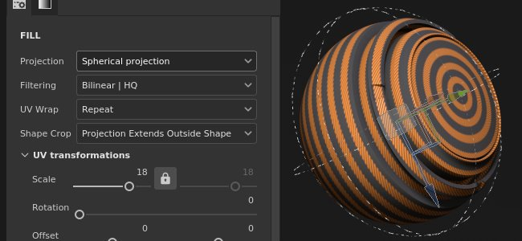

# 球面投影法

塗りつぶし球面投影法を使用すると、オブジェクトの周囲に画像やパターンを投影できます。 丸いオブジェクトに投影したり、テクスチャを円形に変形させたりすると便利です。

## プロパティ

| 設定 | 説明 |
| --- | --- |
| **フィルター** | テクスチャまたはマテリアルのフィルタリング方法をコントロールします。 この設定は、テクスチャが複数回繰り返されるときの外観に影響する場合があります。 デフォルトとは異なるフィルタリングを使用してスケーリング値を大きくすると、見栄えが良くなる場合があります。 現在の設定：<ul data-preserve-html="true"><li data-preserve-html="true"><strong>バイリニア`\|` HQ</strong> （既定）: タイリング値が高い場合にテクスチャの質を向上させる高度なバイリニアフィルタリングです。</li><li data-preserve-html="true"><strong>バイリニア`\|`シャープ</strong> :テクスチャをわずかに滑らかにしながら、ディテールを保持しようとする単純なバイリニアフィルタリングです。</li><li data-preserve-html="true"><strong>最も近い</strong>:フィルター処理なし。バイリニアフィルターの結果がぼやけて、細かいディテールが見えなくなる場合に便利です。 テクスチャにエイリアスを作成できます。</li></ul> |
| **UV ラップ** | 投影内でテクスチャがどのように繰り返されるかを制御します。 指定可能な値は次のとおりです。<ul data-preserve-html="true"><li data-preserve-html="true"><strong>なし</strong>:テクスチャは繰り返されません。 テクスチャの外側にあるものは黒/透明です。</li><li data-preserve-html="true"><strong>水平方向に繰り返す</strong>:テクスチャは水平方向でのみ繰り返されます。</li><li data-preserve-html="true"><strong>縦方向に繰り返す</strong>: テクスチャは縦方向にのみ繰り返されます。</li><li data-preserve-html="true"><strong>繰り返し</strong> （既定）:テクスチャは両方の軸で繰り返されます。</li></ul> 

 |
| **図形の切り抜き** | 投影テクスチャを投影領域の外側に表示するかどうかを指定します。 指定可能な値は次のとおりです。<ul data-preserve-html="true"><li data-preserve-html="true"><strong>プロジェクトがシェイプに切り抜かれました</strong>: 投影が投影領域内に制限されています。</li><li data-preserve-html="true"><strong>投影がシェイプの外側に広がっています</strong> （既定）: 投影は投影領域を超えて続きます。</li></ul> 

 |

### UV変換

UV変換の設定は、投影内のテクスチャを制御します。

| *設定* | *説明* |
| --- | --- |
| **スケール** | 投影内でテクスチャが繰り返される回数を定義します。 |
| **回転** | 投影に適用されるテクスチャの角度を制御します。 |
| **オフセット** | 投影されるテクスチャの原点をコントロールします。 デフォルト値では、テクスチャは投影の中央にあります。 |

### 3D 投影設定

3D 投影は、3D空間での投影の変形を制御します。

| 設定 | 説明 |
| --- | --- |
| **オフセット** | 3D空間での投影の原点の位置。 単位は、シーン全体のバウンディングボックスに基づきます。 0がこのボックスの中心です。 |
| **回転** | 各軸の投影全体を回転させる角度（度単位）。 |
| **スケール** | 各軸の投影全体のサイズ。 |

## コンテキストツールバー

ビューポートの上部に表示され、マニピュレーターと投影を制御する[コンテキストツールバー](../../interface/toolbars.md)から、いくつかの設定とツールを利用できます。

| アイコン | 名前 | 説明 |
| --- | --- | --- |
| 

 | マニピュレーターを表示 / 非表示 | 有効にすると、マニピュレーターがビューポート内で表示およびコントロール可能になります。 |
| 

 | マニピュレーター設定 | このメニューには、次の3つの設定があります。<ul data-preserve-html="true"><li data-preserve-html="true"><strong>マニピュレーターサイズ</strong>: ビューポート内のマニピュレーターの大きさを制御します。</li><li data-preserve-html="true"><strong>グリッドステップ</strong>：制約を使用して移動する場合のステップのサイズを定義します。</li><li data-preserve-html="true"><strong>角度ステップ</strong>：拘束を使用して回転するときのステップの角度を定義します。</li></ul> |
| 

 | 翻訳マニピュレーター | シーン内の投影をメイン軸(X、Y、Z)に沿って動かすことができます。 |
| 

 | 回転マニピュレーター | メイン軸(X、Y、Z)に沿ってシーン内で投影を回転させることができます。 |
| 

 | スケールマニピュレーター | メイン軸(X、Y、Z)に沿ってシーン内の投影をスケーリングします。 |
| 

 | サーフェスマニピュレーター | 3Dモデルのサーフェス上で投影をスナップして移動できるようにします。  **注意：**&#x200B;このマニピュレーターは、平面およびワープ投影の種類でのみ使用できます。 |
| 

 | マニピュレーター空間 | 変換を実行するスペースを定義します。 指定可能な値は次のとおりです。<ul data-preserve-html="true"><li data-preserve-html="true"><strong>ローカル空間</strong>：軸は現在の変換に合わせられます。</li><li data-preserve-html="true"><strong>ワールド空間</strong>：軸はシーンに合わせられます。</li></ul> |
| 

 | X軸でミラー | X軸の変形を反転します。 |
| 

 | Y軸にミラー | Y軸の変形を反転します。 |
| 

 | Z上でミラー | Z軸の変形を反転します。 |
| 

 | 変形をリセット | 投影変換をデフォルトのステートに戻します。 |

## マニピュレーター

このマニピュレーターは、[3D ビューポート](../../interface/viewport/3d-view.md)でのみ使用できます。

| アクション | ショートカット | 説明 |
| --- | --- | --- |
| **翻訳** | マウスクリック | 翻訳マニピュレーターで軸をクリックすると、投影が動きます。<ul data-preserve-html="true"><li data-preserve-html="true"><strong>1つの軸</strong>: 投影の一方向にのみ移動します。</li><li data-preserve-html="true"><strong>2つの軸</strong>: 軸に合わせて投影をプラン上で移動します。</li><li data-preserve-html="true"><strong>3つの軸</strong>: 投影をカメラのスペース（平面の方向）に移動します。</li></ul>   <table> <tr style="border: 0;"> <td style="border: 0;" valign="top">  

  </td> <td style="border: 0;" valign="top">  

  </td> <td style="border: 0;" valign="top">  

  </td> </tr> </table> |
| **翻訳は制限されています** | SHIFT+マウスクリック | 移動マニピュレーターを使用して、選択した軸に沿って、一定の間隔（ステップ）で投影を動かします。 間隔のサイズは、マニピュレータの設定によって定義されます。 

 |
| **回転** | マウスクリック | 回転マニピュレーターで、いずれかの軸をクリックして投影を回転させます。 軸の間をクリックすると、すべての軸を同時に回転できます。   <table> <tr style="border: 0;"> <td style="border: 0;" valign="top">  

  </td> <td style="border: 0;" valign="top">  

  </td> </tr> </table> |
| **回転が制限されています** | SHIFT+マウスクリック | 回転マニピュレータで、1つの軸をクリックして投影を回転させると、特定の間隔でのみ投影が実行されます。 ステップはマニピュレーター設定によって角度で定義されます。 

 |
| **スケール** | マウスクリック | 拡大・縮小マニピュレーターで、軸ハンドルの1つをクリックすると、指定した軸に沿って投影のサイズが変更されます。   <table> <tr style="border: 0;"> <td style="border: 0;" valign="top">  

  </td> <td style="border: 0;" valign="top">  

  </td> <td style="border: 0;" valign="top">  

  </td> </tr> </table> |
| **スケールの制約** | SHIFT+マウスクリック | 拡大・縮小マニピュレーターでは、ショートカットを保持しながら1つの軸ハンドルをクリックすると、投影のサイズが段階的に変更されます。 ステップサイズは移動マニピュレーターのステップサイズと同じです。 

 |
| **サーフェス** | マウスクリック | サーフェスマニピュレーターで、3Dモデル上でサーフェスをクリック&amp;ドラッグすると、サーフェス上でスナップできます。 

 **注意：**&#x200B;このマニピュレーターは、**平面**&#x200B;および&#x200B;**ワープ**&#x200B;投影の種類でのみ使用できます。 |
