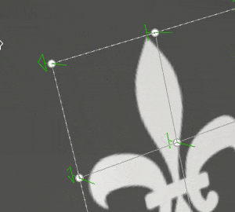

# ワープ投影

塗りのワープ投影は、グリッドのポイントを編集してテクスチャを変形できる3D 投影です。 非平面サーフェスにパターンやロゴをフィットさせるために使用できます。

## Quick setup

ワープ投影を使用してレイヤーをすばやく設定するには、[アセットウィンドウ](../../interface/assets/assets.md)からリソースをメッシュにドラッグ&amp;ドロップします。 マウスを放すとメニューが開き、リソースを割り当てるチャンネルを選択できます。

互換性のあるリソースタイプは次のとおりです。

* **Alpha**
* **手続き型**
* **テクスチャ**
* **マテリアル** （Altキーを押す必要があります）

## プロパティ

| 設定 | 説明 |
| --- | --- |
| **フィルター** | テクスチャまたはマテリアルのフィルタリング方法をコントロールします。 この設定は、テクスチャが複数回繰り返されるときの外観に影響する場合があります。 デフォルトとは異なるフィルタリングを使用してスケーリング値を大きくすると、見栄えが良くなる場合があります。 現在の設定：<ul data-preserve-html="true"><li data-preserve-html="true"><strong>バイリニア`\|` HQ</strong> （既定）: タイリング値が高い場合にテクスチャの質を向上させる高度なバイリニアフィルタリングです。</li><li data-preserve-html="true"><strong>バイリニア`\|`シャープ</strong> :テクスチャをわずかに滑らかにしながら、ディテールを保持しようとする単純なバイリニアフィルタリングです。</li><li data-preserve-html="true"><strong>最も近い</strong>:フィルター処理なし。バイリニアフィルターの結果がぼやけて、細かいディテールが見えなくなる場合に便利です。 テクスチャにエイリアスを作成できます。</li></ul> |
| **UV ラップ** | 投影内でテクスチャがどのように繰り返されるかを制御します。 指定可能な値は次のとおりです。<ul data-preserve-html="true"><li data-preserve-html="true"><strong>なし</strong>:テクスチャは繰り返されません。 テクスチャの外側にあるものは黒/透明です。</li><li data-preserve-html="true"><strong>水平方向に繰り返す</strong>:テクスチャは水平方向でのみ繰り返されます。</li><li data-preserve-html="true"><strong>縦方向に繰り返す</strong>: テクスチャは縦方向にのみ繰り返されます。</li><li data-preserve-html="true"><strong>繰り返し</strong> （既定）:テクスチャは両方の軸で繰り返されます。</li></ul> |
| **図形の切り抜き** | 投影テクスチャを投影領域の外側に表示するかどうかを指定します。 指定可能な値は次のとおりです。<ul data-preserve-html="true"><li data-preserve-html="true"><strong>プロジェクトがシェイプに切り抜かれました</strong>: 投影が投影領域内に制限されています。</li><li data-preserve-html="true"><strong>投影がシェイプの外側に広がっています</strong> （既定）: 投影は投影領域を超えて続きます。</li></ul> 

 |
| **深度** | 投影がZ軸に沿って進む距離をコントロールします。 この設定は、グリッド点またはメッシュ平面が遠すぎる場合に、投影サーフェスに到達するのに役立ちます。緑色の矢印は、グリッドの各点の投影の方向と距離を示します。 

 **警告：**&#x200B;値を大きくすると、パフォーマンスに重大な影響を与える可能性があります。 このパラメータはできる限り低く抑えることをお勧めします。 |
| **深度カリング** | 距離に基づいて投影をフェードします。 次の1つのパラメーターを使用できます。<ul data-preserve-html="true"><li data-preserve-html="true"><strong>硬さ</strong>:フェードの変化の強さを制御します。</li></ul> 

 |

### UVトランスフォーム

UVトランスフォーメーション設定は、投影内のテクスチャ/マテリアルを制御します。

<table data-preserve-html="true" style="width: 100.0%;"><colgroup> <col style="width: 40.0%;"/> <col style="width: 20.0%;"/> <col style="width: 40.0%;"/> </colgroup><tbody><tr><th>スケールモード</th><th>設定</th><th>説明</th></tr><tr><td>
<strong>タイリング</strong> （既定）<strong>  </strong>

現在のテクスチャの繰り返し量を手動で設定できます。
</td><td><strong>タイリング</strong></td><td>テクスチャの繰り返し回数を制御します。</td></tr><tr><td rowspan="2">  </td><td colspan="1"><strong>回転</strong></td><td colspan="1">テクスチャをメッシュに投影する角度をコントロールします。</td></tr><tr><td colspan="1"><strong>オフセット</strong></td><td colspan="1">テクスチャの投影元をコントロールします。 デフォルト値は、テクスチャの中心がメッシュのUVの中心であることを示します。</td></tr><tr><th colspan="1"> </th><th colspan="1"> </th><th colspan="1"> </th></tr><tr><td rowspan="4">
<strong>物理サイズ</strong>

メッシュサイズと埋め込み物理サイズに応じてテクスチャを自動調整します。 幅と長さ（XおよびYの測定値）を使用して、正しい物理サイズを計算します。 Z値は考慮されません。

(詳しくは、専用の[ドキュメントページ](https://experienceleague.adobe.com/en/docs/substance-3d-painter/using/features/physical-size)を参照)
</td><td><strong>カスタムサイズ</strong></td><td>
有効にすると、アセットを手動で入力し、物理サイズで提供されているアセットを上書きできます。

物理サイズが検出されない場合、または異なる物理サイズを持つ複数のアセットが同じレイヤー/エフェクト内で使用されている場合は、自動的に選択されます。
</td></tr><tr><td colspan="1"><strong>サイズ(cm)</strong></td><td colspan="1">埋め込まれた物理サイズはセンチメートル単位で表されます。 異なる単位のメッシュファイルで作業することができます。正しい縦横比が維持されます。 ただし、アセットサイズは現在、センチメートル単位でのみ表示されています。</td></tr><tr><td colspan="1"><strong>回転</strong></td><td colspan="1">テクスチャをメッシュに投影する角度をコントロールします。</td></tr><tr><td colspan="1"><strong>オフセット</strong></td><td colspan="1">
テクスチャの投影元をコントロールします。 デフォルト値は、テクスチャの中心がメッシュのUVの中心であることを示します。
</td></tr></tbody></table>

### 3D 投影設定

3D 投影は、3D空間での投影の変形を制御します。

| 設定 | 説明 |
| --- | --- |
| **オフセット** | 3D空間での投影の原点の位置。 単位は、シーン全体のバウンディングボックスに基づきます。 0がこのボックスの中心です。 |
| **回転** | 各軸の投影全体を回転させる角度（度単位）。 |
| **スケール** | 各軸の投影全体のサイズ。 |

## コンテキストツールバー

ビューポートの上部に表示され、マニピュレーターと投影を制御する[コンテキストツールバー](../../interface/toolbars.md)から、いくつかの設定とツールを利用できます。

| アイコン | 名前 | 説明 |
| --- | --- | --- |
| 

 | マニピュレーターを表示 / 非表示 | 有効にすると、マニピュレーターがビューポートに表示され、投影変換やグリッド点をコントロールできるようになります。 無効にすると、マニピュレーターとグリッドの両方が非表示になります。 |
| 

 | マニピュレーター設定 | このメニューには、次の3つの設定があります。<ul data-preserve-html="true"><li data-preserve-html="true"><strong>マニピュレーターサイズ</strong>: ビューポート内のマニピュレーターの大きさを制御します。</li><li data-preserve-html="true"><strong>グリッドステップ</strong>：制約を使用して移動する場合のステップのサイズを定義します。</li><li data-preserve-html="true"><strong>角度ステップ</strong>：拘束を使用して回転するときのステップの角度を定義します。</li></ul> |
| 

 | ワープ編集メニュー | このメニューには、次の5つのアクションがあります。<ul data-preserve-html="true"><li data-preserve-html="true"><strong>ワープの変形</strong>:ワープの変形を編集します。 グローバルなグリッドの位置、回転、およびスケールを操作できるようにします。</li><li data-preserve-html="true"><strong>頂点を編集</strong>:ワープグリッドポイントを個別に（またはグループ内で）編集します。</li><li data-preserve-html="true"><strong>ワープを斜めに分割</strong>:ワープの分割ツールを開始して、水平方向と垂直方向の両方に新しいグリッドの分割を挿入します。</li><li data-preserve-html="true"><strong>ワープを左右に分割</strong>:ワープの分割ツールを開始して、新しいグリッドを左右に分割します。</li><li data-preserve-html="true"><strong>ワープを上下に分割</strong>:ワープの分割ツールを開始して、新しいグリッドを上下に分割します。</li></ul> |
| 

 | ワープ投影の設定 | このメニューは、現在のワープ投影のみに影響する設定を再グループ化します。<ul data-preserve-html="true"><li data-preserve-html="true"><strong>行と列</strong>:ワープグリッドの分割数を指定します。 この設定は、グリッドのポイントが変更されていない場合にのみ編集できます。</li><li data-preserve-html="true"><strong>ハンドルサイズ</strong>: <strong>頂点を編集</strong>モードでグリッドポイントのサイズを定義します。</li><li data-preserve-html="true"><strong>グリッドの色</strong>:ワープグリッドの線の色を定義します。</li></ul> |
| 

 | 自動正接 | 有効になっている場合、ポイントを移動すると、そのポイントの正接が隣接するポイントに自動的に位置合わせされます。 |
| 

 | 翻訳マニピュレーター | 投影またはグリッドポイントをメイン軸(X、Y、Z)に沿って動かすことができます。 |
| 

 | 回転マニピュレーター | メイン軸(X、Y、Z)に沿って投影またはグリッドポイントを回転できます。 |
| 

 | スケールマニピュレーター | メイン軸(X、Y、Z)に沿ってシーン内の投影をスケーリングします。 |
| 

 | サーフェスマニピュレーター | 3Dモデルのサーフェス上で投影点またはグリッド点をスナップして移動できるようにします。 |
| 

 | マニピュレーター空間 | 変換を実行するスペースを定義します。 有効な値：<ul data-preserve-html="true"><li data-preserve-html="true"><strong>ローカル領域</strong>: 軸は現在の変換に合わせられます。</li><li data-preserve-html="true"><strong>ワールド空間</strong>: 軸はシーンに揃えられています。</li></ul> |
| 

 | X軸でミラー | X軸の変形を反転します。 |
| 

 | Y軸にミラー | Y軸の変形を反転します。 |
| 

 | Z上でミラー | Z軸の変形を反転します。 |
| 

 | 変形をリセット | このメニューには、次の3つのアクションがあります。<ul data-preserve-html="true"><li data-preserve-html="true"><strong>グローバルな変換を復元する</strong>: 投影の位置、回転、スケールを初期値に戻します。 この操作は、グリッドポイント自体には影響しません。</li><li data-preserve-html="true"><strong>すべての頂点をリセット</strong>:ワープグリッドのグリッドポイントの位置と正接をすべてリセットします。</li><li data-preserve-html="true"><strong>選択した頂点をリセット</strong>:ワープグリッドの選択したポイントのみの位置と正接をリセットします。</li></ul> |

## マニピュレーター

このマニピュレーターは、[3D ビューポート](../../interface/viewport/3d-view.md)でのみ使用できます。

| アクション | ショートカット | 説明 |
| --- | --- | --- |
| **翻訳** | マウスクリック | 翻訳マニピュレーターで軸をクリックすると、投影が動きます。<ul data-preserve-html="true"><li data-preserve-html="true"><strong>1つの軸</strong>: 投影の一方向にのみ移動します。</li><li data-preserve-html="true"><strong>2つの軸</strong>: 軸に合わせて投影をプラン上で移動します。</li><li data-preserve-html="true"><strong>3つの軸</strong>: 投影をカメラのスペース（平面の方向）に移動します。</li></ul>   <table> <tr style="border: 0;"> <td style="border: 0;" valign="top">  

  </td> <td style="border: 0;" valign="top">  

  </td> <td style="border: 0;" valign="top">  

  </td> </tr> </table> |
| **翻訳は制限されています** | SHIFT+マウスクリック | 移動マニピュレーターを使用して、選択した軸に沿って、一定の間隔（ステップ）で投影を動かします。 インターバルのサイズはマニピュレーター設定で定義されます。 

 |
| **回転** | マウスクリック | 回転マニピュレーターで、いずれかの軸をクリックして投影を回転させます。 軸の間をクリックすると、すべての軸を同時に回転できます。   <table> <tr style="border: 0;"> <td style="border: 0;" valign="top">  

  </td> <td style="border: 0;" valign="top">  

  </td> </tr> </table> |
| **回転が制限されています** | SHIFT+マウスクリック | 回転マニピュレーターで、投影を回転させる軸を1つクリックすると、指定した間隔でのみ回転が実行されます。 ステップはマニピュレーター設定によって角度で定義されます。 

 |
| **スケール** | マウスクリック | 拡大・縮小マニピュレーターで、軸ハンドルの1つをクリックすると、指定した軸に沿って投影のサイズが変更されます。   <table> <tr style="border: 0;"> <td style="border: 0;" valign="top">  

  </td> <td style="border: 0;" valign="top">  

  </td> <td style="border: 0;" valign="top">  

  </td> </tr> </table> |
| **スケールの制約** | SHIFT+マウスクリック | 拡大・縮小マニピュレーターでは、ショートカットを保持しながら1つの軸ハンドルをクリックすると、投影のサイズが段階的に変更されます。 ステップサイズは移動マニピュレーターのステップサイズと同じです。 

 |
| **サーフェス** | マウスクリック | サーフェスマニピュレーターで、3Dモデル上でサーフェスをクリック&amp;ドラッグすると、サーフェス上でスナップできます。 

 **注意：**&#x200B;このマニピュレーターは、**平面**&#x200B;および&#x200B;**ワープ**&#x200B;投影の種類でのみ使用できます。 |

## グリッドポイントの編集

ワープ投影は、平面と点のグリッドで表されます。 各点を修正して、3Dモデルに合った投影にしたり、テクスチャをゆがめたりすることができます。

グリッドポイントを編集するには、コンテキストツールバーから編集モードを&#x200B;**頂点を編集**&#x200B;に切り替えます。

>[!NOTE]
>
> キーボードショートカットを使用して、**ワープの編集**&#x200B;と&#x200B;**頂点の変形**&#x200B;をすばやく切り替えることができます。 [ショートカット](../../interface/settings/shortcuts.md)ページの&#x200B;**ワープ編集モードの切り替え**&#x200B;を参照してください。

### ポイントの選択

| アクション | 説明 |
| --- | --- |
| 

 | <ul data-preserve-html="true"><li data-preserve-html="true">ポイントを1回クリックすると、そのポイントが選択されます。</li><li data-preserve-html="true">ポイントまたはマニピュレーターの外側をクリックすると、ポイントの選択が解除されます。</li><li data-preserve-html="true"><strong>SHIFT</strong>を押しながらポイントをクリックすると、複数のポイントを選択できます。</li><li data-preserve-html="true"><strong>Ctrl</strong>を押しながらポイントをクリックすると、このポイントの選択のみが解除され、他のポイントの選択は解除されません。</li></ul> |
| 

 | <ul data-preserve-html="true"><li data-preserve-html="true">クリック&amp;ドラッグで長方形を選択できます。 マウスを放すと、長方形内のポイントが選択されます。</li><li data-preserve-html="true"><strong>Shift</strong>を押しながらクリック&amp;ドラッグすると、現在の選択範囲にポイントを追加できます。</li><li data-preserve-html="true"><strong>CTRL</strong>を押しながらクリック&amp;ドラッグすると、現在の選択範囲からポイントを削除できます。</li></ul> |

### 動くポイント

| アクション | 説明 |
| --- | --- |
| 

 | <ul data-preserve-html="true"><li data-preserve-html="true">移動マニピュレーターを使用して、点を移動します。</li><li data-preserve-html="true">サーフェスマニピュレーターを使用して、3Dモデルのサーフェス上の点を移動します。</li></ul> |
| 

 | <ul data-preserve-html="true"><li data-preserve-html="true">ポイントをクリックしてドラッグすると、最初に選択する必要なくすばやく移動できます。</li><li data-preserve-html="true">ポイントをクリックしてドラッグすると、サーフェスマニピュレーターのように動きます。</li><li data-preserve-html="true"><strong>CTRL</strong>を押しながらポイントをクリック&amp;ドラッグすると、移動マニピュレーターと同じようにポイントを移動できます（3つの軸のカメラスペース内）。</li></ul> |

### 正接の調整

ワープグリッドは[ベジェパッチ](https://en.wikipedia.org/wiki/B%C3%A9zier_surface)です。つまり、各ポイントには独自の正接セットがあり、ポイントを結ぶ線のカーブを制御します。 接線を調整すると、テクスチャの変形方法をより詳細に制御できます。

| アクション | 説明 |
| --- | --- |
| 

 | <ul data-preserve-html="true"><li data-preserve-html="true">点（赤で表示）の正接を変更するには、特定の点を選択し、[回転]または[スケール]マニピュレーターを使用します。</li></ul> |

>[!NOTE]
>
> コンテキストツールバーの&#x200B;**自動正接**&#x200B;の設定が有効になっている場合、ポイントを移動すると、正接がリセットされ、自動的に調整されます。
> 
> 

### ポイント数の増減

ワープグリッドを再分割して、ポイントの数を増やし、テクスチャの変形方法をより詳細に制御できます。

| アクション | 説明 |
| --- | --- |
| 

 | <ul data-preserve-html="true"><li data-preserve-html="true">ワープ設定メニューから行と列でグリッドを分割化します。 （ポイントが移動されていない場合のみ可能）</li><li data-preserve-html="true">3つの分割ツールのいずれかを使用して、グリッドを再分割します。</li><li data-preserve-html="true">分割ツールは、<strong>Escape</strong>を押して取り消すことができます。</li></ul> |
