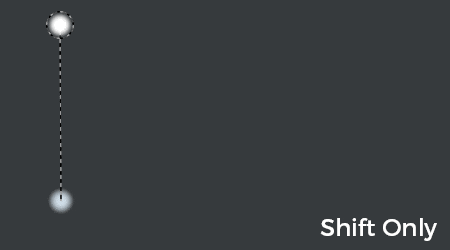

# 直線

直線を使用すると、クリック数が少なく、より正確に任意のペイントツールで簡単に線を描画できます。

キーボードショートカットを使用して一時的に適用される変更です。

直線の位置はビューポートから計算されます。つまり、ブラシストロークの間でカメラが移動すると、次の直線が正しく配置されないことがあります。

## 直線を有効にする

ペイントツールが選択されているときにキーボードのShiftキーを押すと、ペイントツールの軌跡を示す点線が表示されます。 「Shift」キーを押しながら任意の場所をクリックすると、線が引かれます。

{width="400px"}

## 直線のスナップ

「Shift」に加えて、「Ctrl」を押すと、5度ごとに直線をスナップすることができます。

{width="400px"}
