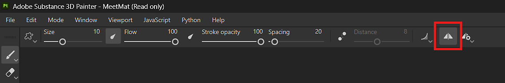

# 対称

「対称」は、ブラシと塗りつぶしレイヤーで幾何拘束に基づいてコンテンツを簡単かつ正確に複製できる便利な設定です。

* ブラシレイヤーでは、対称の軸に基づいて、メッシュの他の場所に個々のブラシストロークを対称します。
* 塗りつぶしレイヤーでは、対称を使用して、対称軸の塗りつぶしレイヤー全体を複製します。

Painterで使用できる対称の種類について詳しく説明します。

* [ミラー対称](mirror-symmetry.md)
* [ラジアル対称](radial-symmetry.md)

## ペイントツールでのシンメトリーの使用

コンテキストツールバーの<b> 対称ボタン</b>で対称を有効にすることができます。

コンテキストツールバーの<b>対称設定ボタン</b>で対称オプションを調整します。

>[!NOTE]
>
> 2D ビューのペイント投影とステンシル投影は対称をサポートしていません。 必要に応じて、代わりに3Dビューを使用することをお勧めします。

## 塗りつぶしレイヤーでのシンメトリの使用

塗りつぶしレイヤーを選択すると、ブラシツール対称と同様に、コンテキストツールバーの<b>対称ボタン</b>を使用できます。 塗りつぶしレイヤーを使用して、<b>プロパティパネル</b>から対称オプションを有効にしてアクセスすることもできます。 対称は、次の投影方法でのみ使用できます。

<table>
<tr style="border: 0;">
<td style="border: 0;" valign="top">

* 三面投影
* 平面投影
* 球投影
* 円筒投影法
* ワープ投影

適切な投影方法を選択したら、プロパティパネルの「シンメトリ」セクションで「シンメトリを有効にする」を選択して、シンメトリのオプションにアクセスします。

サポートされていない投影方式が選択された場合、<b>[対称を有効にする]</b>オプションは使用できなくなり、コンテキストツールバーの<b>対称ボタン</b>は灰色表示されます。

</td>
<td style="border: 0;" valign="top">

![プロパティパネルの[対称]セクションのスクリーンショット](../../assets/FillSymmetry.png){width="400px"}

</td>
</tr>
</table>

>[!NOTE]
>
> 対称の表示オプションは、コンテキストツールバーの<b>対称設定ボタン</b>からのみ使用できます。 <b>プロパティパネル</b>から対称の表示設定を変更することはできません。
