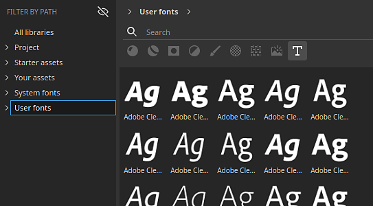
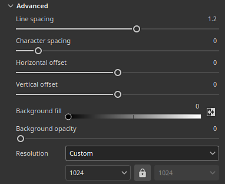

# テキストリソース

の<b>テキストリソース</b>を使用すると、特定の<b>フォントファイル</b>を使用してテキストをテクスチャに書き込むことができます。 最終的に描画されるテキストの外観を調整するために、いくつかのパラメーターを使用できます。

## フォントの参照

使用可能なフォントファイルを参照するには、[アセットウィンドウ](../interface/assets/assets.md)でフォントフィルター（<b>T</b>ボタン）をクリックします。

フォントは、システム上のどこに配置されているかに応じて、パスでフィルタリングすることもできます。

使用できるフォントの場所は、現在のオペレーティングシステムによって異なります。

|  |  |
| --- | --- |
| Windows | <ul data-preserve-html="true"> <li data-preserve-html="true"><b>システム</b>: C:/Windows/Fonts</li> <li data-preserve-html="true"><b>ユーザー</b>: C:/Users/username/Appdata/Local/Microsoft/Windows/Fonts</li> </ul> |
| MacOS | <ul data-preserve-html="true"> <li data-preserve-html="true"><b>システム</b>: /System/Library/Fonts</li> <li data-preserve-html="true"><b>ローカル</b>: /Library/Fonts</li> <li data-preserve-html="true"><b>ユーザー</b>: /Users/username/Library/Fonts</li> </ul> |
| Linux | <ul data-preserve-html="true"> <li data-preserve-html="true"><b>システム</b>: /usr/share/fonts/</li> <li data-preserve-html="true"><b>ローカル</b>: /usr/local/share/fonts/</li> <li data-preserve-html="true"><b>ユーザー</b>: /home/username/.local/share/fonts/</li> </ul> |

### フォントの読み込み

フォントは、手動で読み込むことも、通常のリソースと同様に既存のPainterライブラリに配置することもできます。 詳細については、[ドキュメントのインポート](../content/importing-assets/import-drag-and-drop.md)を参照してください。

Painterは、<b>.ttf</b>と<b>.otf</b>の両方のフォントフォーマットをサポートしています。

>[!NOTE]
>
> リソースの読み込みまたは読み込みに失敗し、「フォントのライセンス制限により読み込めません」というエラーメッセージが表示された場合、Painterで使用できないことを示します。 メタデータで<b>埋め込み可能</b>とマークされているフォントのみ使用できます。

### フォントをテキストリソースとして使用する

テクスチャリソースは、他のリソース（イメージやSubstanceマテリアルなど）と同様に機能し、ブラシパラメータ、塗りつぶし投影、Substanceイメージ入力で使用できます。

リソーススロットにフォントを追加するだけでテキストリソースを作成する。 ビューポートにフォントをドラッグ&amp;ドロップすることもできます。

### テキストリソースパラメーター

テキストリソースには、次の基本パラメーターがあります。

| <b>パラメーター</b> | <b>説明</b> |
| --- | --- |
| <b>テキスト</b> | レンダリングするテキスト。  **注意：**&#x200B;インターフェイスのテキストフィールドでは、幅広い文字を含む一般的なフォントが使用されています。これにより、フィールドに入力された内容と、選択したフォントがテクスチャでレンダリングできる内容が一致しない場合があります。 |
| <b>フォントサイズ</b> | フォントサイズの計算に使用するモードを指定します。 使用可能なモードは次のとおりです。<ul data-preserve-html="true"> <li data-preserve-html="true"><b>自動</b>:サイズはテキストコンテンツから自動的に計算され、テクスチャに合わせられます。</li> <li data-preserve-html="true"><b>カスタム</b>:サイズは、専用の設定を使用して手動で制御できます。</li> </ul> |
| <b>整列</b> | 垂直方向と水平方向の整列を制御します。 ボタンを使用して、使用するモードを選択します。 |
| <b>色</b> | レンダリングされたテキストの色。 テキストリソースがマスクチャンネルまたはグレースケールチャンネルで使用されている場合、この設定はグレースケールになります。 |

さらに高度なパラメーターも使用できます。

| <b>パラメーター</b> | <b>説明</b> |
| --- | --- |
| <b>行間</b> | フォントサイズに対するテキストの行間の距離（「行送り」）。 |
| <b>文字間隔</b> | フォントサイズに対する、隣接する文字間の相対的な間隔です。 マイナスの値を指定すると、間隔が削除されます。 |
| <b>オフセット</b> | テキストの水平方向および垂直方向のオフセット。 フォントサイズに正規化されています。 |
| <b>背景の塗りつぶし</b> | テキストの背景の色です。 |
| <b>背景の不透明度</b> | 表示される背景色の量。 |
| <b>解決策</b> | テキストのレンダリングに使用するテクスチャのサイズの計算に使用するモードを指定します。 使用可能なモードは次のとおりです。<ul data-preserve-html="true"> <li data-preserve-html="true"><b>自動</b>：解像度は自動的に計算されます。</li> <li data-preserve-html="true"><b>カスタム</b>：解像度は、専用の設定を使用して手動で定義できます。</li> </ul> |
