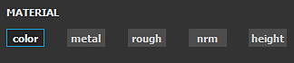

# 消しゴム

消しゴムは、以前に他のツールでペイントした内容を消去/非表示にするペイントツールです。 このツールは一度に1つのレイヤーにのみ影響します。

消しゴムは、ペイントツールと共通のパラメーターとビヘイビアーを共有します。 ブラシ、アルファ、ステンシルのコントロールについて詳しくは、[ペイントツールページ](paint-brush.md)を参照してください。

>[!NOTE]
>
> 技術的には、**消しゴムは実際には情報を削除しません**。 レイヤーのアルファをゼロに戻すだけで、前のペイント情報を消去/非表示にできます。 これは以下を意味します。
> 
> * 消しゴムでブラシストロークを適用する前にプロジェクトを再度開くと、ペイントされた以前のブラシストロークが計算されます。
> * Substanceフィルターでは、アルファ情報を無視してペイント情報を取得することができます
> 
> そのため、パフォーマンスを向上させるために、消しゴムを使用するのではなく、**レイヤーを削除して再作成**&#x200B;することをお勧めします。

## マテリアル

情報を消去する場合は、特定のチャンネルにのみ影響を与えることができます。

>[!NOTE]
>
> ペイントツールとは異なり、消しゴムでは、影響を受けるチャンネルのみを定義できます。 シェルフからリソースをロードして各チャネルに影響を与えることはできません。

* すべてのチャンネルが有効になっている場合、消しゴムはすべてのチャンネル内の情報を削除します。

  

  {width="325px"}
* 特定のチャンネルを選択すると、消しゴムはそれらのチャンネルからのみ情報を削除します。

  

  {width="325px"}
