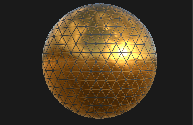
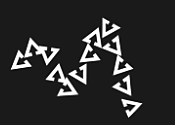
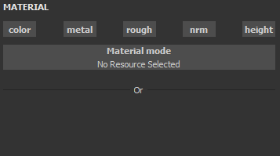

# ペイントブラシ

ペイントツールは、3D メッシュにカラーとマテリアルプロパティを適用するためのSubstance 3D Painterのデフォルトツールです。 [プロパティ](../../interface/properties.md)で編集できる特定のパラメーターがあります。

ペイントツールは、様々な動作と設定を使用してブラシストロークをシミュレートし、3Dメッシュ上にペイントしたような印象を与えます。

## ツールバー

[ツールバー](../../interface/toolbars.md)には、次のショートカットが表示されます（次のセクションで説明を参照） :

* サイズ
* フロー
* 線の不透明度
* 間隔

他のツールにも共通するショートカットが追加されています。

* [レイジーマウス](../lazy-mouse.md)
* [対称](../symmetry/symmetry.md)

## プレビュー

[プロパティ](../../interface/properties.md)の上部には、ブラシとマテリアルのプレビューがあります。 これらは、現在のツールがどのように設定されているかを簡単に確認するために使用できます。

| *名前* | *説明* |
| --- | --- |
| **ブラシのプレビュー** | ブラシプレビューには、ブラシパラメーターに基づいたブラシの動作が表示されます。 プレビューをクリックすると、カスタムストロークを描画できます。   <table> <tr style="border: 0;"> <td style="border: 0;" valign="top">  

  </td> <td style="border: 0;" valign="top">  

  </td> </tr> </table>   **注意：**&#x200B;ブラシプレビューはペンの筆圧をサポートしていません。 |
| **マテリアルプレビュー** | マテリアルプレビューには、現在ペイントに使用されているマテリアルのプロパティが表示されます。 プレビューをクリックして照明を回転させると、ペイントする前にマテリアルの動作を確認できます。   <table> <tr style="border: 0;"> <td style="border: 0;" valign="top">  

  </td> <td style="border: 0;" valign="top">  

  </td> </tr> </table> |

## ブラシ

ブラシパラメーターは、3D メッシュに対して実行されるブラシストロークのルックアンドフィールを定義します。

>[!NOTE]
>
> 一部のパラメーターは、グラフィックタブレットを使用するときにペン圧力で制御できます。 この情報は、[プリセット](../presets/presets.md)にも保存できます。\
> 専用ボタンをクリックして、筆圧を有効または無効にします。
> 
> 

| 名前 | 説明 |
| --- | --- |
| **サイズ** | ブラシストローク内のスタンプの大きさを制御します。 ブラシサイズの相対値は、で定義されている相対間隔に応じて変化します（下の「アラインメントサイズの間隔」パラメーターを参照）。 *このパラメーターは、ペン圧力で制御できます。* |
| **フロー** | ブラシストローク内の個々のスタンプの強度または不透明度。 *このパラメーターは、ペン圧力で制御できます。* |
| **ストロークの不透明度** | ブラシストロークの最大グローバル不透明度。 「流量」パラメーターとは異なり、「ストロークの不透明度」はストローク描画プロセスの最後に適用されるため、「ペンの筆圧」では制御できません。流量とストロークの不透明度の差：<ul data-preserve-html="true"><li data-preserve-html="true"><strong>残り</strong> :フロー50%、ストロークの不透明度100%</li><li data-preserve-html="true"><strong>右</strong> : 100%の流量、50%のストローク</li></ul> 

 **注意：**&#x200B;上記のアニメーションと同様に、ショートカット「A」を押すと、前のストロークを続けることができます。 |
| **間隔** | ブラシストロークの個々のスタンプ間の距離です。 値を小さくすると、連続した線を作成できますが、スタンプを合計で描画する量が多くなるため、計算範囲が広くなります。 値を大きくすると、印鑑の間にギャップが生じ、特定のパターン（木の爪など）に適した場合があります。 |
| **角度** | ブラシストローク内のスタンプの方向です。 正しく位置合わせされていない場合に、Alphaを回転させると便利です。 Follow Pathと組み合わせることができます。 |
| **パスに従う** | ブラシストロークの内側のスタンプの向きを、ペイントの方向に合わせます。 

 **注意：** Substance 3D Painterでストロークの方向を計算するには、前のスタンプと現在のスタンプを比較します。「パスに従う」が有効になっている場合、「ペイントを1回クリックしても結果が表示されません。 この機能を有効にしてブラシストロークをペイントするには、少なくとも2つのスタンプが必要です。 |
| **サイズジッター** | ブラシストローク内のスタンプごとにランダムサイズ値を適用します。 値0はランダム度がないことを意味し、値1は完全なランダム度を意味します。 

 |
| **フロージッター** | ブラシストローク内のスタンプごとにランダムフロー値を適用します。 値0はランダム度がないことを意味し、値1は完全なランダム度を意味します。 

 |
| **角度のジッター** | ブラシストローク内のスタンプごとにランダムに追加の回転角度を適用します。 値0はランダム度がないことを意味し、値1は完全なランダム度を意味します。 

 |
| **位置のジッター** | ブラシストローク内のスタンプごとにランダムな位置オフセットを適用します。 値0はランダム度がないことを意味し、値1は完全なランダム度を意味します。 

 |
| **アラインメント** | ブラシストローク内のスタンプを3D メッシュのサーフェスに投影する/方向を指定します。 次の値を使用できます。<ul data-preserve-html="true"><li data-preserve-html="true"><strong>カメラ</strong> ：スタンプをビューポートの視点に向けます</li><li data-preserve-html="true"><strong> 正接 `\|`ラップ（既定） </strong> :スタンプの向きを3D メッシュサーフェスに合わせます。 スタンプもサーフェスに合わせて変形されます。</li><li data-preserve-html="true"><strong>正接`\|`平面</strong> :スタンプの向きを3D メッシュ面に合わせます。 スタンプの境界がフェードサーフェスから離れすぎているため、スタンプが3D メッシュされます。 </li><li data-preserve-html="true"><strong> UV </strong> : 3D メッシュ UVに基づいてスタンプの方向を設定します。</li></ul> |
| **バックフェースカリング** | スタンプと位置合わせされていない3D メッシュ上のサーフェスを無視します。 3D メッシュのどの部分を無視するかを判断するために、ペイントエンジンは3D メッシュのサーフェスの法線を見て、定義された値と角度を比較します。 |
| **サイズ空間** | ブラシサイズの計算に使用する相対間隔を指定します。 指定可能な値は次のとおりです。<ul data-preserve-html="true"><li data-preserve-html="true"><strong>オブジェクト（既定） </strong> :ブラシサイズは3D メッシュサイズと同期されます。 ビューポート内でカメラを動かすと、3D メッシュとの相対的な大きさを保つのに影響します。</li><li data-preserve-html="true"><strong>ビューポート</strong> ：ブラシサイズはビューポートにリンクされています。 インターフェイスのサイズを変更すると、ブラシサイズが変わります。 カメラを移動しても何も起こりません。</li><li data-preserve-html="true"><strong>テクスチャ</strong> ：ブラシサイズは、2Dビューポートレベルのズームにリンクされています。</li></ul> |

## アルファ

ブラシストローク内のスタンプごとに適用されるグレースケールマスクがAlphaです。 Substanceのファイルまたはビットマップです。

>[!NOTE]
>
> Substanceグラフにパラメーター「hardness」(ID)が表示されている場合は、「Hardness」[Shortcuts](../../interface/settings/shortcuts.md)で制御できます。

## 物理的性質

物理プロパティを使用すると、ペイント時に投影されるパーティクルを制御できます。

デフォルトではPhysicsプロパティは使用できませんが、次の2つの方法で有効にすることができます。

* [Toolbars](../../interface/toolbars.md)でツールを[物理]に切り替える（またはキーボードショートカットを使用する）。
* [アセット](../../interface/assets/assets.md)ウィンドウでパーティクルブラシプリセットをクリックします。

## ステンシル

ステンシルは、ブラシストローク用の追加のグレースケールマスクです。 個々のスタンプに適用されるアルファとは異なり、ステンシルは[ビューポート](../../interface/viewport/viewport.md)の視点から適用されるグローバルマスクです。

>[!NOTE]
>
> ステンシル変形をリセットするには、**S**&#x200B;キーを押してから、ビューポートの右上にある「**リセット**」ボタンをクリックします。
> 
> 

| *モード* | *ビューポート* |
| --- | --- |
| **リソースが読み込まれていません** | リソースが読み込まれない場合、ステンシルは何の影響も与えません。 

 **注意：** [ショートカット](../../interface/settings/shortcuts.md) 「N」を長押しすることで、ステンシルを削除せずにリソースマスクを一時的に無効にすることができます。 |
| **ステンシルの移動** | ステンシルの移動は、**S**&#x200B;キーを押し、**中マウス**&#x200B;ボタンでクリック&amp;ドラッグすることで実行できます。 

 |
| **ステンシルを回転** | ステンシルの回転は、**S**&#x200B;キーを押しながら&#x200B;**左マウスボタン**&#x200B;でクリック&amp;ドラッグすることで実行できます。 さらに、**Shift**&#x200B;キーを押すと、 **90度**&#x200B;ごとに回転をスナップできます。 

 |
| **ステンシルのサイズ変更** | ステンシルのサイズを変更するには、**S**&#x200B;キーを押しながら&#x200B;**右マウスボタン**&#x200B;でクリック&amp;ドラッグします。 

 |

タイリングモードの設定は、ステンシルマスクをビューポート上で繰り返す方法を制御します（この設定はテクスチャリングにも影響します）。

| *タイルモード* | *説明* |
| --- | --- |
| **タイリングなし（既定）** | ステンシルマスクは繰り返されません。 

 |
| **横タイル** | ステンシルマスクは水平軸でのみ繰り返します。 

 |
| **垂直方向のタイリング** | ステンシルマスクを垂直軸でのみ繰り返します。 

 |
| **HとVのタイリング** | 水平軸と垂直軸の両方でステンシルマスクを繰り返します。 

 |

## マテリアル

マテリアルは複数のチャンネルで構成され、各チャンネルで特定のプロパティが保持されます。 チャンネルの一覧は、[テクスチャセットの設定](../../interface/texture-set/texture-set-settings.md)で定義されているチャンネルに依存しています。

「**マテリアルモード**」ボタンを使用すると、Substanceのファイルやプリセットを簡単に読み込んで、複数のチャンネルを一度にすばやく割り当てて編集できます。

チャンネルボタンをクリックすると、選択または選択解除できます。 選択を解除すると、チャンネルプロパティは変更できず、ペイントプロセス中には使用されません。

