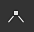
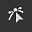
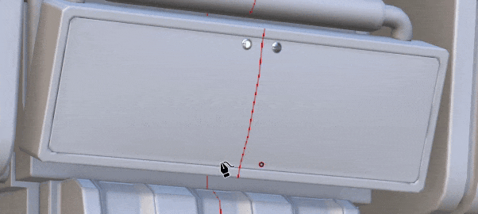

# パスツールの概要

<table>
<tr style="border: 0;">
<td style="border: 0;" valign="top">

<b>オーディオ</b>

プロジェクトに音声を調整または追加します。

* オーディオがある場合は、ソースビデオのボリュームを調整します。
* 外部オーディオファイルを追加、削除、または置換します。
* 外部オーディオファイルのボリュームを調整します。

</td>
<td style="border: 0;" valign="top">

</td>
</tr>
</table>

<b>パスツール</b>を使用すると、メッシュのサーフェス上にポイントを持つカーブを定義できます。 カーブを作成した後は、様々なパスツールを使用して、カーブに沿って様々なエフェクトを作成できます。

## パスの作成

パスは、ペイントレイヤーおよびペイントエフェクト上に作成できます。 パスツールにアクセスするには、次の2つの方法があります。

* <b>インターフェイスから</b> ：左側のツールのツールバーに移動し、上から3番目のアイコンをクリックします。
* <b>キーボードショートカットを使用する</b>：既定では、このツールには何も割り当てられていません。 これは、「パスツールに沿ってペイントを選択」ショートカットを編集することで、設定メニューで変更できます。

ツールを選択したら、3Dビューポート内の3Dモデルのサーフェスをクリックしてポイントを配置できます。 パスを作成するには、2つ以上のポイント（または頂点）が必要です。

パスツールには、アプリケーションで使用可能な他のペイントツールと同様の様々なモードがあります。

* パスに沿ってペイント：定義されたパスに沿って通常のブラシストロークを描画します。
* [リボンパス](ribbon-tool.md):パスに沿って繰り返し画像または引き伸ばされた画像を描画します。
* [塗りつぶされたパス](filled-path.md):パスの内側を均一な色で塗りつぶします。
* パスに沿って消去：定義されたパスに沿って情報を消去/削除するストロークを描画します。
* パスに沿ってこする：定義されたパスに沿って情報をぼかす/ぼかすストロークを描画します。

例えば、<b>指先</b>モードのパスツールが、他のペイント情報に影響を与えています。

>[!NOTE]
>
> <b>パスツール</b>は、図形の表面の3D空間でのみ機能します。 UV空間でのパスの作成またはスクリーン空間の投影としてのパスの作成は、現在サポートされていません。

### パスの編集

パスポイント（または頂点）は、メッシュのサーフェスに自動的に付着します。 いつでも移動および調整できます。 線に沿って任意の場所をクリックすると、既存のパスに新しい頂点を追加できます。 

* <b>Esc </b>または<b>Enter </b>を押すと、パス編集が終了します。
* 終了したら、メッシュの空白のサーフェスをクリックすると、新しいパスが開始されます。
* 既存のパスにカーソルを合わせてクリックすると、そのパスが選択され、そのパスの続行または編集が可能になります。 パスは、<b>パス</b>パネルを使用して再選択することもできます（以下を参照）。

一部のプロパティは、パス全体に固有です。 これは、<b>プロパティ</b>ウィンドウで見つかったオプションの場合です。 通常のストロークと同様に（[ペイントツールのドキュメント](paint-brush.md)を参照）、パスの次のプロパティを定義できます。

* <b>ブラシ</b>
* <b>Alpha</b>
* <b>マテリアル</b>

<b>ブラシ</b>セクションには、パスツールでのみ使用できる追加のオプションが含まれています。

| <b>設定</b> | <b>説明</b> |
| --- | --- |
| <b>プロジェクション深度</b> | ブラシスタンプを表示するために、パスがメッシュサーフェスにどの程度近づく必要があるかを指定します。 この視覚的なフィードバックをビューポートで直接表示するには、<b>パスの表示設定</b>で<b>法線</b>を有効にすることができます（以下を参照）。 |
| <b>上の軸</b> | <b>パスに従う</b>がオフの場合に、ブラシスタンプの向きを設定するために使用される軸です。   状況によっては、すべてのスタンプをパスではなくグローバル軸/方向に整列させると、より理にかなっています。 例えば、金属の表面にリベットを使用します。 |

その他のプロパティは、パス上のポイント（頂点）ごとに定義されます（圧力など）。 特定のポイントを編集するには、そのポイントをクリックします（または長方形の選択を使用します）。 次に、コンテキストツールバーを使用して、選択したポイントの値を編集します。

### 接線を制御する

スムーズなパスは、3Dモデルの最適なサーフェスに沿っていなかったり、特定の外観に合っていなかったりするために、理想的ではない場合があります。 これらの問題を解決するために、特定の頂点の接線を修正することができます。 接線は、パスの曲げ方法を制御するポイントの方向です。

スムーズ接線または線形/破断接線を切り替えるには、頂点をダブルクリックします（または、コンテキストツールバーの専用ボタンを使用します）。

接線の方向をより正確にコントロールするには、コンテキストツールバーの[カスタム接線]ボタンを使用して手動でオーバーライドします。

<b>ALT</b>キーボードショートカットを使用して、ポイントがまだ移動していない場合に移動中に接線を分割します。

<b>CTRL</b>キーボードショートカットを使用して、両方の接線を同時にスケーリングします。

>[!NOTE]
>
> 接線コントロールは、パス内の指定された点の法線に位置合わせされた平面に沿って定義されます。 これは、接線が特定の方向に曲がることができないことを意味します。

### コンテキストツールバー

<b>パス</b>ツールを選択したときの<b>コンテキストツールバー</b>には、現在選択されているパスを制御できるいくつかの設定があります。

| <b>パラメーター</b> | <b>説明</b> |
| --- | --- |
| <b>ビューポートインターフェイスの表示/非表示</b>  

 | 有効にすると、パスと頂点のオーバーレイがビューポートに表示されます。 |
| <b>表示設定</b>  

 | ビューポートのパスビジュアルフィードバックの外観をコントロールします。<ul data-preserve-html="true"> <li data-preserve-html="true"><b>ハンドルサイズ</b>:パスのポイントの大きさを制御します。</li> <li data-preserve-html="true"><b>パスの幅</b>:パスの線のThicknessを制御します。  </li> <li data-preserve-html="true"><b>パスの色</b>:パス線の色を制御します。  </li> <li data-preserve-html="true"><b>選択されていないパスの色</b>:アクティブでないパスの色を制御します。  </li> <li data-preserve-html="true"><b>法線</b>：有効にした場合、パスの各ポイントの投影方向を表示します。  </li> <li data-preserve-html="true"><b>接線</b>：有効にすると、パスのコントロールポイントの曲線の方向が表示されます。  </li> <li data-preserve-html="true"><b>パスの方向</b>：有効にすると、パスの端に小さな矢印が表示され、ペイントの方向が示されます。 これは、ストローク内のスタンプの方向を知る場合に便利です。</li> </ul>  

 |
| <b>パスの方向を反転</b>  

 | 現在のパスの方向を反転します。 方向は、ストローク内でスタンプをペイントするときに使用する一般的な方向を定義します。 パスを反転させると、描画したパターンの向きを変えるのに役立ちます。 |
| <b>コーナー/スムーズを切り替え</b>  

 | 現在選択されている頂点の接線をブレークまたは位置合わせし、スムーズ曲線と直線曲線を切り替えられるようにします。  

  **注意：**&#x200B;コーナー/滑らかな動作の切り替えは、パス上の点を直接ダブルクリックすることでも実行できます。 |
| <b>カスタム接線</b>  

 | 有効にすると、パス上の特定のポイントの接線を手動でコントロールできるようになります。  

 |
| <b>パスを開く/閉じる</b>  

 | 現在のパスを開く、または閉じる。 パスを閉じるには、現在のパスの2つの終点のうち、1つを最初に選択する必要があります。  

 |
| <b>頂点を削除</b>  

 | パス上の現在選択されている頂点を削除します。 |
| <b>対称</b>  

 | 現在のパスのシンメトリを有効または無効にします。 詳細については、[対称のドキュメント](../symmetry/symmetry.md)を参照してください。  

 |
| <b>除外されたジオメトリを非表示/無視</b>  

 | 有効になっている場合は、非表示のジオメトリを通して現在のパスがペイントされます。 詳細については、[ジオメトリマスクのドキュメント](../../interface/layer-stack/geometry-mask.md)を参照してください。 |

### パスパネル

>[!NOTE]
>
> パネルは、現在のツールがパスツールでない場合、または塗りつぶしレイヤーやフォルダーが選択されている場合は非表示になります。

ビューポート内には<b>パス</b>パネルがあり、現在選択されているペイントレイヤー/エフェクトのすべてのパスが一覧表示されます。 パスを簡単に選択および管理できます。

このパネルでは、次の操作が可能です。

* パスをダブルクリックして、パスを<b>名前を変更</b>します。
* パスを<b>削除</b>するには、パスを選択してDeleteキーを押します。
* 専用のキーボードショートカットを使用して、パスを<b>コピー</b>/<b>貼り付け</b>/<b>複製</b>します。
* 目のアイコンが付いたパスを<b>表示</b>または<b>非表示</b>にします（パスがテクスチャリングに適用されるかどうかを制御します）。

パスを右クリックして、同じアクションを提供するコンテキストメニューを開くこともできます。

右クリックメニューでもアクションが開き、パスのプロパティや位置を別のパスにコピーできます。 これにより、異なるパス間でフィーチャを簡単に共有または同期できます。

>[!NOTE]
>
> プロパティのコピー&amp;ペーストは、パスが同じペイントツールに基づいている場合にのみ機能します。 例えば、指先ツールの設定を使用しているパスとブラシ設定を使用しているパスの間でプロパティを共有することはできません。

## ツールプリセット

{width="400px"}

パスツールを選択すると、プロパティパネルの上部に「プリセット」セクションが表示されます。 ここから、様々なパスツールのプリセットにすばやくアクセスできます。

### お気に入りのパスプリセット

「プリセット」セクションの「お気に入り」オプションには、お気に入りのプリセットのみが表示され、より迅速にアクセスできます。 お気に入りの追加を開始するには、「お気に入り」を選択し、「アセットに互換性のあるプリセットを表示」を選択して、使用可能なパスプリセットの完全なリストを表示します。

プリセットをお気に入りに登録するには、アセットパネルまたはプロパティパネルの「プリセット」セクションでプリセットを右クリックし、「お気に入りに追加」を選択します。 

お気に入りリストからプリセットを削除することもできます。 お気に入りプリセットを右クリックし、「お気に入りから削除」を選択します。

{width="400px"}

### パスプリセットの作成

他のツールと同様に、プリセットを作成してブラシ設定/構成をすばやく復元できます。 これを行うには、<b>プロパティ</b>ウィンドウで右クリックし、<b>ツールプリセットを作成</b>を選択します。 この新しく作成されたプリセットは、<b>アセット</b>ウィンドウで選択すると、自動的にパスツールに切り替わります。
